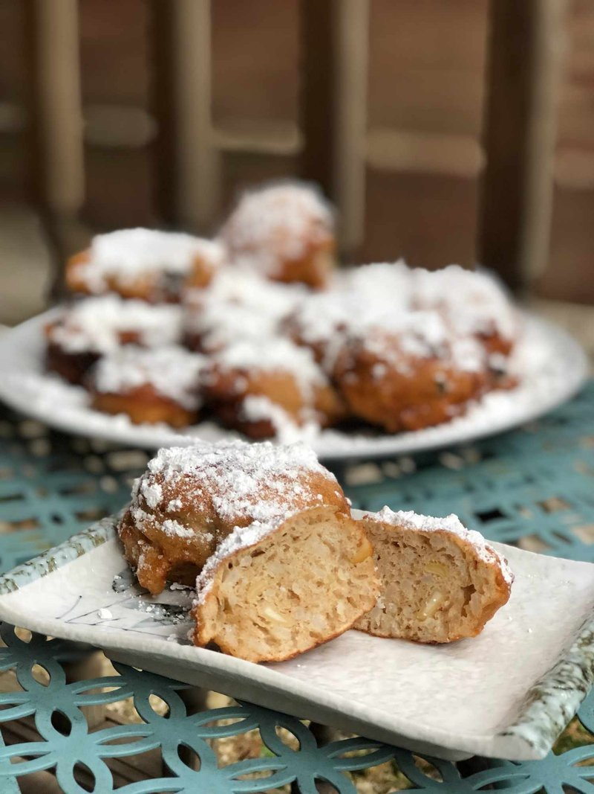

# Calas

*Old New Orleans rice fritters: leftover cooked rice mixed with sugar, egg, flour and nutmeg, dropped into hot oil and fried golden puffy balls.*

**Serves:** 4 (makes about 20 fritters)

**Prep Time:** 10 minutes (plus 30 minutes resting)

**Cook Time:** 15 minutes

## Overview
Calas are the New Orleans rice fritters that used to be sold by Black Creole women calling "Belles calas tout chauds!" through the French Quarter streets at dawn, a Sunday-morning breakfast pastry now mostly forgotten outside specialist Creole kitchens. Cooked long-grain rice, slightly over-cooked so it mashes easily, lightly crushes with sugar, beaten egg, milk, vanilla and a pinch of nutmeg. Flour and baking powder fold through to a thick batter, which rests for half an hour. You drop tablespoons of the batter into 175°C oil and fry for two to three minutes per side until they puff into deep-gold balls. Drain on kitchen paper, dust with icing sugar, eat warm with chicory coffee.

## Ingredients

- 300 g cooked long-grain rice (slightly soft - see Notes)
- 2 eggs (large, beaten)
- 80 g caster sugar
- 80 ml whole milk
- 1 teaspoon vanilla extract
- 150 g plain flour
- 2 teaspoons baking powder
- ½ teaspoon ground nutmeg
- ¼ teaspoon ground cinnamon
- ¼ teaspoon salt
- 1 litre vegetable oil for deep frying
- 100 g icing sugar (for dusting)

## Method

### Stage 1 - Mash rice
1. In a wide bowl, mash the cooked rice lightly with a fork - keep some grains visible.

### Stage 2 - Wet mix
1. Stir in the eggs, sugar, milk and vanilla.

### Stage 3 - Dry into wet
1. Sift flour, baking powder, nutmeg, cinnamon, salt into the bowl.
1. Fold to a thick batter (slightly looser than pancake batter).

### Stage 4 - Rest
1. Cover; rest 30 minutes - the rice absorbs moisture and the baking powder activates.

### Stage 5 - Fry
1. Heat oil to 175°C in a deep heavy pan.
1. Drop tablespoons of batter into the oil. Fry in batches of 6-8.
1. Cook 2-3 minutes per side, turning, until deep gold and puffed.
1. Drain on kitchen paper.

### Stage 6 - Sugar
1. While still warm, dust generously with icing sugar.

### Stage 7 - Serve
1. Eat warm with strong chicory coffee or a glass of cold milk.

## Notes
- **Rice texture:** Slightly over-cooked, soft rice is right - gives a tender fritter. Drying-out leftover rice from the fridge works perfectly.
- **Rest the batter:** The baking powder needs to activate; the rice needs to drink some moisture. 30 minutes is the minimum.
- **Eat warm:** Calas are 50% better in the first 10 minutes after frying. They turn dense and chewy when cold.

## Storage
- Best fresh.
- Refresh briefly in a 180°C oven 3 minutes if you must.
