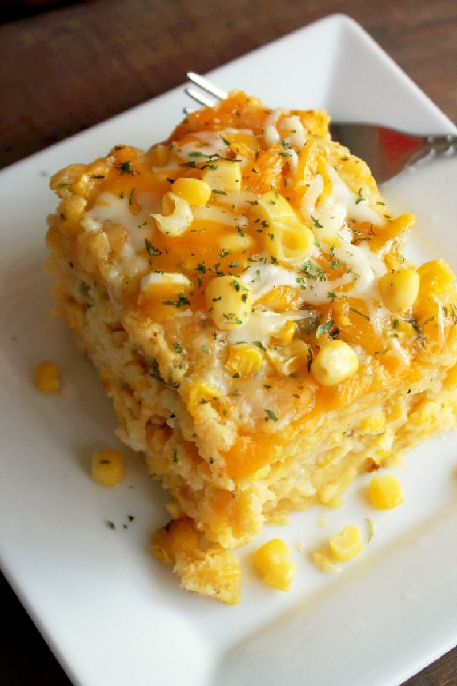

# Corn Pudding

*The American South / Creole baked side: a soft, savoury custard of fresh corn kernels, beaten egg, cream, melted butter and a touch of sugar, baked until set with a faintly bronzed top. Sweet, eggy, comforting. Goes alongside fried chicken, BBQ ribs, or - at Thanksgiving - turkey and ham.*

**Serves:** 6

**Prep Time:** 15 minutes

**Cook Time:** 50 minutes

## Overview
Fresh corn kernels (or thawed frozen) blend with cream, eggs, melted butter, sugar, salt, pepper and a small amount of flour for body. Half the corn stays whole; the rest blends to a smooth purée, the texture contrast matters. Pour into a buttered dish, bake at 180°C 45 minutes until set with a slight wobble in the centre.

## Ingredients

- 800 g sweetcorn kernels (fresh from 6-8 cobs, or frozen thawed)
- 4 eggs (large)
- 300 ml double cream
- 100 ml whole milk
- 80 g unsalted butter (melted)
- 3 tablespoons plain flour
- 2 tablespoons caster sugar
- 1 teaspoon salt
- ½ teaspoon ground black pepper
- ¼ teaspoon ground nutmeg

## Method

### Stage 1 - Process corn
1. Set aside 300 g of the corn kernels (whole).
1. Blitz the remaining 500 g in a food processor with the cream to a coarse purée (some texture left).

### Stage 2 - Custard
1. In a large bowl, whisk eggs.
1. Whisk in the milk, melted butter, flour, sugar, salt, pepper, nutmeg.
1. Add the blended corn-cream and the whole reserved kernels; stir to combine.

### Stage 3 - Bake
1. Heat oven to 180°C (160°C fan).
1. Butter a 25 x 18 cm baking dish.
1. Pour in the corn custard.

### Stage 4 - Cook
1. Bake 45-50 minutes until set around the edge with a slight wobble in the centre and the top is faintly bronzed.

### Stage 5 - Rest and serve
1. Rest 10 minutes - the custard sets fully as it cools.
1. Serve warm; spoon out onto plates.

## Notes
- **Half whole, half blended:** This gives the soft custard texture with intact kernels for chew. All-blended gives a smooth pudding; all-whole gives a curdled mess.
- **Don't overbake:** The wobble in the centre is right. Over-baking gives a rubbery texture.
- **Fresh vs frozen:** Frozen corn is fine - thaw and drain. Tinned is too watery.

## Storage
- Refrigerate 3 days. Reheat covered at 180°C 15 minutes.
- Doesn't freeze well - the custard separates.
