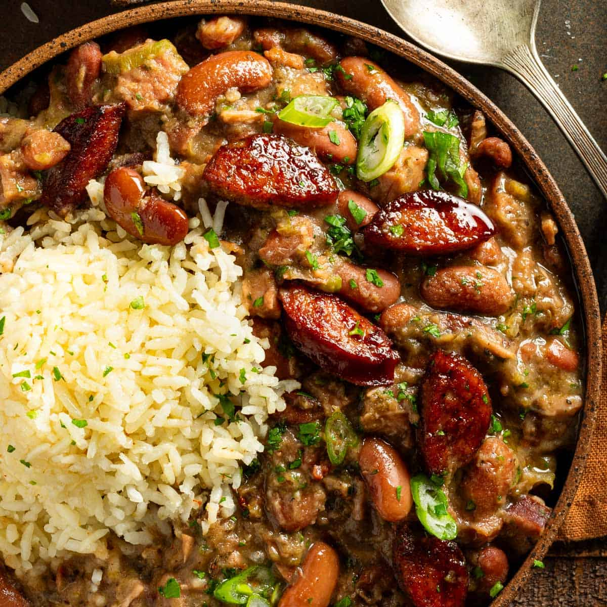

# Red Beans (Creole)

*New Orleans Creole red beans: small red beans slow-cooked with the trinity, smoked ham hock and andouille till creamy. The Monday-laundry-day pot.*

**Serves:** 6

**Prep Time:** 15 minutes (plus 12 hours soaking)

**Cook Time:** 2 hours 30 minutes

## Overview
Red beans is the Monday dish of New Orleans, the meal that filled the kitchens of Black Creole cooks on washing day when the pot could simmer unattended for hours while the laundry happened. Dried small red beans soak overnight (don't skip this, fresh boil-up never reaches the same softness). A smoked ham hock simmers slowly with the trinity (onion, celery, green pepper) and garlic; the beans, bay, thyme and stock join in for two hours covered, until the beans are creamy and the broth is thick. Andouille sausage slices in for the last half hour to render its smoke into the pot. Mash a portion of the beans against the side of the pot to thicken the broth naturally. Serve over plain white rice; lay a slice of sausage across the top of each bowl.

## Ingredients

- 500 g dried small red beans (or kidney beans - soaked 12 hours, drained)
- 1 smoked ham hock (about 800 g)
- 300 g andouille sausage (sliced 1 cm thick)
- 2 tablespoons vegetable oil
- 1 onion (large, chopped)
- 3 sticks celery (chopped)
- 1 green bell pepper (large, chopped)
- 6 garlic cloves (crushed)
- 3 bay leaves
- 1 tablespoon dried thyme (or 4 sprigs fresh)
- 1 teaspoon Creole seasoning (or smoked paprika + cayenne + oregano)
- 1 teaspoon ground black pepper
- 1 ½ teaspoons salt (to taste, added late)
- 2 ½ litres hot stock
- 2 tablespoons hot pepper sauce (Tabasco or Crystal - to serve)

### To serve
- 6 servings cooked white rice
- Chopped spring onions

## Method

### Stage 1 - Trinity
1. Heat the oil in a wide tall pot over medium heat.
1. Add the onion, celery and bell pepper; cook 10 minutes until soft and gold.
1. Add garlic; cook 30 seconds.

### Stage 2 - Ham hock and beans
1. Add the ham hock, drained beans, bay, thyme, Creole seasoning and pepper.
1. Pour in the hot stock; bring to a simmer.
1. Skim any foam.
1. Cover; cook on low 1 hour 45 minutes, stirring occasionally.

### Stage 3 - Sausage
1. Add the sliced andouille; cook a further 30 minutes uncovered.

### Stage 4 - Thicken
1. Lift the ham hock out; shred the meat off the bone; discard skin and bone.
1. With the back of a wooden spoon or a potato masher, mash about a quarter of the beans against the pot wall - they thicken the pot liquor naturally.
1. Return the shredded ham; stir.
1. Stir in salt; taste; adjust.

### Stage 5 - Rest
1. Rest 15 minutes off the heat. The beans drink the liquor.

### Stage 6 - Serve
1. Ladle over a generous mound of white rice in each bowl.
1. Scatter spring onion. Pass hot sauce at the table.

## Notes
- **Salt timing:** Adding salt to beans while still hard tightens the skins. Wait until they're soft.
- **Mash not blend:** Mashing a portion against the pot wall thickens naturally without losing texture. Don't blend; the dish should still look like whole beans in liquor.
- **Monday tradition:** Cook them on a Monday using the leftover Sunday-roast ham bone. The dish is older than the gas stove.

## Storage
- Refrigerate 5 days; better day 2 and 3.
- Freezes 3 months.
