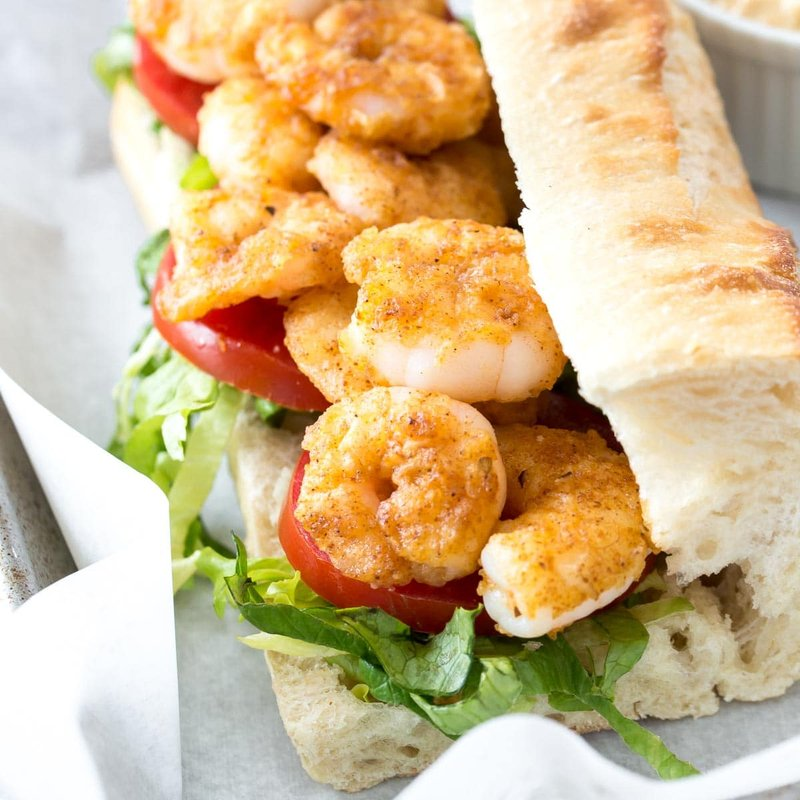

# Shrimp Po-Boy

*The New Orleans po-boy: a long French roll slathered with mayo and Creole mustard, piled with fried shrimp, sliced tomato, lettuce and pickles.*

**Serves:** 2

**Prep Time:** 25 minutes

**Cook Time:** 10 minutes

## Overview
The shrimp po-boy is the New Orleans sandwich invented in the 1920s for striking streetcar workers, two long French rolls split open, slathered with mayo and Creole mustard, and piled with fried shrimp, lettuce, tomato and pickles. The shrimp marinate briefly in buttermilk and a few dashes of hot sauce, then dredge in a mix of seasoned flour and cornmeal. They deep-fry at 180°C until deep gold and audibly crisp, no more than two to three minutes; shrimp cook fast and overdoing them is the only real way to ruin this sandwich. You toast the cut faces of the rolls so they hold up to the wet filling, slather the mayo and mustard generously, pile the shrimp high, dress with lettuce, tomato and pickles. Wrap the bottom half in paper to catch the drips and eat with both hands.

## Ingredients

### Shrimp
- 400 g raw shell-off shrimp (large, 16-20 count)
- 200 ml buttermilk
- 2 tablespoons hot pepper sauce (Crystal or Tabasco)
- 100 g plain flour
- 50 g fine yellow cornmeal
- 1 teaspoon Creole seasoning (paprika + cayenne + oregano + garlic powder + onion powder + salt + pepper, or pre-mixed)
- 1 teaspoon salt

### To fry
- 1 litre vegetable oil

### Po-boy assembly
- 2 long French rolls (each 25-30 cm, soft inside, crisp crust)
- 3 tablespoons mayonnaise
- 2 tablespoons Creole mustard (or coarse Dijon)
- 1 cup shredded iceberg lettuce
- 1 tomato (medium, sliced)
- 12 dill pickle slices
- 1 lemon (cut into wedges)
- More hot sauce on the table

## Method

### Stage 1 - Marinate shrimp
1. Whisk buttermilk and hot sauce in a bowl.
1. Add shrimp; toss to coat; refrigerate 15 minutes.

### Stage 2 - Dredge
1. Whisk flour, cornmeal, Creole seasoning, salt in a wide dish.
1. Lift shrimp from buttermilk (let excess drip); roll in the dry mix; press firmly to coat.

### Stage 3 - Fry
1. Heat oil to 180°C.
1. Fry shrimp in batches of 6-8, 2-3 minutes, until deep gold and curled.
1. Drain on a rack.

### Stage 4 - Buns
1. Split rolls lengthways. Toast cut-side down in a dry pan or under the grill 30 seconds.

### Stage 5 - Build
1. Spread the bottom of each roll with mayo. Spread the top with Creole mustard.
1. Lay 2 tomato slices on the bottom.
1. Top with shredded lettuce and pickles.
1. Pile the fried shrimp generously over the lettuce.
1. Squeeze lemon over the shrimp.
1. Close.

### Stage 6 - Eat
1. Wrap halfway in paper. Eat immediately with both hands.

## Notes
- **The bread is the soul:** A proper po-boy uses a long French roll with a crisp shell and hollow centre. A baguette is too crisp; a soft sub roll is too soft. Find a fresh French loaf or an Italian filone.
- **Cornmeal in the dredge:** Gives the New Orleans crunch. Pure flour gives a softer fried shrimp.
- **Dressed vs naked:** "Dressed" = with lettuce, tomato, pickles, mayo. "Naked" = just shrimp on bread. Both are right.

## Storage
- Eat immediately. Po-boys don't keep - the bread goes soggy in 20 minutes.
