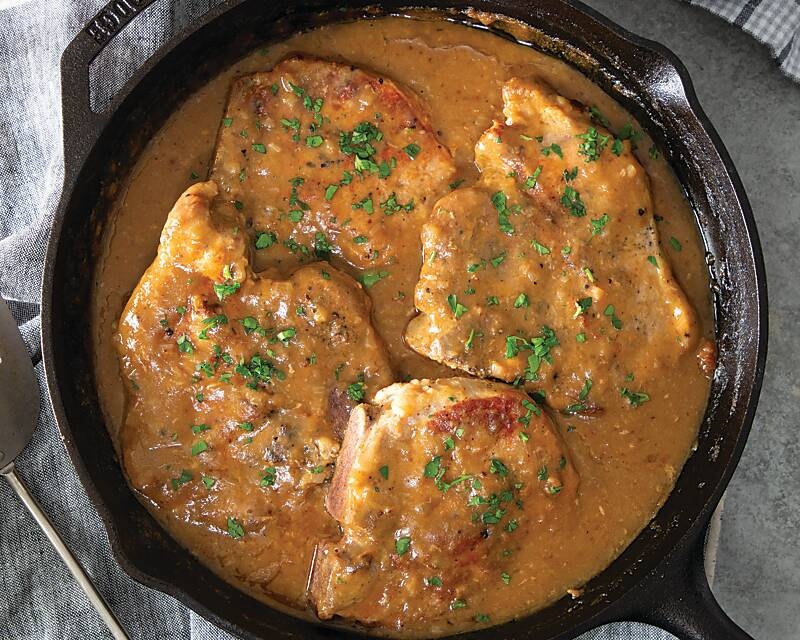

# Smothered Pork Chops

*A Creole smother: bone-in pork chops dredged in seasoned flour, seared, then slow-braised in a dark onion gravy till fork-tender. Eaten over rice.*

**Serves:** 4

**Prep Time:** 15 minutes

**Cook Time:** 1 hour 15 minutes

## Overview
Smothered pork chops is the Creole dinner that hides in plain sight: a method as much as a recipe, where any tough cut of meat goes in to brown and emerges an hour later under a blanket of dark onion gravy. Bone-in chops dusted in seasoned flour, seared hard in a heavy pan for the colour, then lifted out while a blonde roux builds from the drippings and onion cooks down deep in the roux till soft and almost caramel-coloured. Stock, Worcestershire and thyme go into the pan with the chops returned to braise covered on the lowest heat till fork-tender. Bone-in chops are the canonical cut; the bone gives the gravy depth and the meat stays moister under the long cook. Served over plain rice with the gravy ladled over the top.

## Ingredients

- 4 bone-in pork chops (250-300 g each, 2 cm thick)
- 4 tablespoons plain flour
- 1 ½ teaspoons salt
- 1 teaspoon ground black pepper
- 1 teaspoon smoked paprika
- ½ teaspoon cayenne pepper
- ½ teaspoon dried thyme
- 4 tablespoons vegetable oil
- 2 onions (large, sliced)
- 1 green bell pepper (sliced)
- 4 garlic cloves (crushed)
- 3 tablespoons plain flour (for gravy)
- 700 ml hot chicken stock
- 2 tablespoons Worcestershire sauce
- 1 bay leaf
- 1 sprig fresh thyme (or ½ teaspoon dried)

### To serve
- 4 servings cooked white rice
- 3 tablespoons fresh parsley (chopped)

## Method

### Stage 1 - Season
1. Whisk the 4 tablespoons flour with salt, pepper, paprika, cayenne and thyme in a wide shallow dish.
1. Dredge each chop, pressing the flour into the meat. Reserve the seasoned flour.

### Stage 2 - Sear
1. Heat 3 tablespoons of the oil in a wide heavy pan over medium-high.
1. Brown the chops 3-4 minutes per side. Lift onto a plate.

### Stage 3 - Roux
1. Add the remaining tablespoon of oil to the pan.
1. Add 3 tablespoons of the seasoned flour. Whisk to a blonde roux, 2-3 minutes.

### Stage 4 - Aromatics
1. Add onion and bell pepper; cook 8-10 minutes until soft and onion is gold.
1. Add garlic; cook 30 seconds.

### Stage 5 - Gravy
1. Slowly pour in the hot stock, whisking, to a smooth thick gravy.
1. Add Worcestershire, bay, thyme.
1. Bring to a simmer.

### Stage 6 - Smother
1. Return the chops and any juices, pushing them into the gravy.
1. Cover; reduce heat to low; braise 40-50 minutes until the meat is fork-tender.
1. Taste; adjust salt and pepper.

### Stage 7 - Serve
1. Plate rice; lay a chop on top; ladle gravy generously over.
1. Scatter parsley.

## Notes
- **Bone-in chops:** The bone keeps the meat moist over the long braise. Boneless chops dry out.
- **Don't rush the onion:** Deep gold onion is the gravy's character. Pale onion gives pale gravy.
- **Smother is a verb:** The cooking technique here is the dish. Don't rush the slow braise step.

## Storage
- Refrigerate 4 days. Better the next day.
- Freezes 3 months.
