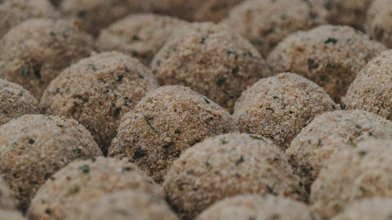

# Boudin Balls

*Cajun boudin sausage filling rolled into balls, breaded, and deep-fried into crisp-shelled spheres of seasoned pork, rice and aromatics. Eats with Creole mustard or Crystal hot sauce. The Louisiana bar-and-festival snack: take the soft pork-and-rice mixture out of its casing, shape, fry. A way to extend boudin sausage into something portable and snackable.*

**Serves:** Makes 16 balls

**Prep Time:** 25 minutes (plus 30 minutes chilling)

**Cook Time:** 12 minutes (in batches)

## Overview
Boudin filling combines pork shoulder, pork liver (optional, traditional), cooked rice, onion, celery, garlic, parsley, green onion, cayenne, salt, pepper. Either bought ready-made boudin (casings removed) or made from scratch by simmering then mincing pork shoulder with the aromatics. Filling rolls into walnut-sized balls; chills 30 min so they hold shape. Dredges in flour, egg, then seasoned breadcrumbs. Deep-fries 3-4 minutes at 175°C.

## Ingredients

### Boudin filling (or use 500 g of pre-made boudin, casings removed)
- 400 g pork shoulder (cut into 3 cm cubes)
- 100 g pork liver (optional, traditional - gives the iconic boudin earthiness)
- 1 large onion (chopped)
- 2 celery stalks (chopped)
- ½ green pepper (chopped)
- 6 garlic cloves
- 1 bay leaf
- 200 g cooked long-grain rice
- 30 g flat-leaf parsley (chopped)
- 3 spring onions (sliced thin)
- 1 ½ teaspoons salt
- 1 teaspoon ground black pepper
- 1 teaspoon cayenne pepper
- 1 teaspoon sweet paprika
- ½ teaspoon dried thyme

### Breading
- 100 g plain flour
- 2 eggs (beaten)
- 200 g panko breadcrumbs
- 1 teaspoon Cajun seasoning (paprika + cayenne + garlic powder + onion powder)

### Frying
- 800 ml neutral oil

### To serve
- Creole mustard
- Crystal hot sauce (or any Louisiana hot sauce)

## Method

### Stage 1 - Boudin filling (from scratch)
1. In a heavy pot, combine the pork shoulder, pork liver, onion, celery, green pepper, garlic, bay leaf and 500 ml water.
1. Bring to a simmer; cook 1 hour 15 minutes until the pork is very tender.
1. Drain (reserve some cooking liquid).
1. Remove the bay leaf.
1. Coarsely mince or pulse the pork mixture in a food processor (don't reduce to paste - keep some texture).
1. Mix with the cooked rice, parsley, spring onion, salt, pepper, cayenne, paprika and thyme.
1. Stir in 2-3 tablespoons of the reserved cooking liquid to moisten if dry.

### Stage 1b - Using ready-made boudin
1. Squeeze the filling out of 500 g of boudin sausage casings into a bowl.
1. Fluff with a fork.

### Stage 2 - Shape
1. Roll the filling into walnut-sized balls (~30 g each).
1. Place on a tray; chill 30 minutes (firms up; easier to bread).

### Stage 3 - Bread
1. Set up three plates: flour, beaten egg, panko + Cajun seasoning mix.
1. Dredge each ball in flour, dip in egg, roll in seasoned panko.
1. For extra crisp: double-bread (back through egg + panko a second time).

### Stage 4 - Fry
1. Heat oil to 175°C.
1. Lower 5-6 balls; fry 3-4 minutes turning, till deep amber-gold all over.
1. Lift onto a wire rack.

### Stage 5 - Serve
1. Pile on a plate.
1. Serve with small bowls of Creole mustard and hot sauce.

## Notes
- **Pork liver is traditional:** gives the iconic boudin earthiness. Omit if squeamish; the balls work but taste subtly different.
- **Don't over-process the filling:** texture should remain visible - bits of pork, distinct rice grains. Pasty boudin balls taste of nothing.
- **Chill before breading:** room-temp filling slides around during the dredge. 30 min firm-up makes neat balls.
- **Cajun seasoning in the breading:** not the filling. The pepper hits twice - in the filling and on the crust - for the iconic flavour.

## Storage
- Best within 30 minutes of frying.
- Unfried, shaped, breaded balls freeze 2 months on a tray then bagged; fry from frozen + 1 min.
- Cooked balls reheat in a 200°C oven 6 minutes; crisp returns.
