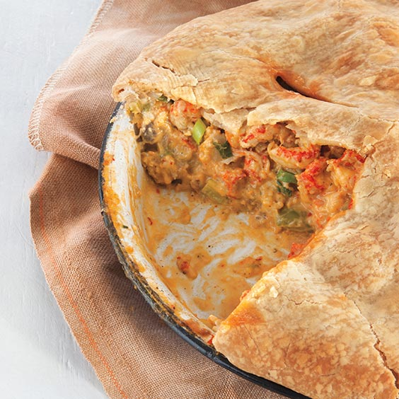

# Crawfish Pie (Mini)

*Louisiana mini hand pies: a buttery roux-thickened crawfish filling spiced Cajun, finished with green onion and parsley, baked golden in shortcrust.*

**Serves:** Makes 12 mini pies

**Prep Time:** 45 minutes (plus 30 minutes pastry rest)

**Cook Time:** 30 minutes

## Overview
Sweet shortcrust pastry chills for 30 min. Filling: butter + flour make a blonde roux; trinity (onion + celery + green pepper) softens; crawfish tails + cream + tomato paste + Cajun seasoning + green onion finishes. Cool. Roll pastry; cut 10 cm rounds; spoon 1 tbsp filling on half; fold and crimp; brush with egg wash. Bake for 25 minutes at 200°C till deep gold.

## Ingredients

### Pastry
- 350 g plain flour
- 200 g cold unsalted butter (cubed)
- 1 teaspoon salt
- 6-8 tablespoons ice-cold water

### Filling
- 50 g unsalted butter
- 30 g plain flour
- 1 onion (medium, finely diced)
- 2 celery stalks (finely diced)
- ½ green pepper (finely diced)
- 3 garlic cloves (minced)
- 300 g cooked crawfish tail meat (frozen or fresh; substitute small peeled shrimp)
- 2 tablespoons tomato paste
- 150 ml chicken (or shellfish stock)
- 80 ml double cream
- 2 teaspoons Cajun seasoning (paprika + cayenne + thyme + garlic powder + onion powder)
- 1 teaspoon Worcestershire sauce
- ½ teaspoon salt (adjust)
- ½ teaspoon ground black pepper
- 3 spring onions (sliced thin)
- 2 tablespoons fresh parsley (chopped)

### Glaze
- 1 egg (beaten with 1 tablespoon milk)

## Method

### Stage 1 - Pastry
1. Rub the cold butter into flour and salt until breadcrumb-like.
1. Sprinkle in ice water 1 tablespoon at a time; mix with a knife till the dough just comes together.
1. Form into 2 discs; wrap; chill 30 minutes.

### Stage 2 - Filling
1. Melt the butter in a wide pan over medium heat.
1. Whisk in the flour; cook 3 minutes till blonde.
1. Add the onion, celery and green pepper (the Louisiana trinity); cook 5 minutes till soft.
1. Add the garlic; 30 seconds.
1. Stir in tomato paste; 1 minute.
1. Pour in the stock; whisk smooth; simmer 2 minutes till thickened.
1. Add the cream, Cajun seasoning, Worcestershire, salt, pepper.
1. Fold in the crawfish tails; cook 2 minutes just to heat through.
1. Off heat; stir in spring onion and parsley.
1. Cool to room temperature (warm filling melts the pastry).

### Stage 3 - Assemble
1. Heat the oven to 200°C (180°C fan).
1. Roll the pastry to 3 mm thick.
1. Cut 10 cm rounds (you should get 12 from both discs).
1. Spoon 1 heaped tablespoon of cool filling onto one half of each round.
1. Brush the edge with egg wash.
1. Fold in half; press the edges together; crimp with a fork.
1. Brush the tops with egg wash.

### Stage 4 - Bake
1. Place on a parchment-lined baking tray.
1. Bake 22-25 minutes till deep golden.

### Stage 5 - Serve
1. Cool 5 minutes (the filling is molten).
1. Serve warm.

## Notes
- **Cool the filling before assembly:** warm filling melts the pastry and the pies leak.
- **Don't overstuff:** 1 tablespoon per pie is enough. Overstuffed pies burst.
- **Crawfish tails are sold frozen:** Louisiana grocers and some specialty shops stock them. Frozen-thawed cooked tails work perfectly. Small peeled shrimp are a fine substitute.
- **Cajun seasoning, not Creole:** different blends. Cajun is heavier on cayenne and dried thyme; Creole has more tomato and herbs. For these pies, Cajun is correct.

## Storage
- Keeps 2 days refrigerated.
- Reheats well in a 180°C oven 8 minutes.
- Freeze unbaked, on a tray then bagged, 2 months. Bake from frozen at 200°C 28-30 minutes.
