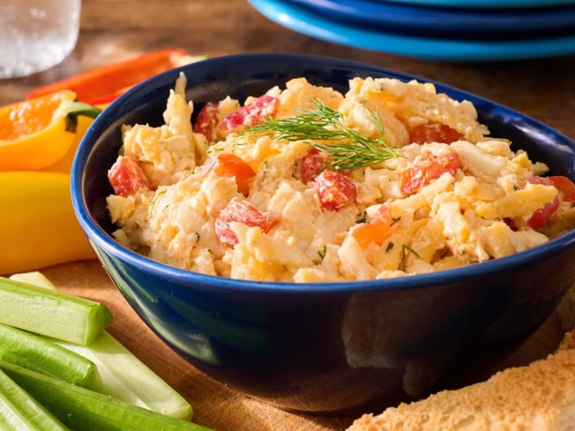

# Pimento Cheese

*The American South's spread: grated sharp cheddar mixed with mayonnaise, pimentos and cracked pepper. Served on crackers or white bread.*

**Serves:** Makes 500 g (10-12 small servings)

**Prep Time:** 15 minutes (plus 30 minutes chilling)

**Cook Time:** 0 minutes

## Overview
Pimento cheese is the Southern spread the New Orleans Creoles adopted as their own, served on crackers at every porch-party and slid in between two slices of soft white bread for a proper Southern sandwich. Sharp cheddar grates on the LARGE holes of a box grater (this is non-negotiable; the small holes give a paste, the large holes give the right rough texture). A small amount of cream cheese softens to bind. Jarred roasted red peppers (pimentos) drain and chop fine. Everything mixes with mayonnaise, Worcestershire, garlic powder, paprika, lots of black pepper, and a tiny pinch of cayenne. Chill for half an hour to let the flavours meld. Eat with crackers, with celery sticks, or made into a sandwich. Keeps a week in the fridge.

## Ingredients
- 400 g mature sharp cheddar cheese (extra-mature or vintage; ORANGE cheddar gives the iconic colour but white works)
- 100 g cream cheese (softened)
- 150 g mayonnaise (Duke's or Hellmann's - Southerners insist on Duke's)
- 100 g jarred pimentos (or roasted red peppers; drained, patted dry, finely diced)
- 1 teaspoon Worcestershire sauce
- 1 teaspoon Dijon mustard
- 1 teaspoon onion powder
- 1 teaspoon garlic powder
- 1 teaspoon sweet paprika
- ½ teaspoon cayenne pepper (less if mild preferred)
- 1 teaspoon ground black pepper (lots - black pepper is a signature)
- ½ teaspoon salt (taste; cheese may be salty enough)

### To serve
- Saltines, Ritz crackers, sourdough crostini, or white sandwich bread
- Sliced celery sticks (stuffing)
- Iced tea (Southern requirement)

## Method

### Stage 1 - Grate cheese
1. Grate the cheddar on the LARGE side of a box grater. Important: cheese pre-grated from a bag has anti-caking agents and won't bind properly. Grate fresh.

### Stage 2 - Soften cream cheese
1. Bring the cream cheese to room temperature 30 minutes before mixing.
1. Beat briefly in a bowl with a fork or hand whisk to smooth out.

### Stage 3 - Combine
1. In a wide bowl, combine the grated cheddar, softened cream cheese, mayonnaise, drained-and-diced pimentos, Worcestershire, mustard, onion powder, garlic powder, paprika, cayenne, black pepper and salt to taste.
1. Stir with a fork; don't over-mix (Southern pimento cheese has visible texture, not paste).

### Stage 4 - Chill
1. Cover; chill at least 30 minutes (1 hour is better; the flavours come together).

### Stage 5 - Serve
1. Bring to room temperature 15 minutes before serving (cold pimento cheese is muted; room temp is brightest).
1. Spread on Ritz crackers or sandwich bread; stuff celery sticks; melt onto a hot grits bowl or burger.

## Notes
- **Sharp orange cheddar is the colour:** Tillamook, Cracker Barrel extra sharp, or Cabot vintage all work. White cheddar tastes great but the iconic appearance is the orange.
- **Duke's mayo, if you can find it:** Southerners ride or die for Duke's (lemon juice, no sugar). Hellmann's / Best Foods is the universal substitute.
- **Don't over-process:** stir with a fork; visible cheese shreds and pepper specks are correct. A food processor turns this into beige paste.
- **Black pepper, lots of it:** distinguishes pimento cheese from generic cheese spread. Use freshly cracked.

## Storage
- Keeps 1 week refrigerated in a sealed container.
- The flavour improves on day 2-3 as the mayo softens the cheese further.
- Doesn't freeze - texture breaks.
