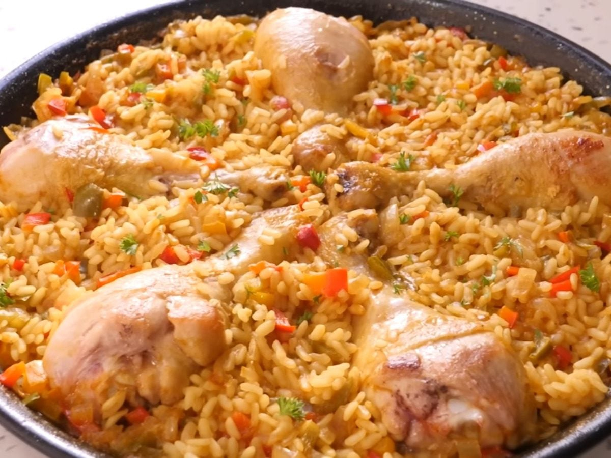

# Arroz con Pollo Cubano

*Cuba's one-pot chicken-and-rice: bone-in chicken simmered with rice in a sofrito-and-beer base with peas, olives, capers and saffron, till the rice absorbs the broth and turns deep yellow.*

**Serves:** 6

**Prep Time:** 25 minutes

**Cook Time:** 55 minutes

## Overview
Arroz con pollo Cubano is Cuba's iconic one-pot chicken-and-rice dish and a Sunday-family classic across the island and the diaspora. Bone-in chicken pieces brown in olive oil, then slow-cook with medium-grain rice in a base of sofrito Cubano, sliced bell peppers, tomato sauce, sazón, saffron (or Bijol, the Cuban yellow seasoning), peas, sliced olives and capers. The traditional Cuban touch is the splash of light lager beer in the cooking liquid; it gives a malty depth that distinguishes the dish from its Puerto Rican cousin. The other differences from the PR version are saffron or Bijol rather than achiote for colour, and a slightly drier final texture, less brothy. Medium-grain rice (Bomba or Calrose) is the Cuban preference, slightly stickier than long-grain and more absorbent. Served family-style from the pot with sliced avocado, lime wedges and a small salad.

## Ingredients

### Chicken and marinade
- 1.2 kg bone-in skin-on chicken pieces (thighs and drumsticks, or whole chicken cut into 8)
- 1 tablespoon adobo seasoning (Cuban-style)
- 1 tablespoon [Sazón](../../base-ingredients/spices/sazon.md)
- 1 teaspoon ground cumin
- 1 teaspoon dried oregano
- 1 teaspoon fine sea salt
- 1 teaspoon ground black pepper
- Juice of 1 lime
- 6 garlic cloves (crushed)

### Cooking
- 3 tablespoons olive oil
- 1 large onion (finely chopped)
- 1 large green bell pepper (finely chopped)
- 1 medium red bell pepper (cut into thin strips)
- 4 garlic cloves (crushed)
- 4 tablespoons sofrito Cubano (or use Puerto Rican sofrito + 1 teaspoon dried oregano)
- 3 tablespoons tomato paste
- 200 ml tomato sauce

### Rice and liquid
- 500 g medium-grain rice (or long-grain; rinsed 2-3 times)
- 350 ml Cuban or light lager beer (Cristal, Cuban-style; or any light beer)
- 500 ml hot chicken stock
- Generous pinch of saffron threads (infused in 2 tablespoons warm water; or 1 teaspoon Bijol seasoning)
- 2 bay leaves
- 1 tablespoon [Sazón](../../base-ingredients/spices/sazon.md)
- 1 ½ teaspoons fine sea salt
- 1 teaspoon ground cumin
- 1 teaspoon dried oregano

### Additions
- 200 g frozen peas
- 100 g pitted green olives (sliced)
- 2 tablespoons capers (drained)
- 1 large red bell pepper (cut into strips; for the topping/garnish)

### To finish
- 1 small bunch fresh coriander (chopped)
- Lime wedges
- Sliced avocado

### To serve
- Fresh green salad
- Cristal beer or mojito

## Method

### Stage 1 - Marinate the chicken
1. Pat the chicken dry.
2. Combine the adobo, sazón, cumin, oregano, salt, pepper, lime juice and crushed garlic; rub into the chicken.
3. Let stand 30 minutes (or overnight in the fridge).

### Stage 2 - Brown the chicken
1. Heat the olive oil in a wide heavy pot over medium-high heat.
2. Brown the chicken pieces 4-5 minutes per side till deep golden.
3. Lift out and set aside.

### Stage 3 - Build the base
1. Reduce heat to medium.
2. Add the chopped onion and bell peppers to the pot; cook 7-8 minutes till soft.
3. Add the crushed garlic; cook 30 seconds.
4. Add the sofrito Cubano and tomato paste; cook 2 minutes till deepened.
5. Add the tomato sauce; cook 3 minutes.

### Stage 4 - Add rice and liquid
1. Add the rinsed rice to the pot; stir for 1 minute to coat.
2. Pour in the beer; let bubble for 30 seconds (the alcohol cooks off).
3. Add the hot chicken stock.
4. Stir in the saffron-water infusion (or Bijol), bay leaves, sazón, salt, cumin and oregano.
5. Stir once.

### Stage 5 - Add chicken and cook
1. Return the browned chicken to the pot, nestling into the rice.
2. The chicken should be partially submerged; the rice fully covered with liquid.
3. Bring to a gentle simmer.
4. Reduce heat to lowest; cover with a tight-fitting lid.
5. Cook 30 minutes covered (don't lift the lid).

### Stage 6 - Add additions
1. Lift the lid; scatter the peas, olives, capers and red pepper strips over the rice.
2. Cover again; cook 5 more minutes.

### Stage 7 - Rest
1. Take off the heat; keep the lid on.
2. Rest 10 minutes; the rice finishes steaming.

### Stage 8 - Fluff and serve
1. Uncover; gently fluff the rice with a fork (don't disturb the chicken too much).
2. The rice should be a deep yellow-orange colour.
3. Scatter chopped coriander over.
4. Serve family-style from the pot with sliced avocado, lime wedges and a fresh salad.

## Notes
- **Beer in the cooking:** the traditional Cuban touch. Light lager (Cristal if you can find it; or any light Mexican/American lager). Don't substitute with dark beer.
- **Saffron or Bijol:** for the proper yellow colour. Bijol is the easy Cuban substitute available at Latin markets.
- **Medium-grain rice:** gives the proper Cuban texture. Long-grain works as substitute.
- **Don't lift the lid:** the rice cooks by absorption-and-steam. 30 minutes covered, then 10 minutes resting.
- **Bone-in chicken for flavour:** the bones release flavour into the rice.

## Variations
- **With chorizo:** add 200 g of sliced chorizo to the pot in stage 3; gives a richer fattier version.
- **With seafood (arroz con pollo y mariscos):** add 200 g of cooked shrimp in the last 5 minutes; turns the dish into a paella-leaning special-occasion meal.
- **Without beer (kid-friendly):** swap the beer for 350 ml of chicken stock; less traditional but works for children.
- **Vegetarian (arroz amarillo Cubano):** skip the chicken; use vegetable stock; add 1 tin of chickpeas + extra vegetables. The rice is the star.

## Serving
- Family-style from the pot at the centre of the table. Sliced avocado, lime wedges, fresh salad. Drink: cold Cristal beer, mojito, or fresh limonada.

## Storage
- Keeps refrigerated 4 days; the flavour deepens overnight.
- Reheat gently in a covered pan with a splash of stock or water.
- Freezes 3 months in portions; defrost in the fridge.
- Day-old arroz con pollo is excellent for lunch; some Cuban cooks deliberately make a day ahead.
