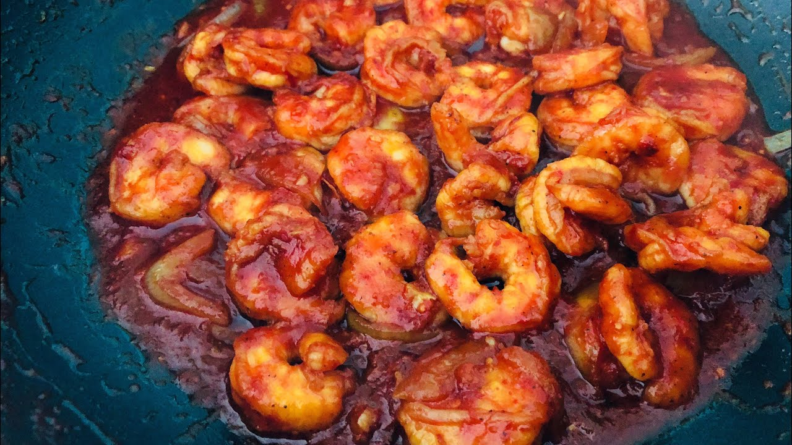

# Camarones Enchilados

*Cuba's shrimp in spicy tomato sauce: large shrimp simmered in a sofrito-tomato base with bell peppers, onions, garlic, olives, capers, white wine and a generous touch of Aleppo pepper, into a thick orange-red shrimp stew. The Cuban-coastal classic, eaten over white rice with sweet plantains and a cold beer.*

**Serves:** 4

**Prep Time:** 20 minutes

**Cook Time:** 25 minutes

## Overview
Camarones enchilados is Cuba's most beloved shrimp dish and a coastal-Cuban specialty. In Cuban Spanish, "enchilado" means "in spicy sauce", not the Mexican rolled tortilla dish (the name catches plenty of people out). Large shrimp simmer in a sofrito-tomato base with sliced onions, bell peppers, crushed garlic, white wine, a splash of dry sherry, sliced olives, capers, bay leaves and Aleppo pepper, till the sauce reduces into a thick orange-red coating around them. The sofrito-tomato base is what makes the dish Cuban rather than generic shrimp-in-tomato, and the splash of dry sherry is the traditional Cuban touch that adds a slightly sweet depth. Don't overcook the shrimp: they go from sweet to rubbery in sixty seconds, so add them at the end and cook for three or four minutes maximum. Cubans make this dish when they want seafood with more substance than the simpler camarones al ajillo. Eat over plain white rice with black beans, sweet plantains and a fresh salad.

## Ingredients

### Shrimp
- 600 g large raw shrimp (16-20 count per kg; peeled and deveined)
- 1 teaspoon fine sea salt
- 1 teaspoon ground black pepper
- 1 teaspoon Aleppo pepper
- Juice of 1 lime

### Sauce
- 4 tablespoons olive oil
- 4 tablespoons sofrito Cubano (or substitute Puerto Rican sofrito)
- 1 large onion (finely chopped)
- 1 medium green bell pepper (finely chopped)
- 1 medium red bell pepper (finely chopped)
- 6 garlic cloves (crushed)
- 3 tablespoons tomato paste
- 1 tin (400 g) chopped tomatoes
- 200 ml dry white wine
- 60 ml dry sherry (or extra white wine + 1 tablespoon brown sugar)
- 1 tablespoon Aleppo pepper or smoked paprika
- 1 tablespoon dried oregano
- 1 teaspoon ground cumin
- 1 ½ teaspoons fine sea salt
- 1 teaspoon ground black pepper
- 80 g pitted green olives (sliced)
- 2 tablespoons capers (drained)
- 2 bay leaves
- 1 small fresh chilli (sliced, optional)

### To finish
- 1 small bunch fresh coriander (chopped)
- Juice of 1 lime

### To serve
- Plain white rice
- Black beans
- Sweet plantains (maduros)
- Crusty bread (for mopping the sauce)
- Lime wedges
- Cristal beer

## Method

### Stage 1 - Season the shrimp
1. Pat the shrimp dry.
2. Toss with salt, pepper, Aleppo pepper and lime juice.
3. Set aside while you make the sauce.

### Stage 2 - Build the sauce
1. Heat the olive oil in a wide heavy pan over medium heat.
2. Add the sofrito, chopped onion and bell peppers; cook 8-10 minutes till soft.
3. Add the crushed garlic; cook 30 seconds.
4. Add the tomato paste; cook 2 minutes till deepened.
5. Add the chopped tomatoes; cook 4-5 minutes till they break down.
6. Pour in the white wine; let bubble 30 seconds.
7. Add the sherry (or substitute); let bubble 30 seconds.
8. Stir in the Aleppo pepper, oregano, cumin, salt and pepper.
9. Add the olives, capers and bay leaves.
10. Simmer 5 minutes till the sauce is thick and glossy.

### Stage 3 - Add the shrimp
1. Add the seasoned shrimp to the sauce.
2. Stir to coat thoroughly.
3. Add the chopped chilli if using.
4. Cover with the lid; cook 3-4 minutes till the shrimp turn pink and curl.
5. Don't overcook; check by lifting one shrimp, when it's pink throughout and the flesh is just opaque, it's done.

### Stage 4 - Finish
1. Take off the heat.
2. Lift out the bay leaves.
3. Squeeze the lime juice over.
4. Stir in most of the chopped coriander; reserve some for garnish.
5. Taste; adjust salt.

### Stage 5 - Serve
1. Spoon hot white rice into deep bowls.
2. Ladle the camarones enchilados generously over.
3. Add a portion of black beans and 2-3 slices of plantain alongside.
4. Scatter the reserved coriander over.
5. Lime wedges and crusty bread on the side for mopping the sauce.

## Notes
- **Don't overcook the shrimp:** 3-4 minutes maximum. Pink and just-opaque; not rubbery.
- **Sofrito Cubano:** the traditional base. Don't skip.
- **Dry sherry is the Cuban touch:** adds a slight sweetness that distinguishes the dish.
- **Olives and capers for brininess:** Cuban character.
- **Add shrimp at the end:** the sauce should be fully developed before shrimp go in.

## Variations
**Lobster enchilada (langosta enchilada):** swap the shrimp for lobster tails (split lengthwise); cook 5-6 minutes. The luxurious special-occasion version.
**Chicken enchilado:** swap the shrimp for diced chicken thigh (browned first); simmer 15 minutes till cooked through. Variation for non-shellfish diners.
**Spicier:** double the Aleppo pepper and add 1 chopped habanero; properly Caribbean fierce.
**With coconut milk:** add 200 ml of coconut milk to the sauce in stage 2; gives a more tropical Cuban-Caribbean variation.

## Serving
Over white rice with black beans, sweet plantains, fresh salad. Crusty bread for mopping the sauce. Drink: cold Cristal beer, fresh mojito, or sparkling cidra. As a Cuban family dinner.

## Storage
- Best eaten immediately; shrimp goes off-texture when reheated.
- Keeps refrigerated 2 days; reheat gently in a covered pan over low heat for 2 minutes.
- The sauce alone keeps refrigerated 5 days and freezes 3 months; cook fresh shrimp in the reheated sauce.
- Don't freeze with the shrimp; the texture suffers.
