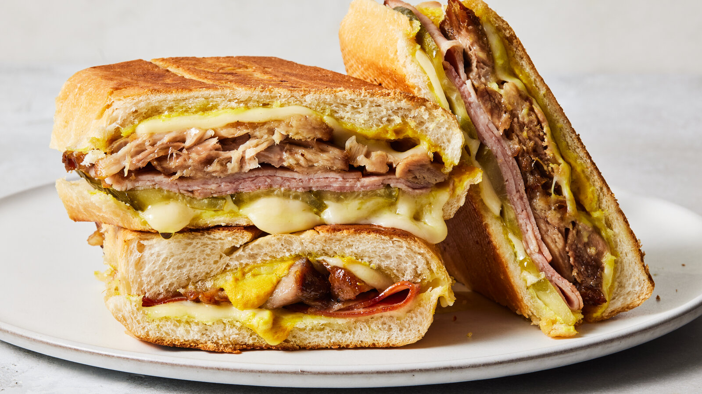

# Cubano Sandwich

*Cuba's iconic pressed sandwich: a long Cuban bread roll layered with thinly sliced roasted pork, ham, Swiss cheese, dill pickles and yellow mustard, pressed in a hot plancha or panini press till the bread crisps deeply and the cheese melts. The Miami-Tampa Cuban-American classic, the lunch-time signature of every Cuban café.*

**Serves:** 4

**Prep Time:** 15 minutes (plus pre-roasted pork)

**Cook Time:** 12 minutes

## Overview
The Cubano sandwich is one of the most iconic sandwiches in the world and the traditional Cuban-American lunch: a long Cuban bread roll (similar to a French baguette but with lard in the dough for a softer crumb) split lengthwise, lightly mustarded inside, then layered with thinly sliced slow-roasted Cuban pork (lechón asado, marinated in mojo), thinly sliced ham, Swiss cheese and dill pickles. Pressed in a hot plancha or panini press till the bread crisps deeply on both sides, the cheese melts into the meats and the whole sandwich compresses into a thin crispy slab. Miami uses pork, ham and cheese only; Tampa adds Genoa salami, reflecting the city's mixed Spanish, Italian and Cuban heritage. Both are valid. Cuban bread (pan Cubano) is essential; a regular French baguette gives a tougher result. The meats must be sliced thin so they meld together under the press. Cut on the diagonal and served with mariquitas or papas fritas.

## Ingredients

### Bread
- 2 loaves Cuban bread (about 30 cm each); or 4 Portuguese rolls; or 1 French baguette cut into 4 sections (about 15 cm each)

### Inside layers
- 4 tablespoons yellow mustard (the traditional American-Cuban mustard)
- 300 g thinly sliced cooked Cuban pork (lechón asado; see the recipe; or use leftover slow-roasted pork shoulder)
- 200 g thinly sliced sweet ham (or Black Forest ham)
- 80 g thinly sliced Genoa salami (optional; for the Tampa version)
- 200 g sliced Swiss cheese (or substitute Gruyère or aged Cheddar)
- 8-12 dill pickle slices (sandwich-cut pickles)

### Pressing
- 4 tablespoons unsalted butter (softened; for brushing the outside of the bread)

### To serve
- Mariquitas (plantain chips) or papas fritas (potato fries)
- Sliced fresh salad or coleslaw
- Sliced jalapeños (for non-traditional heat)
- Lime wedges

## Method

### Stage 1 - Prepare the bread
1. Cut each Cuban bread loaf in half lengthwise (split open like a long sandwich roll). If using a baguette, cut into 4 sections and split each.
2. Don't cut all the way through; keep a hinge along one side.

### Stage 2 - Layer the fillings
1. Spread a thin layer of yellow mustard on the inside of both halves of each loaf.
2. Layer the meats and cheese (in this order): half the sliced pork on the bottom; half the ham over; half the salami if using; half the Swiss cheese on top.
3. Add 2-3 pickle slices spread along the length.
4. Repeat the cheese layer at the very top (some Cuban cooks like cheese on both sides for proper meltiness): 2-3 more slices of cheese.
5. Close the sandwich.

### Stage 3 - Brush the outside
1. Brush the top and bottom of each sandwich with softened butter.
2. The butter helps the crust crisp dramatically in the press.

### Stage 4 - Press the sandwich
1. Heat a panini press to medium-high (or a heavy frying pan over medium heat).
2. If using a frying pan: place the sandwich; weight with another heavy pan (or a foil-wrapped brick); press firmly.
3. Cook 4-5 minutes; flip if using a frying pan; cook another 4-5 minutes.
4. The bread should be deeply golden, crispy and compressed; the cheese melted; the inside hot.
5. If using a panini press: cook 6-8 minutes total.

### Stage 5 - Cut and serve
1. Lift the sandwich onto a board.
2. Let rest 1-2 minutes (the cheese is molten; let it set slightly).
3. Cut diagonally in half.
4. Serve immediately with mariquitas or papas fritas, sliced salad, and lime wedges.

## Notes
- **Cuban bread is traditional:** the lard-enriched soft Cuban bread is what gives the proper character. Portuguese rolls are the closest substitute; French baguette gives a tougher result.
- **Press firmly:** the compression is what makes the sandwich a Cubano. Don't go light on the press.
- **Cheese on both sides:** some Cuban cooks put cheese as the layer touching the bread (top and bottom); this melts into the bread giving the proper gooey result.
- **Yellow mustard, not Dijon:** yellow American mustard is the traditional Cuban-American choice. Dijon is too sharp.
- **No mayo or lettuce:** the Cubano sandwich is precisely defined. No mayonnaise, no lettuce, no tomato. The simplicity is the point.

## Variations
**Medianoche (the "midnight" version):** swap the Cuban bread for a soft sweet egg-bread roll (pan suave); same fillings; pressed the same way. Sweeter softer version eaten in Cuba at midnight after parties.
**With salami (Tampa-style):** include 80 g of thinly sliced Genoa salami; reflects the Italian-Cuban heritage of Tampa's Ybor City.
**Pan con bistec:** swap the pork-and-ham for a thin minute-steak, with onions; less traditional but a related Cuban classic.
**Vegetarian Cubano:** swap the meats for grilled portobello mushrooms + roasted red peppers; keep cheese and pickles; still excellent pressed.

## Serving
Cut diagonally on a board, with mariquitas (plantain chips) on the side. A cold Cristal beer or a mojito. Or a glass of cafe Cubano (the strong Cuban espresso) for the morning version. At lunch at any Cuban café in Miami or Tampa; or at home with proper Cuban bread.

## Storage
- Best eaten immediately while crispy.
- Don't refrigerate assembled; the bread goes soggy.
- The components (cooked pork, ham, cheese, pickles) keep separately for 4 days; assemble and press fresh.
- Pre-pressed sandwiches reheat poorly; press fresh for each serving.
- Don't freeze; the texture suffers completely.
