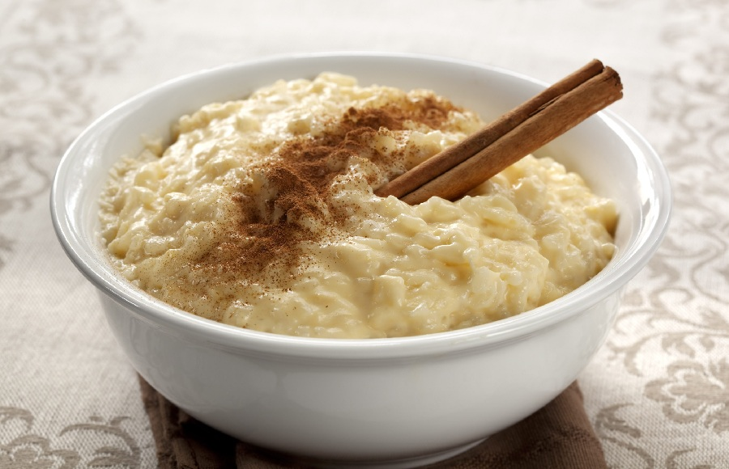

# Arroz Con Leche

*Cuban rice pudding: short-grain rice slow-cooked in whole milk with cinnamon, lemon zest, vanilla and condensed milk. Eaten warm or cold, dusted with cinnamon.*

**Serves:** 6

**Prep Time:** 5 minutes

**Cook Time:** 45 minutes

## Overview
Short-grain rice (paella-style or pudding rice) cooks slow in a mix of water then whole milk, infused with cinnamon stick and lemon zest. Once the rice is tender, sweetened condensed milk goes in for richness and sweetness, along with vanilla and a pinch of salt. Cooked a little longer until creamy and just-thick (it firms further as it cools). Optional finish with butter or egg yolk; dusted with cinnamon to serve.

## Ingredients

- 150 g short-grain rice (paella rice, pudding rice or arborio - not basmati or long-grain)
- 500 ml water
- 1 cinnamon stick
- 1 strip of lemon zest (about 5 cm long, no pith)
- 1 strip of orange zest (optional)
- A pinch of salt
- 750 ml whole milk
- 1 × 397 g tin sweetened condensed milk
- 1 teaspoon vanilla extract
- 20 g unsalted butter (optional, for richness)
- 1 large egg yolk (optional, for a custardy finish)

### To serve
- Ground cinnamon, for dusting
- Optional: a tablespoon of raisins per serving, soaked in 1 tablespoon dark rum or hot water

## Method

### Stage 1 - Rice in water
1. Rinse the rice in cold water until the water runs clear; drain.
2. Place in a heavy saucepan with the 500 ml water, cinnamon stick, lemon zest, orange zest (if using) and salt.
3. Bring to the boil; reduce to a gentle simmer.
4. Cook uncovered 12-15 minutes, stirring occasionally, until the rice is half-cooked and most of the water has been absorbed.

### Stage 2 - Add the milk
1. Pour in the whole milk; stir.
2. Reduce the heat to low (the milk catches and burns easily).
3. Cook 20-25 minutes, stirring often (every 2-3 minutes), until the rice is tender and the mixture is creamy but still loose. It will thicken as it cools.

### Stage 3 - Sweeten
1. Stir in the condensed milk and vanilla; cook another 5-6 minutes over low heat until the pudding has just thickened to your liking. It should coat the back of a spoon and drop in soft, slow blobs.
2. Off the heat, stir in the butter if using.
3. For a richer, custardy version: beat the egg yolk with 2 tablespoons of the hot pudding to temper, then stir back into the pot. Cook 30 seconds more over low heat to set the yolk (don't boil).
4. Fish out and discard the cinnamon stick and citrus zest strips.
5. Taste; if you want it sweeter, add a tablespoon more condensed milk.

### Stage 4 - Serve
1. Divide between glasses, ramekins or shallow bowls.
2. Top each with a spoonful of rum-soaked raisins (if using).
3. Dust generously with ground cinnamon.
4. Serve warm, or chill and serve cold.

## Notes
- **Short-grain rice:** Paella, pudding or arborio - the starch is what makes the pudding creamy. Long-grain or basmati won't give the right texture: the grains stay separate and the milk stays thin.
- **Condensed milk over plain sugar:** The Cuban version uses sweetened condensed milk for richness and a slight caramel note. Substituting with plain sugar gives a thinner, less rich pudding.
- **Cinnamon stick, not powder:** Powder makes the pudding dusty-grey. The stick infuses cleanly and lifts out.
- **Stir often:** Milk on the base of the pan catches and burns; the burn taints the whole pot. Stir every few minutes.
- **It thickens on cooling:** Pull it off the heat when it looks slightly looser than you want; it sets up firm in the fridge.

## Variations
**Coconut (arroz con leche de coco):** Replace half the whole milk with coconut milk; tropical, lush.
**Chocolate:** Stir in 60 g grated dark chocolate at the end of cooking.
**With raisins (con pasas):** Add 60 g raisins (soaked in 2 tablespoons rum or warm water for 10 minutes) at the same time as the condensed milk.
**Spanish-style:** Skip the condensed milk; use 80 g caster sugar instead, and serve with a thicker dusting of cinnamon.

## Serving
Serve warm in glass cups for a comforting after-dinner sweet, or cold from the fridge for a hot-day pudding. A small glass of dark rum on the side is traditional.

## Storage
- Keeps 4 days refrigerated, covered.
- Thickens significantly when cold: loosen with a splash of warm milk if needed.
- Don't freeze: the rice goes grainy.
