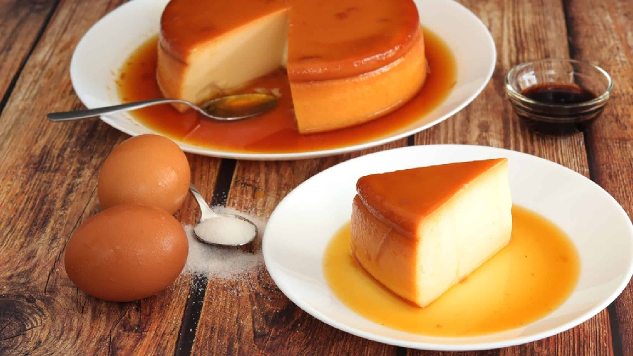

# Flan Cubano

*Cuba's caramel custard: a dense, glossy flan of condensed and evaporated milk with whole eggs, set firm and unmoulded under a deep mahogany caramel.*

**Serves:** 8

**Prep Time:** 20 minutes

**Cook Time:** 1 hour (plus 6 hours chilling)

## Overview
A dry caramel is made by melting sugar to a deep amber and poured into the bottom of a flan mould (or individual ramekins). A custard of whole eggs, condensed milk, evaporated milk, vanilla and a pinch of salt is whisked together (no whipping, no air bubbles), poured over the set caramel, and baked in a water bath at low heat until just set with a slight wobble in the centre. Chilled overnight; inverted to serve, the caramel sliding down the sides in a glossy sauce.

## Ingredients

### Caramel
- 200 g caster sugar
- 3 tablespoons water (for a wet caramel, which is more forgiving for beginners)

### Custard
- 4 whole eggs (large)
- 2 egg yolks (large)
- 397 g tin sweetened condensed milk
- 410 g tin evaporated milk
- 1 ½ teaspoons vanilla extract
- ¼ teaspoon salt
- Optional: zest of ½ lemon (or 1 cinnamon stick infused into the milks)

## Method

### Stage 1 - Caramel
1. Heat the oven to 160°C (140°C fan). Have a 22 cm round cake tin or a flan mould ready (a metal one transfers heat best), plus a deep roasting tin large enough to hold it.
2. Combine the sugar and water in a small saucepan. Heat over medium, swirling but not stirring, until the sugar dissolves.
3. Continue cooking, without stirring, until the syrup turns a deep amber colour, about 6-8 minutes. Watch closely once it starts to colour: it goes from caramel to burnt in 30 seconds.
4. Immediately pour into the warm flan tin; tilt to coat the base in a thin even layer. The caramel will harden almost at once.
5. Set aside (the caramel will redissolve in the oven).

### Stage 2 - Custard
1. In a large jug or bowl, whisk the whole eggs and yolks gently with a fork. Don't whip: bubbles in the custard mean bubbles in the finished flan.
2. Add the condensed milk; whisk smooth.
3. Add the evaporated milk, vanilla and salt; whisk just to combine.
4. Strain through a fine sieve into another jug. This catches any white strands or shell fragments and gives a glassy finish.
5. If you used a cinnamon stick or lemon zest, leave it to infuse in the strained custard for 10 minutes then remove.

### Stage 3 - Bake
1. Pour the strained custard over the caramel layer. If foam forms on top, skim or pop bubbles with a toothpick.
2. Cover the tin tightly with foil.
3. Place in the deep roasting tin. Fill the roasting tin with hot water to come halfway up the sides of the flan tin (this water bath, or baño maría, is what makes the custard silky rather than rubbery).
4. Carefully transfer to the oven. Bake 55-65 minutes for a 22 cm tin; check at 50 minutes. The custard is ready when it's just set around the edges with a 5 cm diameter wobbly centre that jiggles as one piece (not liquid).
5. Lift the flan tin out of the water bath; cool to room temperature on a rack.
6. Refrigerate at least 6 hours, ideally overnight. The caramel partially dissolves into a sauce during this rest.

### Stage 4 - Unmould and serve
1. Run a thin knife around the edge of the flan to loosen.
2. Place a deep serving plate or shallow bowl upside down over the tin.
3. Invert in one swift, confident motion. Lift the tin; the flan will release with the caramel sauce sliding down the sides.
4. Slice into wedges (a hot dry knife gives clean cuts). Spoon the pooled caramel sauce over each portion.

## Notes
- **Condensed and evaporated milk together:** This is the Cuban signature. Pure cream or milk gives a lighter French-style flan; the two tinned milks together are what makes flan cubano dense, glossy and intensely sweet.
- **Don't whip the eggs:** Whisk gently to combine. Aerated custard = honeycombed flan.
- **Strain the custard:** Catches the strands of egg white that never break down, gives a perfectly glassy surface. Worth the 30 seconds.
- **Water bath:** Non-negotiable. Direct heat curdles the custard into something rubbery. The water bath keeps the temperature gentle and even.
- **Wobble test:** A 5 cm centre that wobbles in one piece is done. If it ripples liquid, give it another 5 minutes. Overcooked flan has tiny holes throughout.
- **Overnight rest:** The caramel needs time to liquefy into sauce. Don't try to unmould before 6 hours; it'll come out dry.

## Variations
**Coconut (flan de coco):** Replace half the evaporated milk with coconut milk; reduce vanilla to 1 teaspoon.
**Coffee (flan de café):** Dissolve 1 tablespoon instant espresso powder in the warm milks.
**Cheese (flan de queso):** Whisk 200 g cream cheese (room temperature) into the milks for a denser, almost cheesecake-like flan.

## Serving
Serve cold from the fridge in wedges, with the caramel sauce spooned over. A few segments of orange or strawberries on the side cut the sweetness.

## Storage
- Keeps 4 days refrigerated, covered, in or out of the tin.
- Don't freeze: the custard goes grainy.
