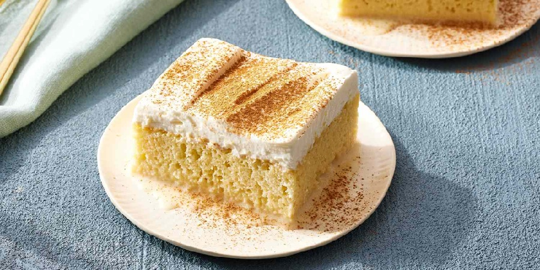

# Tres Leches

*The pan-Latin celebration cake: a light sponge drowned in evaporated milk, condensed milk and cream, crowned with whipped cream and a dust of cinnamon.*

**Serves:** 10 to 12

**Prep Time:** 20 minutes

**Cook Time:** 30 minutes (plus 6 hours soaking)

## Overview
A simple egg sponge bakes in a deep tin (no butter, no oil; the cake stays light so it can drink). While still warm, it's pricked all over and a mixture of three milks is poured over the top: evaporated, sweetened condensed and double cream. The cake absorbs the milk over several hours of refrigeration. Just before serving, topped with softly whipped cream and a dusting of cinnamon.

## Ingredients

### Sponge
- 5 large eggs (separated, at room temperature)
- 200 g caster sugar (split: 130 g for yolks, 70 g for whites)
- 1 teaspoon vanilla extract
- 150 g plain flour
- 1 teaspoon baking powder
- A pinch of salt
- 60 ml whole milk

### Three milks soak
- 1 × 397 g tin sweetened condensed milk
- 1 × 410 g tin evaporated milk
- 250 ml double cream
- 1 teaspoon vanilla extract
- 1 tablespoon dark rum (optional, traditional)

### Topping
- 400 ml double cream (cold)
- 2 tablespoons icing sugar
- 1 teaspoon vanilla extract
- Ground cinnamon, for dusting

## Method

### Stage 1 - Sponge
1. Heat the oven to 180°C (160°C fan). Lightly grease a 30 × 20 cm baking tin (deep, at least 5 cm) and line the base with parchment.
2. Whisk the yolks with 130 g of the sugar and the vanilla until pale and thick, 3-4 minutes.
3. In a separate bowl, whip the whites with the salt to soft peaks. Add the remaining 70 g sugar in three additions, whipping to stiff glossy peaks.
4. Sift the flour and baking powder over the yolk mixture; fold gently to combine.
5. Add the milk; fold in.
6. Fold one third of the whites into the batter to lighten; then fold in the rest in two additions. Stop folding as soon as the batter is uniform.
7. Pour into the prepared tin; smooth the top.
8. Bake 25-30 minutes until pale golden and a skewer comes out clean. The sponge will be light and dry; that's correct (it needs to be able to absorb the soak).

### Stage 2 - Soak mixture
1. While the cake bakes, whisk the condensed milk, evaporated milk, double cream, vanilla and rum (if using) together in a jug.

### Stage 3 - Soak
1. While the sponge is still warm (5 minutes out of the oven, in the tin), prick all over deeply with a thin skewer or a fork: every 1 cm in both directions, going right through to the base.
2. Pour the three-milk mixture slowly over the warm cake, allowing it to soak in. It will look like far too much liquid; trust it.
3. Cover the tin with cling film or foil and refrigerate at least 6 hours, ideally overnight. The sponge should fully absorb the milk; any liquid pooled at the base will be absorbed during the rest.

### Stage 4 - Topping and serve
1. Whip the double cream with the icing sugar and vanilla to soft peaks (not stiff: it should still flow gently from a spoon).
2. Spread thickly over the soaked cake right in the tin.
3. Dust the top with cinnamon (a fine sieve gives an even layer).
4. Cut into squares and serve cold, ideally with a small pool of the soaking liquid spooned over each slice.

## Notes
- **Drying sponge is the point:** Don't reach for a moist, buttery sponge recipe. The dry, light egg sponge is what makes tres leches work: it has the structure and capacity to drink the soak without collapsing.
- **Prick deeply:** A shallow prick won't carry milk to the base. Go straight through, every cm.
- **Refrigerate overnight:** The flavour and texture transform between 6 and 24 hours of resting. Plan ahead.
- **Soft-peak topping, not stiff:** Stiff whipped cream sits on top like a wig; soft peaks fold into the wet sponge naturally.
- **Cinnamon over cocoa:** Cinnamon is traditional in Cuban and Nicaraguan versions. Some Mexican versions use cocoa.

## Variations
**Cuatro leches (four milks):** Add 60 g grated white chocolate to the cream as you heat it gently; cool then add to the soak. Richer, slightly thicker.
**Chocolate tres leches:** Replace 30 g of the flour in the sponge with cocoa powder; add 30 g grated dark chocolate to the warm soak.
**With fruit:** Top with sliced strawberries, mango or peach alongside the cream layer.
**Coffee tres leches:** Add 1 tablespoon instant espresso to the warm soak.

## Serving
Serve cold from the fridge, in squares cut directly from the tin, with the soaking liquid spooned alongside. A few fresh strawberries or a strawberry compote cuts the sweetness beautifully.

## Storage
- Keeps 3 days refrigerated, covered, in the tin.
- Improves between day 1 and day 2; day 3 is still good.
- Don't freeze: texture is destroyed.
