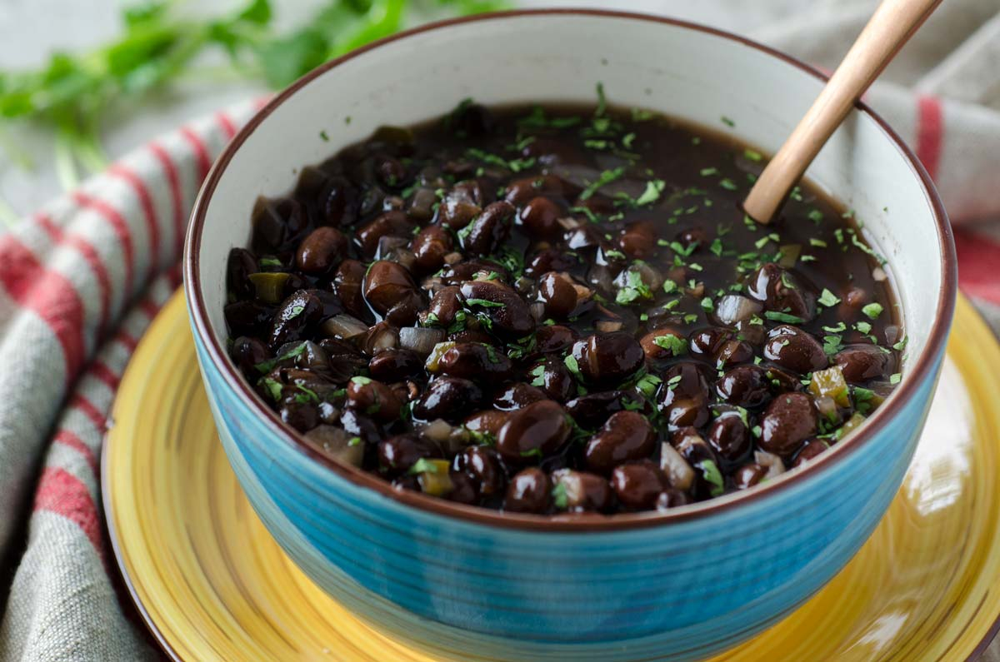

# Frijoles Negros

*Cuba's black beans: dried black beans slow-cooked with sofrito, bell pepper, garlic, bay leaves, oregano and a splash of red wine vinegar till the beans go silky and the broth thickens to a glossy mahogany. The Cuban national bean dish, the traditional accompaniment to white rice (the combination known as "arroz con frijoles negros" or simply "frijoles") for every Cuban meal.*

**Serves:** 6-8 (vegetarian)

**Prep Time:** 15 minutes (plus overnight soaking)

**Cook Time:** 2 hours

## Overview
Frijoles negros is Cuba's national bean dish and one of the most foundational staples of Cuban cooking. Dried black beans (turtle beans or Hispanic black beans) soak overnight, then slow-cook with a sofrito Cubano of onion, bell pepper, garlic and oregano, plus bay leaves, cumin and a splash of red wine vinegar at the end. After an hour and a half to two hours the beans turn properly tender, the bean starches release naturally and the whole pot reduces to a thick glossy mahogany-brown stew. Three things make the dish properly Cuban: dried beans (canned gives a different less Cuban result), sofrito Cubano with a generous amount of green bell pepper (unusual in some bean traditions but traditional here), and vinegar added at the end to brighten the dish and give the proper Cuban tang. Eat with plain white rice (arroz con frijoles negros, or simply "frijoles"), the traditional side for every Cuban meal: lechón asado, ropa vieja, picadillo, vaca frita. Also one of the great vegetarian Cuban offerings on its own.

## Ingredients

### Beans
- 500 g dried black beans (turtle beans / Hispanic black beans)
- Cold water for soaking
- 2.5 litres water (or vegetable stock; for cooking)

### Sofrito and aromatics
- 4 tablespoons olive oil
- 2 large onions (finely chopped)
- 1 large green bell pepper (finely chopped)
- 1 small red bell pepper (finely chopped)
- 10 garlic cloves (crushed)
- 4 tablespoons sofrito Cubano (or homemade onion-garlic-pepper paste)
- 2 tablespoons tomato paste
- 2 bay leaves
- 2 tablespoons ground cumin
- 1 tablespoon dried oregano
- 1 tablespoon sazón (optional)
- 2 teaspoons fine sea salt (taste; adjust later)
- 1 teaspoon ground black pepper
- 1 teaspoon caster sugar (the traditional Cuban touch; balances the acidity)
- 1 small fresh chilli (deseeded, optional)

### Vinegar finish (traditional)
- 3 tablespoons red wine vinegar (or sherry vinegar)
- 1 small bunch fresh coriander (chopped)

### To serve
- Plain white rice
- Sliced raw red onion (the traditional topping)
- Sliced avocado
- Lime wedges
- Hot sauce or Aji caballero
- Crusty Cuban bread

## Method

### Stage 1 - Soak the beans (the night before)
1. Place the dried beans in a wide bowl.
2. Cover with cold water by 5 cm.
3. Soak overnight (12 hours).
4. Drain; rinse under cold water.

### Stage 2 - Start the beans
1. Place the drained beans in a large heavy pot.
2. Add 2.5 litres of water (or vegetable stock).
3. Bring to a boil; reduce to a simmer.
4. Cook 45 minutes uncovered; the beans should begin to soften.
5. Skim any foam that rises to the surface.

### Stage 3 - Build the sofrito
1. While the beans simmer, make the sofrito base.
2. Heat the olive oil in a wide pan over medium heat.
3. Add the chopped onions and bell peppers; cook 10 minutes till deeply soft.
4. Add the crushed garlic; cook 30 seconds.
5. Add the sofrito Cubano and tomato paste; cook 2 minutes till deepened.

### Stage 4 - Combine with beans
1. Tip the sofrito into the bean pot.
2. Stir to combine.
3. Add the bay leaves, cumin, oregano, sazón (if using), salt, pepper, sugar and chilli.
4. Continue cooking with the lid slightly ajar for 60-75 more minutes till the beans are completely tender and the broth has thickened to a mahogany-brown stew.
5. Use the back of a wooden spoon to mash a few beans against the side of the pot to thicken the broth.

### Stage 5 - Vinegar finish
1. In the last 5 minutes of cooking, stir in the red wine vinegar.
2. Taste; adjust salt and pepper.
3. Stir in most of the chopped coriander.

### Stage 6 - Serve
1. Spoon hot white rice into bowls or onto plates.
2. Ladle generous portions of frijoles negros over (or alongside).
3. Top each portion with raw sliced red onion (the traditional Cuban garnish).
4. Add sliced avocado and lime wedges.
5. Pass hot sauce at the table.

## Notes
- **Soak the beans overnight:** shortens cooking and gives properly tender beans. Don't skip.
- **Bell pepper is traditional Cuban:** the generous green bell pepper in the sofrito distinguishes Cuban frijoles from generic bean dishes.
- **Vinegar at the end:** the small splash brightens the dish. Don't add early; the heat dulls the vinegar's brightness.
- **Sugar balances the acid:** the 1 teaspoon of sugar is a traditional Cuban touch. Skipping is fine but the proper balance includes it.
- **Raw red onion on top:** the traditional Cuban garnish. Crunchy and sharp; cuts through the rich beans.

## Variations
- **Frijoles con cerdo (with pork):** add a smoked ham hock (or 150 g of bacon) at stage 2; cook with the beans. Common non-vegetarian variation.
- **Frijoles con chorizo:** add 200 g of sliced chorizo to the sofrito in stage 3; renders fat into the beans.
- **Spicier:** double the chilli and add 1 chopped habanero; properly Caribbean fierce.
- **Cuban black bean soup (sopa de frijoles negros):** thin the cooked beans with additional stock; serve as a soup with rice as a side rather than the base.

## Serving
- Alongside (or over) white rice as the traditional Cuban side. With ropa vieja, picadillo, vaca frita, lechón asado, or any Cuban main. Topped with raw red onion. Drink: Cristal beer, mojito, fresh limeade.

## Storage
- Keeps refrigerated 5 days; flavour deepens significantly overnight (often considered better the next day).
- Reheat gently in a covered pan over low heat with a splash of water.
- Freezes 6 months in portions; defrost in the fridge.
- Day-old frijoles negros are a Cuban breakfast staple over rice with a fried egg.
- The beans get thicker on standing; thin with water or stock when reheating if needed.
