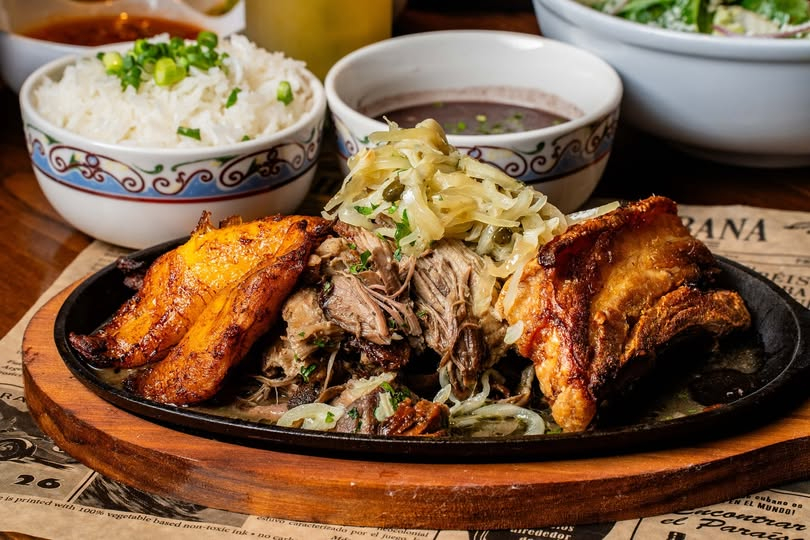

# Lechón Asado Cubano

*Cuba's slow-roasted pork shoulder: a bone-in pork shoulder marinated overnight in mojo (garlic-citrus-cumin-oregano paste), slow-roasted at low heat for 5 hours till the meat falls from the bone, with a final blast of high heat to crisp the skin. The Cuban national centerpiece for Nochebuena (Christmas Eve), the heart of every Cuban celebration meal.*

**Serves:** 8-10

**Prep Time:** 30 minutes (plus overnight marinating)

**Cook Time:** 5 hours

## Overview
Lechón asado is Cuba's national celebration roast, the Nochebuena (Christmas Eve) centrepiece in every Cuban family from Havana to Miami. A whole bone-in pork shoulder marinates overnight in a generous quantity of mojo (the Cuban garlic-citrus-cumin-oregano marinade made from crushed garlic, sour orange juice, olive oil, oregano, cumin and salt), then slow-roasts at low heat for five hours till the meat falls from the bone, with a final thirty-minute blast at high heat to crisp the skin into the iconic cuerito. Closely related to but distinct from Puerto Rican pernil; the Cuban version is defined by the mojo marinade (with sour orange as the canonical citrus) and the traditional pit-roast caja china technique, though most modern Cubans roast in a regular oven. Sour orange (naranja agria) is hard to find outside Cuba and Florida; the workable substitute is equal parts orange juice and lime juice, plus extra garlic and oregano. Score the skin and prick the meat all over so the marinade penetrates deeply. Sliced thick or shredded, served at the centre of the Nochebuena table with black beans and rice, yuca con mojo and sweet plantains.

## Ingredients

### Pork
- 1 bone-in pork shoulder picnic roast (about 3.5-4 kg; skin on)

### Mojo marinade
- 20 garlic cloves (crushed)
- 250 ml fresh sour orange juice (naranja agria); OR 125 ml fresh orange juice + 125 ml fresh lime juice as substitute
- 100 ml olive oil
- 4 tablespoons dried oregano
- 4 tablespoons ground cumin
- 2 tablespoons fine sea salt
- 1 tablespoon ground black pepper
- 1 tablespoon paprika
- 1 large white onion (finely grated)
- 1 small bunch fresh coriander (chopped, optional)

### To finish (the crispy skin)
- 1 tablespoon olive oil (rubbed on skin before final blast)
- 1 teaspoon flaky sea salt

### Mojo sauce (to serve with)
- 6 garlic cloves (crushed)
- 80 ml olive oil
- 100 ml fresh sour orange juice (or orange-lime mix)
- 1 teaspoon ground cumin
- 1 teaspoon dried oregano
- 1 teaspoon fine sea salt
- ½ teaspoon ground black pepper

### To serve
- Black beans
- Plain white rice (or moros y cristianos)
- Yuca con mojo
- Sweet plantains (maduros)
- Sliced avocado
- Fresh salad
- Cuban bread (for soaking up the juices)

## Method

### Stage 1 - Score and prep the pork (the night before)
1. Pat the pork dry.
2. Score the skin in a diamond pattern, cutting through the skin into the fat layer but not into the meat. Cuts about 2 cm apart.
3. Pierce the skin and meat with a thin sharp knife in many places (helps the marinade penetrate).

### Stage 2 - Make the mojo marinade
1. In a wide bowl, combine all marinade ingredients.
2. Mash together to a wet paste.

### Stage 3 - Apply the marinade
1. Rub the marinade all over the pork shoulder, pressing into the scored skin, around the bone and into the meat through the piercings.
2. Spoon any remaining marinade over the surface.
3. Place in a large container or zip-lock bag.
4. Cover and refrigerate at least 12 hours, ideally 24 hours.

### Stage 4 - Bring to room temperature
1. Take the pork out of the fridge 1 hour before cooking.

### Stage 5 - Slow-roast
1. Preheat the oven to 160°C (325°F).
2. Place the pork skin-side-up in a heavy roasting tin.
3. Cover loosely with foil.
4. Roast for 4.5 hours.

### Stage 6 - Baste midway
1. Check at 2.5 hours; baste with the pan juices.

### Stage 7 - Crisp the skin
1. After 4.5 hours, remove the foil.
2. Brush the skin with olive oil; sprinkle with flaky salt.
3. Turn the oven up to 220°C (425°F).
4. Roast uncovered for 25-30 minutes till the skin is deeply golden-brown, bubbled and crackling-crisp.

### Stage 8 - Rest
1. Take out of the oven.
2. Cover loosely with foil; rest 20 minutes.

### Stage 9 - Make the fresh mojo sauce
1. While the pork rests, make a fresh mojo sauce for drizzling.
2. Heat the olive oil in a small pan over medium heat.
3. Add the crushed garlic; cook 30 seconds till just fragrant (don't brown).
4. Take off the heat; let cool 1 minute.
5. Add the sour orange juice (or orange-lime mix), cumin, oregano, salt and pepper.
6. Stir to combine.
7. Transfer to a small jug for the table.

### Stage 10 - Carve and serve
1. Place the lechón on a wooden carving board.
2. Lift off the crispy skin (cuerito) in pieces; arrange on a separate plate.
3. Slice the pork into thick slices or pull it apart with two forks.
4. Pour some pan juices over.
5. Serve at the centre of the Nochebuena table with black beans, rice, yuca, plantains, salad and the mojo sauce.
6. Pass the cuerito around for everyone.

## Notes
- **Sour orange (naranja agria) is canonical:** if you can find it, use it. Otherwise equal parts orange juice and lime juice is the standard substitute.
- **Generous marinade:** the mojo should penetrate deep. Pierce the meat and skin to help.
- **Long marinade:** 12 hours minimum, 24 hours ideal. 48 hours is even better.
- **Two-temperature roast:** 5 hours at low + 30 minutes at high. Don't constant-temperature roast.
- **Rest before carving:** 20 minutes is essential. The juices redistribute.

## Variations
**Caja china (the proper Cuban pit roast):** for a whole pig roast over coals in a metal-lined wooden box (caja china); takes 4-5 hours; properly authentic Cuban Nochebuena. Specialist equipment required.
**With pineapple:** add sliced pineapple to the roasting tin in the last hour; gives a sweet-tart counterpoint.
**Smaller version (8 person picnic shoulder portion):** use 1.8 kg shoulder; reduce cooking to 3 hours + 25 minutes high heat.
**With achiote:** add 1 tablespoon of achiote/annatto powder to the marinade; gives a more orange-red colour and a slightly different flavour profile.

## Serving
On a wooden board at the centre of the Nochebuena table. With black beans, rice (or moros y cristianos), yuca con mojo, sweet plantains, salad and Cuban bread. Drink: Cuba libre (rum + Coca-Cola + lime), Cristal beer, or sparkling cidra de manzana. At Christmas Eve, New Year's Eve or any major Cuban family celebration.

## Storage
- Keeps refrigerated 5 days; the flavour deepens overnight.
- Reheat in a covered oven dish at 160°C / 325°F for 25-30 minutes.
- The shredded leftover lechón is the canonical filling for Cubano sandwiches.
- Freezes 3 months shredded in portions; defrost in the fridge.
- The pan juices (after skimming fat) make excellent gravy.
