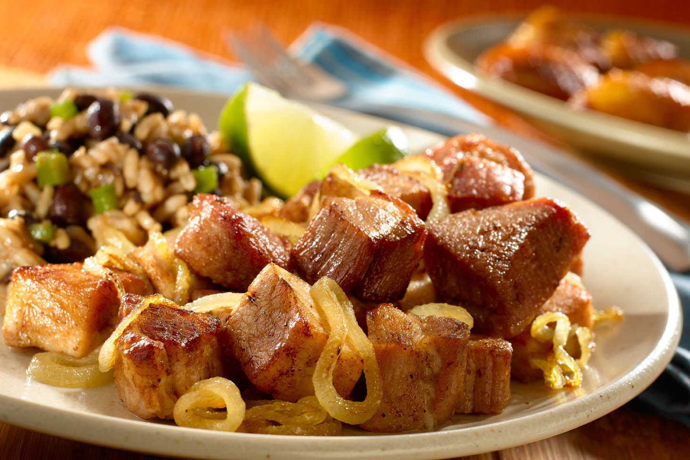

# Masitas de Puerco

*Cuba's fried pork chunks: cubes of pork shoulder marinated overnight in mojo (garlic-citrus-oregano), slow-cooked in their own fat (confit-style) till tender, then crisp-fried in a hot pan with sliced onion till the outside is dark golden and crackling and the inside stays juicy. The Cuban Sunday-dinner classic, served over rice with sweet plantains and black beans.*

**Serves:** 4-6

**Prep Time:** 25 minutes (plus overnight marinating)

**Cook Time:** 1 hour 30 minutes

## Overview
Masitas de puerco fritas ("little fried pork pieces") is one of Cuba's most beloved pork preparations and a Sunday family-dinner staple across the island and the diaspora. Cubes of pork shoulder marinate overnight in mojo (the Cuban garlic-citrus paste with sour orange, lime, garlic, cumin and oregano), then cook in two stages. First, a slow confit-style hour in their own rendered fat covered with the marinade and some lard, till the meat is fork-tender. Then a final crisp-fry in a hot dry pan with sliced onion till the outside of each piece goes dark golden-brown and crackling-crisp while the inside stays juicy. Combining both stages into a single fry gives tough chewy results. The texture contrast is what makes the dish memorable. The sliced onion goes in for the final minutes, staying bright and fresh against the crisp pork. Eat immediately over plain white rice with black beans, sweet plantains and a fresh salad.

## Ingredients

### Pork
- 1 kg pork shoulder (cut into 3 cm cubes; with some fat attached)

### Mojo marinade
- 12 garlic cloves (crushed)
- 150 ml fresh sour orange juice (or 75 ml orange + 75 ml lime juice as substitute)
- 4 tablespoons olive oil
- 2 tablespoons dried oregano
- 2 tablespoons ground cumin
- 2 teaspoons fine sea salt
- 1 teaspoon ground black pepper
- 1 small white onion (finely grated)
- 1 tablespoon white wine vinegar

### For slow-cooking
- 4 tablespoons lard (or vegetable oil): for additional cooking fat

### For crisp-frying
- 2 large white onions (sliced into thin half-moons)
- Juice of 1 lime
- 1 teaspoon fine sea salt

### To finish
- 1 small bunch fresh coriander (chopped)
- Lime wedges

### To serve
- Plain white rice
- Black beans
- Sweet plantains (maduros)
- Sliced avocado
- Yuca con mojo
- Fresh salad

## Method

### Stage 1 - Marinate the pork (overnight)
1. In a wide bowl, combine all marinade ingredients to a paste.
2. Add the cubed pork; toss thoroughly to coat.
3. Cover and refrigerate at least 12 hours, ideally 24 hours.

### Stage 2 - Slow-cook the pork (confit-style)
1. Transfer the marinated pork and all the marinade to a wide heavy pot.
2. Add the lard (or oil).
3. Cover the pot; place over low heat.
4. Cook 1 hour, stirring occasionally; the pork will release its fat, which combines with the marinade liquid to braise the meat.
5. After 1 hour, the pork should be fork-tender.

### Stage 3 - Drain the pork
1. Lift the pork pieces out with a slotted spoon; transfer to a plate.
2. Reserve the cooking liquid; pour into a separate bowl. The fat will rise to the top.

### Stage 4 - Heat the pan for crisp-frying
1. Heat a wide heavy frying pan over high heat.
2. Skim 4 tablespoons of the fat from the reserved cooking liquid; add to the hot pan.
3. The pan should be properly hot; the pork should sizzle aggressively when it hits.

### Stage 5 - Crisp-fry the pork
1. Add the cooked pork pieces in a single layer (work in batches if needed).
2. Cook 4-5 minutes; don't move; let the bottoms develop a deep golden crust.
3. Turn pieces; cook another 3-4 minutes till crispy and dark golden on the second side.

### Stage 6 - Add onions
1. Add the sliced onions to the pan with the fried pork.
2. Toss together over high heat for 2-3 minutes; the onions soften but stay crisp.
3. Add 4 tablespoons of the reserved cooking liquid; let bubble for 30 seconds.
4. Squeeze the lime juice over.
5. Add the salt.

### Stage 7 - Serve immediately
1. Tip into a serving dish.
2. Scatter chopped coriander over.
3. Serve over white rice with black beans, plantains, avocado and salad.
4. Lime wedges on the side.

## Notes
- **Pork shoulder for the right fat:** lean cuts (loin) give dry results. Shoulder (with the fat attached) is essential.
- **Long marinade:** the mojo needs time. 12 hours minimum, 24 hours ideal.
- **Two-step cooking:** slow-confit first, then crisp-fry. Combining into one step gives tough chewy results.
- **Don't move during the crisp-fry:** let the bottoms develop a proper crust before turning.
- **Onions at the end:** sliced raw onion tossed in with the fried pork; gives the traditional Cuban texture contrast.

## Variations
- **With pickled red onions:** instead of fresh onion, top with quick-pickled red onion (red onion + lime juice + salt + 10 minutes); adds tang.
- **Spicier:** add 1 chopped habanero pepper to the marinade; properly Caribbean fierce.
- **With pineapple:** add 200 g of fresh pineapple chunks to the pan in stage 6; gives a sweet-tart contrast.
- **Slow-cooker version:** cook the marinated pork in a slow-cooker (low for 6 hours); proceed with the crisp-fry as in the recipe. Easier weeknight version.

## Serving
- Over hot white rice with black beans, sweet plantains, sliced avocado and salad. Yuca con mojo on the side for extra Cuban-ness. Drink: Cristal beer, mojito, or a Cuba libre.

## Storage
- Best eaten immediately while crispy.
- Keeps refrigerated 4 days; reheat in a hot pan briefly to re-crisp the edges.
- Don't microwave; the texture suffers.
- The slow-cooked pork (before the final crisp-fry) keeps refrigerated 4 days and freezes 3 months; crisp-fry fresh just before serving.
- Day-old masitas make excellent Cuban-sandwich filling or taco filling.
