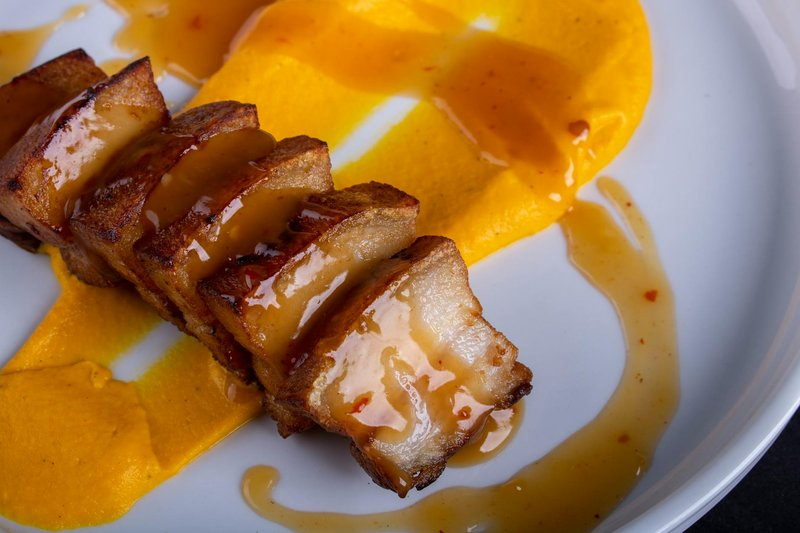

# Mojo Pork

*Slow-roasted pork shoulder, the surface crackling and bronze, the inside falling into garlicky shreds that smell of bitter orange, cumin and toasted oregano. It is the smell of Cuban Sunday lunch, of Nochebuena, of family kitchens with the windows fogged.*

**Serves:** 8

**Prep Time:** 20 minutes (plus overnight marinade)

**Cook Time:** 4 hours

## Overview
Mojo, pronounced moh-ho, is the foundational citrus and garlic marinade of Cuban cooking, and lechon asado al mojo, a whole pig or shoulder marinated in it and roasted slowly, is the centrepiece of Christmas Eve dinners across Cuba and the Cuban diaspora in Miami, Tampa and beyond. The defining ingredient is naranja agria, the sour or bitter orange, whose juice is sharper and more aromatic than regular orange and which provides the acid backbone of the marinade. If you cannot find sour oranges, the universal substitute is two parts fresh orange juice to one part lime juice, with a splash of grapefruit if you have it. The rest of the mojo is generous: a head of garlic crushed into paste, dried oregano (Cuban oregano if possible, regular Mediterranean otherwise), cumin, salt and good olive oil. The pork shoulder is stabbed all over and the marinade pushed deep into the flesh, then left overnight so the acid begins to break down the muscle fibres. The roast itself is forgiving: low and slow, fat-side up, until the meat pulls apart with a fork and the skin crackles. Leftovers become the heart of a Cuban sandwich, layered with ham, Swiss cheese, mustard and pickles in pressed bread. Difficulty is low. The only thing to plan for is time: the marinade needs overnight, and the roast takes most of an afternoon.

## Ingredients

### Pork
- 2 ½ kg bone-in pork shoulder, skin on if available

### Mojo marinade
- 250 ml fresh sour orange juice (or 170 ml orange juice + 80 ml lime juice)
- 1 whole head of garlic, peeled (roughly 12 cloves)
- 2 tbsp dried oregano
- 1 tbsp ground cumin
- 1 tbsp flaky salt
- 1 tsp black pepper
- 100 ml olive oil
- 1 onion (small), thinly sliced
- 2 bay leaves

### To serve
- White rice
- Black beans
- Fried sweet plantains
- Lime wedges

## Method

### Stage 1 - The marinade
1. In a mortar, pound the garlic with the salt to a coarse paste. Alternatively pulse in a small food processor.
2. Stir in the cumin and oregano, then the citrus juice and pepper.
3. Warm the olive oil gently in a small pan until just hot but not smoking. Pour it over the garlic-citrus mixture. It will hiss and bloom: this is what cooks the raw garlic edge out.
4. Add the bay leaves and let cool.

### Stage 2 - Marinate
1. Pat the pork dry. Using a sharp knife, stab the shoulder all over, about 2 cm deep, every 3 cm.
2. Place in a deep dish or large freezer bag with the sliced onion.
3. Pour over the mojo, working some down into each slit. Cover and refrigerate at least 12 hours, ideally 24, turning once.

### Stage 3 - Roast
1. Heat the oven to 160 degrees fan.
2. Lift the pork out of the marinade and place fat-side up in a roasting tin. Strain and reserve the marinade.
3. Pour the strained marinade and 250 ml water into the tin around (not over) the pork.
4. Cover the tin tightly with foil. Roast for 3 hours.

### Stage 4 - Crisp the skin
1. Remove the foil. Spoon some pan juices over the meat.
2. Raise the oven to 220 degrees fan and continue roasting uncovered for 30 to 45 minutes, until the skin or fat cap is deeply golden and crackled, and the meat shreds easily with a fork at the thickest part.

### Stage 5 - Rest and shred
1. Lift the pork onto a board and tent with foil. Rest 20 minutes.
2. Skim the fat from the pan juices and keep the juices warm.
3. Pull the pork into rough shreds, leaving some larger chunks. Spoon over the warm pan juices to moisten.

## Notes
- **Sour orange substitute:** the 2:1 orange to lime ratio is the standard. Adding 1 tablespoon of grapefruit juice deepens the bitterness toward true naranja agria.
- **Blooming the oil:** pouring hot oil over raw garlic cooks the harshness off without losing the perfume. Skip this and the mojo tastes raw.
- **Skin or fat cap:** if you have skin-on shoulder, score it in a fine crosshatch and rub with extra salt for proper chicharron crackle. Without skin, the fat cap still browns beautifully.
- **Resting juices:** the strained pan liquid is essentially a finishing sauce. Do not throw it away.

## Storage
- Pulled mojo pork keeps 4 days refrigerated in its juices and freezes 3 months. It is the traditional base for Cubano sandwiches, so plan leftovers on purpose. Reheat covered with a splash of stock.
