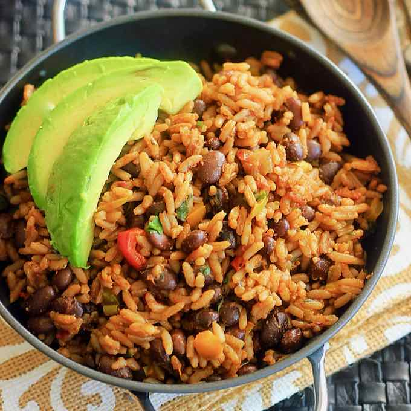

# Moros Y Cristianos

*Cuba's everyday rice and beans, cooked together in one pot with sofrito so the rice turns dusky purple from the bean liquor. The name ("Moors and Christians") refers to the colour contrast - but cooked properly, the rice is anything but pale.*

**Serves:** 4

**Prep Time:** 15 minutes (plus overnight bean soak)

**Cook Time:** 1 ¼ hours

## Overview
Moros y cristianos, "Moors and Christians", is the Cuban black beans and rice dish whose name nods at the old Iberian conflict in the way the dark beans and white rice are cooked together in the same pot. Black beans simmer first with bay and oregano until they're tender enough to hold shape but soft enough to bite through. A sofrito of onion, pepper, garlic and cumin builds in olive oil; the cooked beans plus their flavourful black liquid join in; rice stirs through and steams in the bean broth until tender and tinted the colour of espresso. The rice should be loose-grained, the colour even, the beans visible but not crushed. Serve as a bowl of its own or as the base for fried plantains, roast pork or a Cuban steak.

## Ingredients

- 250 g dried black beans (soaked overnight)
- 1 bay leaf
- 1 teaspoon dried oregano
- 4 tablespoons olive oil
- 1 onion (large, finely chopped)
- 1 green pepper (finely chopped)
- 6 garlic cloves (crushed)
- 1 teaspoon ground cumin
- 1 teaspoon smoked paprika
- 250 g long-grain rice (rinsed)
- 600 ml vegetable stock (or bean cooking liquid)
- 2 tablespoons red wine vinegar
- salt
- pepper
- Fresh coriander (to serve)

## Method

### Stage 1 - Beans
1. Drain the soaked beans; cover with fresh water by 5 cm. Add the bay and oregano.
1. Bring to the boil; reduce to a simmer and cook 45-60 minutes until tender. Reserve 600 ml of the cooking liquid.

### Stage 2 - Sofrito
1. Heat 3 tablespoons of the olive oil in a heavy saucepan over medium heat.
1. Cook the onion and green pepper 8 minutes until soft.
1. Add the garlic, cumin and paprika; cook 1 minute until fragrant.

### Stage 3 - Combine and steam
1. Stir in the cooked beans (with a slotted spoon, leaving most liquid behind) and the rice; toast 1 minute.
1. Pour in the bean cooking liquid (or stock to top up to 600 ml). Add salt to taste.
1. Bring to the boil; reduce to lowest heat; cover and cook 18-20 minutes without lifting the lid.
1. Off the heat, rest covered 10 minutes.

### Stage 4 - Finish
1. Stir in the vinegar and remaining olive oil with a fork (don't mash).
1. Taste; adjust salt and pepper.
1. Top with chopped coriander.

## Notes
- **Reserve the bean liquid:** The smoky-sweet broth is what flavours and colours the rice. Plain stock is a fallback, not equivalent.
- **Don't lift the lid:** Steam escaping during the rice-cooking stage gives gummy rice. Set a timer; trust the process.
- **Soft beans:** Tender black beans mean a 45+ minute simmer. Old beans take longer; pressure cooking works too.

## Storage
- Keeps 4 days refrigerated; reheat with a splash of water.
- Freezes 3 months.
