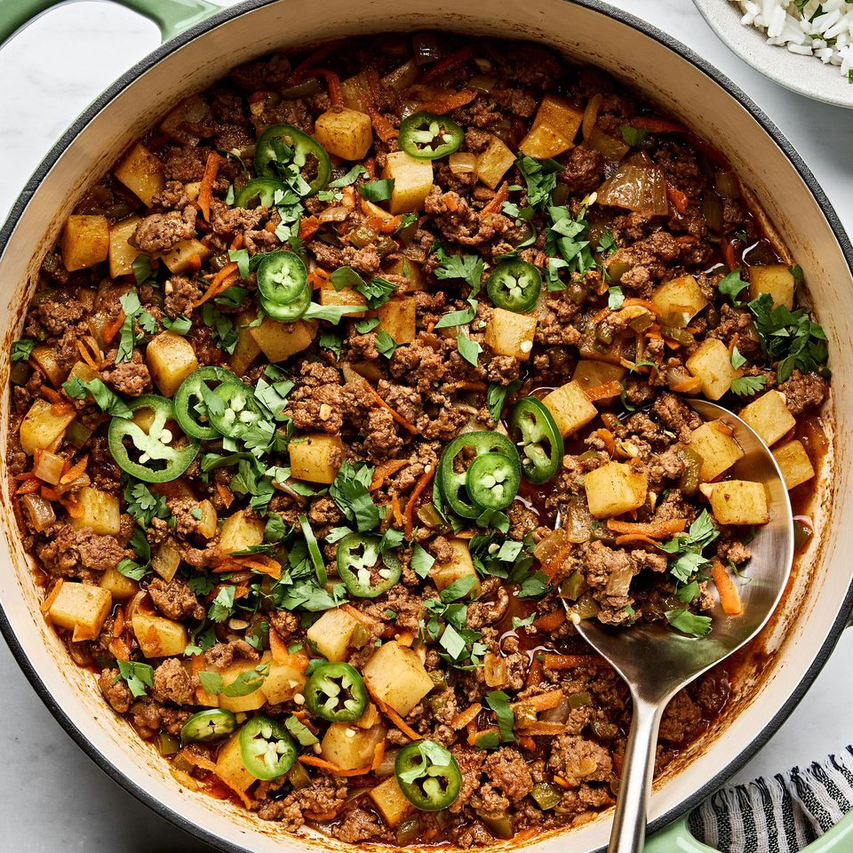

# Picadillo Cubano

*Cuba's ground-beef hash: minced beef cooked with sofrito, bell peppers, tomatoes, olives, capers, raisins and warm spices into a sweet-savoury beef stew that's eaten over white rice with black beans, sweet plantains and fried eggs. The Cuban everyday family dinner, the unofficial-second national dish after ropa vieja.*

**Serves:** 4-6

**Prep Time:** 20 minutes

**Cook Time:** 45 minutes

## Overview
Picadillo Cubano is Cuba's everyday ground-beef hash and arguably the second-most iconic Cuban dish after ropa vieja: minced beef (or a mix of beef and pork) cooked with sofrito, sliced onions, bell peppers, garlic, tomato, tomato paste, olives, capers, raisins (yes, raisins - the canonical Cuban sweet element that balances the savoury), warm spices (cumin, oregano, paprika) and a splash of dry white wine, into a thick fragrant beef hash that's served over plain white rice with black beans, sweet plantains (maduros) and often a fried egg on top. The dish is what every Cuban family makes on a weeknight; it's quick (45 minutes from start to finish), accessible (everyone makes it slightly differently), and absolutely Cuban in flavour. The dish is also the canonical filling for Cuban empanadas, papas rellenas (stuffed potatoes) and Cuban tamales. Three details define proper Cuban picadillo. First, raisins are non-negotiable. The Cuban version distinguishes itself from Mexican picadillo by the sweet-savoury balance from raisins; some Cubans omit but most include. Second, olives and capers are canonical. The brininess is essential. Third, served with fried egg on top is the home-cook tradition. Restaurant versions don't include the egg, but the Cuban home cook adds a fried egg (over-easy with a runny yolk) to each plate before serving; the yolk runs into the beef.

## Ingredients

### Picadillo
- 800 g minced beef (or 50/50 minced beef and pork; 15-20% fat)
- 3 tablespoons olive oil
- 1 large onion (finely chopped)
- 1 medium green bell pepper (finely chopped)
- 1 medium red bell pepper (finely chopped)
- 6 garlic cloves (crushed)
- 3 tablespoons tomato paste
- 1 tin (400 g) chopped tomatoes (or 300 g fresh tomato sauce)
- 100 ml dry white wine (or 100 ml chicken stock + 1 tablespoon white vinegar)
- 80 g raisins
- 100 g pitted green olives (sliced)
- 3 tablespoons capers (drained)
- 1 tablespoon ground cumin
- 1 tablespoon dried oregano
- 1 tablespoon Aleppo pepper or smoked paprika
- 1 teaspoon ground turmeric (or sazón)
- 2 teaspoons fine sea salt (taste; the olives are salty)
- 1 teaspoon ground black pepper
- 2 bay leaves
- 1 cinnamon stick (small; optional but very Cuban)

### To finish
- 1 small bunch fresh coriander (chopped)
- 1 fresh red chilli (sliced, optional)
- Juice of 1 lime

### To serve (the canonical Cuban plate)
- Plain white rice
- Black beans
- Sweet plantains (maduros)
- Fried eggs (1 per person; over-easy with runny yolk)
- Sliced avocado
- Lime wedges
- Fresh salad

## Method

### Stage 1 - Sweat the aromatics
1. Heat the olive oil in a wide heavy pan over medium heat.
2. Add the chopped onion; cook 6-7 minutes till soft and starting to caramelise.
3. Add the chopped green and red peppers; cook 5 minutes till softened.
4. Add the crushed garlic; cook 30 seconds.

### Stage 2 - Brown the beef
1. Add the minced beef to the pan.
2. Break up with a wooden spoon; cook 7-8 minutes till the beef is browned and any released liquid has evaporated.

### Stage 3 - Add tomato and pastes
1. Add the tomato paste; cook 2 minutes till deepened in colour.
2. Add the chopped tomatoes; cook 3-4 minutes till they break down.
3. Pour in the white wine (or stock + vinegar substitute); let bubble for 1 minute.

### Stage 4 - Add seasonings, raisins, olives, capers
1. Stir in the cumin, oregano, Aleppo pepper, turmeric, salt and pepper.
2. Add the raisins, olives and capers.
3. Add the bay leaves and cinnamon stick.

### Stage 5 - Simmer
1. Reduce heat to low; partially cover with the lid.
2. Simmer 25-30 minutes till the sauce has thickened and the flavours have melded.
3. Stir occasionally.

### Stage 6 - Finish
1. Lift out the bay leaves and cinnamon stick.
2. Stir in the lime juice and chopped coriander.
3. Taste; adjust salt and pepper.

### Stage 7 - Plate (Cuban family-style)
1. Spoon hot white rice onto each plate; about a fist-sized mound.
2. Ladle generous picadillo over (or alongside).
3. Add black beans alongside the rice (or on top).
4. Add 3-4 slices of sweet plantains.
5. Place a fried egg over the picadillo (yolk side up).
6. Sliced avocado, lime wedges, and a small salad.

## Notes
- **Raisins are canonical Cuban:** the sweet-savoury balance distinguishes Cuban picadillo from Mexican. Don't skip unless you really don't like them.
- **Olives and capers for brininess:** essential Cuban character.
- **20% fat in the beef:** lean beef gives dry picadillo. Use proper meat with fat.
- **Cinnamon stick is the secret:** the small amount gives Cuban picadillo its warm-spice depth. Don't substitute with ground cinnamon (too dominant).
- **Fried egg on top:** the canonical Cuban home-cook addition. Yolk runs into the picadillo. Worth it.

## Variations
**Picadillo with potatoes (picadillo con papas):** add 2 cubed potatoes to the pan in stage 4; cook with the picadillo till tender. Common variation; turns the dish into a heartier one-pot.
**Mexican picadillo:** skip the raisins; add 2 fresh jalapeños; use Mexican oregano and ancho chili powder. Different but related Mexican version.
**Spicier:** double the Aleppo pepper and add 1 chopped habanero pepper; Caribbean fierce version.
**Vegetarian picadillo (picadillo de soya):** swap the beef for textured vegetable protein (TVP) or crumbled tofu; keep all other ingredients the same. Surprisingly excellent.

## Serving
On wide plates with the canonical Cuban sides: white rice, black beans, plantains, fried egg, avocado, lime. With a cold Cristal beer (Cuban) or fresh mojito. As an everyday family dinner.

## Storage
- Keeps refrigerated 5 days; flavour deepens overnight.
- Reheat gently in a covered pan over low heat with a splash of water.
- Freezes 3 months in portions; defrost in the fridge.
- Day-old picadillo is the canonical filling for Cuban empanadas, papas rellenas and Cuban tamales.
- Often deliberately made the day before for the proper flavour.
