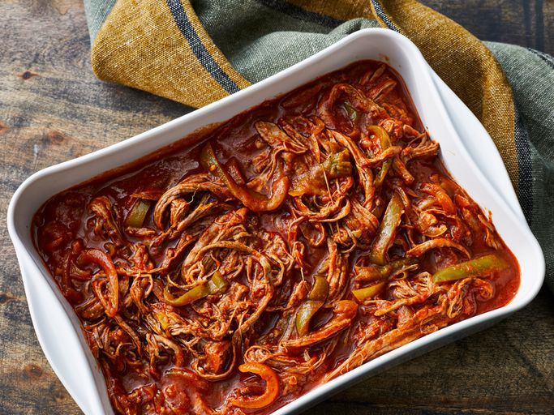

# Ropa Vieja

*Cuba's national dish: flank steak slow-braised till it shreds easily, then simmered with sofrito, bell peppers, onions, tomato, olives, capers and warm spices into a thick savoury stew. The Cuban national dish, the heart of Cuban-American cooking, eaten over white rice with sweet plantains and black beans.*

**Serves:** 6

**Prep Time:** 25 minutes

**Cook Time:** 2 hours 30 minutes

## Overview
Ropa vieja (literally "old clothes", named for the shredded texture that resembles rags) is Cuba's national dish and one of the most iconic Cuban-American comfort foods. Flank steak slow-simmers in a flavoured broth till the meat is fork-tender and falls apart, then shreds with two forks and returns to a separate pan with sautéed onions, bell peppers, garlic, tomato, olives, capers, sofrito and warm spices. Everything simmers together till the sauce reduces and the beef has absorbed the flavours into a thick savoury stew. Flank steak is the traditional cut for the right shreddable grain (skirt works; brisket gives a chunkier result; lean sirloin won't shred properly). The two-step cooking is essential: combining both stages gives a less developed flavour. The colourful peppers and olives are what make ropa vieja visually and flavour-wise distinctive. The centrepiece of every Cuban family Sunday lunch, every Cuban-American restaurant menu, every Cuban diaspora kitchen across Miami and beyond. Eat over white rice with black beans, sweet plantains and a fresh salad.

## Ingredients

### Stage 1: Cook the beef
- 1200 g flank steak (or skirt steak; or brisket)
- 1 large onion (quartered)
- 6 garlic cloves (whole, lightly crushed)
- 2 bay leaves
- 1 tablespoon whole black peppercorns
- 1 tablespoon dried oregano
- 1 ½ teaspoons fine sea salt
- 1.5 litres beef stock (or water)

### Stage 2: Build the stew
- 4 tablespoons olive oil
- 2 large onions (sliced into thin half-moons)
- 2 large green bell peppers (cut into thin strips)
- 1 large red bell pepper (cut into thin strips)
- 8 garlic cloves (crushed)
- 4 tablespoons tomato paste
- 1 tin (400 g) chopped tomatoes
- 200 ml dry white wine (or 200 ml reserved cooking broth + 50 ml white vinegar)
- 250 ml reserved cooking broth (from stage 1)
- 1 tablespoon ground cumin
- 1 tablespoon dried oregano
- 1 teaspoon ground turmeric (or 1 tablespoon [Sazón](../../base-ingredients/spices/sazon.md))
- 1 teaspoon Aleppo pepper or smoked paprika
- 1 teaspoon fine sea salt (taste; the olives are salty)
- 1 teaspoon ground black pepper
- 2 bay leaves
- 1 cinnamon stick (small)
- 100 g pitted green olives (sliced)
- 3 tablespoons capers (drained)
- 1 small fresh chilli (optional, sliced)

### To finish
- 1 small bunch fresh coriander (chopped)
- Juice of 1 lime
- 2 tablespoons fresh parsley (chopped)

### To serve
- Plain white rice (Cuban-style with garlic)
- Black beans (frijoles negros)
- Sweet plantains (maduros)
- Sliced avocado
- Lime wedges
- Fresh salad

## Method

### Stage 1 - Simmer the beef
1. Place the flank steak in a large heavy pot.
2. Add the quartered onion, garlic cloves, bay leaves, peppercorns, oregano, salt and beef stock.
3. Bring to a boil.
4. Reduce to a low simmer; cover with the lid slightly ajar.
5. Simmer 1.5-2 hours till the beef is fork-tender (a fork should pull strands apart easily).

### Stage 2 - Shred the beef
1. Lift the beef out with tongs; transfer to a board.
2. Strain the cooking broth; reserve 250 ml for the stew (and freeze the rest for future stock).
3. Once the beef is cool enough to handle, use two forks to shred it along the grain into long thin strands.
4. The proper ropa vieja shred is long thin "ribbons" of beef.

### Stage 3 - Build the stew base
1. Heat the olive oil in a wide heavy pan over medium heat.
2. Add the sliced onions; cook 10 minutes till deeply soft and starting to caramelise.
3. Add the sliced green and red peppers; cook 8 minutes till softened.
4. Add the crushed garlic; cook 30 seconds.

### Stage 4 - Add tomato and seasonings
1. Add the tomato paste; cook 3 minutes till deepened.
2. Add the chopped tomatoes; cook 5 minutes till they break down.
3. Add the white wine (or vinegar substitute); let bubble 1 minute.
4. Pour in the reserved 250 ml of cooking broth.
5. Add the cumin, oregano, turmeric, Aleppo pepper, salt and pepper.
6. Add the bay leaves and cinnamon stick.

### Stage 5 - Add the shredded beef
1. Add the shredded beef to the pan.
2. Stir to combine; the beef should be fully coated in the sauce.
3. Add the olives, capers and chilli (if using).
4. Bring to a simmer.

### Stage 6 - Simmer to combine
1. Reduce heat to low; cover with the lid slightly ajar.
2. Simmer 25-30 minutes till the sauce has reduced and the beef has absorbed the flavours.
3. The sauce should be thick and glossy, clinging to the beef strands; not soupy.
4. Stir occasionally.

### Stage 7 - Finish
1. Take off the heat; lift out the bay leaves and cinnamon stick.
2. Stir in the lime juice, fresh coriander and parsley.
3. Taste; adjust salt and pepper.

### Stage 8 - Serve
1. Spoon hot white rice into deep bowls or onto plates.
2. Ladle generous portions of ropa vieja over (or alongside).
3. Add black beans alongside.
4. Plantains (maduros) on the plate.
5. Sliced avocado, lime wedges, salad.

## Notes
- **Flank steak is the traditional cut:** the long-grain structure shreds into the proper "rags". Skirt steak works as substitute; brisket gives chunkier shreds.
- **Two-step cooking:** simmer to tender first, shred, then build the sauce. The two stages give distinct depth.
- **Shred along the grain:** pulling along the grain gives long thin strands; pulling against gives small bits.
- **Generous bell peppers:** the colourful peppers are visually iconic. Don't skimp.
- **Olives and capers are Cuban:** the brininess is essential.

## Variations
- **Vaca frita (the related fried cousin):** make the cooked shredded beef the night before; the next day, fry the shredded beef in a screaming-hot pan with onions and citrus till the strands crisp. See vaca frita recipe.
- **Spicier ropa vieja:** double the Aleppo pepper and add 2 chopped fresh chillies; common Cuban-Latin variation.
- **With pumpkin:** add 200 g of cubed pumpkin to the sauce in stage 5; gives a slight sweetness and extra body.
- **Quick weeknight version:** skip the long simmer; use pressure cooker (45 minutes) or slow cooker (8 hours low) for the beef tenderising stage.

## Serving
- On wide plates with white rice, black beans, sweet plantains and salad, the classic Cuban "vianda" plate. A glass of cold Cristal beer or fresh mojito. Often part of a Cuban family Sunday lunch.

## Storage
- Keeps refrigerated 5 days; the flavour deepens significantly overnight (often considered better the next day).
- Reheat gently in a covered pan over low heat with a splash of stock or water.
- Freezes 3 months in portions; defrost in the fridge.
- Day-old ropa vieja is excellent in Cuban sandwiches or empanadas as a filling.
