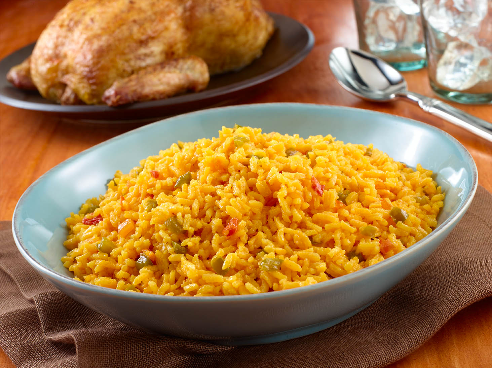

# Arroz Amarillo Cubano

*Cuba's yellow rice: medium-grain rice cooked in a sofrito-and-stock base with saffron (or Bijol) for the canonical deep yellow colour, plus peas, olives, capers and a splash of dry sherry. The Cuban festive rice that turns up alongside lechón asado, ropa vieja and any celebration meal.*

**Serves:** 6

**Prep Time:** 15 minutes

**Cook Time:** 35 minutes

## Overview
Arroz amarillo Cubano is the Cuban yellow rice and a festive staple of Cuban celebration meals: medium-grain rice cooked in a base of sofrito Cubano, sliced bell peppers, garlic and tomato, with saffron threads (or Bijol - the Cuban yellow seasoning) for the canonical deep yellow-orange colour, plus peas, sliced olives and capers, and a small splash of dry sherry for depth. Cooked together as a one-pot covered rice till the grains absorb the stock and turn properly yellow throughout. Served as a side alongside lechón asado, ropa vieja, masitas de puerco, or any Cuban celebration main. Three details define proper Cuban arroz amarillo. First, saffron or Bijol for colour. Saffron is canonical but expensive; Bijol (the Cuban yellow seasoning packet containing achiote, turmeric and cumin) is the everyday accessible substitute. Either gives the proper deep yellow colour. Second, sofrito base. Without sofrito, you have generic yellow rice; with it, you have Cuban arroz amarillo. Third, sherry splash. The small amount of dry sherry distinguishes the dish from generic rice; gives a slight sweet depth.

## Ingredients

- 500 g medium-grain rice (or long-grain; rinsed 2-3 times)
- 3 tablespoons olive oil
- 4 tablespoons sofrito Cubano
- 1 large onion (finely chopped)
- 1 medium green bell pepper (finely chopped)
- 1 medium red bell pepper (finely chopped)
- 6 garlic cloves (crushed)
- 2 tablespoons tomato paste
- 200 ml dry sherry (or 200 ml extra stock + 1 tablespoon white wine vinegar)
- 800 ml hot chicken stock (or vegetable stock)
- Generous pinch of saffron threads (infused in 2 tablespoons warm water; or 1 teaspoon Bijol)
- 2 bay leaves
- 1 tablespoon sazón
- 1 tablespoon dried oregano
- 1 teaspoon ground cumin
- 1 ½ teaspoons fine sea salt
- ½ teaspoon ground black pepper
- 200 g frozen peas
- 80 g pitted green olives (sliced)
- 2 tablespoons capers (drained)
- 1 small red bell pepper (cut into strips; for garnish)

### To finish
- 2 tablespoons fresh parsley (chopped)
- 1 tablespoon fresh coriander (chopped)

## Method

### Stage 1 - Sauté the base
1. Heat the olive oil in a wide heavy pot over medium heat.
2. Add the sofrito, chopped onion and chopped bell peppers; cook 7-8 minutes till soft.
3. Add the crushed garlic; cook 30 seconds.
4. Add the tomato paste; cook 2 minutes till deepened.

### Stage 2 - Add rice and liquid
1. Add the rinsed rice; stir to coat for 1 minute.
2. Pour in the sherry; let bubble 30 seconds.
3. Add the hot stock.
4. Stir in the saffron-water infusion (or Bijol), bay leaves, sazón, oregano, cumin, salt and pepper.

### Stage 3 - Cook covered
1. Bring to a simmer.
2. Reduce heat to lowest.
3. Cover with a tight-fitting lid.
4. Cook 22 minutes covered (don't lift the lid).

### Stage 4 - Add peas, olives, capers
1. Lift the lid; scatter the peas, olives, capers and red pepper strips over the rice.
2. Cover again; cook 5 more minutes.

### Stage 5 - Rest
1. Take off the heat; keep the lid on.
2. Rest 10 minutes.

### Stage 6 - Fluff and serve
1. Uncover; lift out the bay leaves.
2. Fluff gently with a fork.
3. Scatter chopped parsley and coriander over.
4. Serve as a side.

## Notes
- **Saffron or Bijol for colour:** essential for the proper Cuban yellow.
- **Sofrito base:** don't skip; gives the dish its Cuban identity.
- **Sherry splash:** the Cuban touch.
- **Don't lift the lid:** cooks by absorption-and-steam.
- **Medium-grain rice:** Cuban preference; long-grain works.

## Variations
**With chickpeas:** add 1 tin of drained chickpeas in stage 4; gives extra body.
**Vegetarian (without chicken stock):** use vegetable stock; otherwise identical.
**With chorizo:** add 100 g of sliced chorizo to the sofrito in stage 1; gives a richer fattier version.
**Saffron-only (luxe version):** double the saffron; skip the Bijol; gives a more delicate floral flavour.

## Serving
Alongside lechón asado, ropa vieja, masitas de puerco, or any Cuban main. Often part of a Cuban celebration meal. With Cristal beer, mojito, or sparkling cidra.

## Storage
- Keeps refrigerated 4 days; flavour deepens overnight.
- Reheat in a covered pan with a splash of stock.
- Freezes 3 months in portions.
- Don't microwave; texture suffers.
