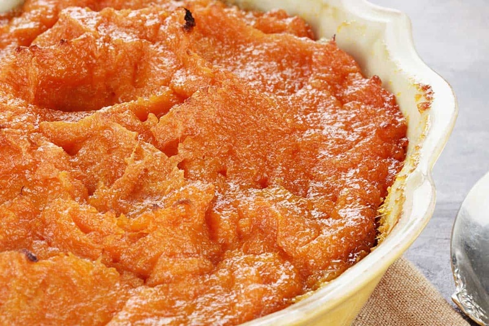

# Boniato Mash

*Boniato is the Caribbean white-fleshed sweet potato, drier and less sugary than the orange American kind, with a soft chestnut sweetness when cooked. Mashed with butter, garlic, sour orange and a splash of olive oil, it's the Cuban answer to mashed potato: rich, gently sweet, fragrant with citrus.*

**Serves:** 4 to 6

**Prep Time:** 10 minutes

**Cook Time:** 25 minutes

## Overview
Boniato mash is the Cuban answer to the everyday mashed potato, made from boniato (Cuban white sweet potato) whose flesh stays pale and only faintly sweet, more like a chestnut than a yam. Peel and cube the boniato, simmer in salted water until completely tender, drain, then return to the warm pot to steam-dry off any clinging moisture (this is the step that stops the mash going wet). Mash with butter, warmed garlic-infused olive oil, sour orange juice (or a lime-and-orange substitute), salt and pepper. The texture you're after is soft and spoonable, not stiff. Sour orange is the signature note; without it the mash tastes flat and one-dimensional. Serve hot, beside roast pork or grilled fish.

## Ingredients

- 1 kg boniato (Caribbean white sweet potato)
- 1 teaspoon salt (for the cooking water)
- 60 g unsalted butter
- 3 tablespoons olive oil
- 4 garlic cloves (finely sliced)
- 3 tablespoons sour orange juice (naranja agria, or 2 tablespoons fresh orange juice + 1 tablespoon lime juice)
- ½ teaspoon ground cumin
- salt
- pepper
- 1 tablespoon fresh coriander (or flat-leaf parsley, chopped, to finish)

## Method

### Stage 1 - Cook the boniato
1. Peel the boniato (the dark pinkish-brown skin comes off easily with a vegetable peeler) and cut into 4 cm cubes.
2. Place in a large pot; cover with cold water by 3 cm. Add the salt.
3. Bring to the boil; reduce to a steady simmer.
4. Cook 18-22 minutes until completely tender when pierced with a knife. The pieces should yield with almost no resistance.

### Stage 2 - Garlic oil
1. While the boniato cooks, gently warm the olive oil in a small pan over low heat.
2. Add the sliced garlic; cook 3-4 minutes until pale gold and fragrant. Don't brown: bitter garlic ruins the mash.
3. Take off the heat; let the garlic continue to infuse the oil.

### Stage 3 - Mash
1. Drain the boniato thoroughly. Return to the empty hot pot; place over low heat for 1 minute to steam off excess moisture, shaking the pot.
2. Add the butter; mash with a potato masher or pass through a ricer for the smoothest result.
3. Stir in the garlic oil (garlic and all), the sour orange juice and the cumin.
4. Season generously with salt and pepper. The mash absorbs salt readily; taste twice.
5. If it's stiff, beat in a splash of warm milk or the boniato cooking water until soft and spoonable.

### Stage 4 - Serve
1. Pile into a warm dish; drizzle with a little extra olive oil.
2. Scatter with coriander or parsley.
3. Serve immediately.

## Notes
- **Boniato vs sweet potato:** Boniato (sold in Latin and Caribbean shops) has white-cream flesh, drier and less sugary than the orange American sweet potato. If unavailable: a 70/30 mix of floury potato and orange sweet potato approximates the flavour and texture. Pure orange sweet potato alone gives a sweeter, wetter mash.
- **Sour orange (naranja agria):** The defining citrus of Cuban cooking, available bottled in Latin shops as "naranja agria". Substitute is 2 parts orange juice to 1 part lime juice; add a teaspoon of grapefruit juice if you have it.
- **Don't burn the garlic:** Gold and fragrant is the goal. Brown garlic turns bitter and overwhelms the mash.
- **Mash, don't whip:** Boniato can go gluey if whipped in a food processor. Stick to a masher or ricer.

## Variations
- **With pork drippings:** Replace half the butter with rendered pork fat from a mojo pork roast. Traditional, decadent.
- **Spicy:** Mash in a finely chopped seeded scotch bonnet, or ½ teaspoon dried red chilli flakes with the garlic.
- **Fresh coriander-heavy:** Fold in 3 tablespoons of finely chopped coriander at the end for a green-flecked version.

## Serving
- Serve with: Mojo pork (lechon), ropa vieja, grilled chicken thighs, fried fish. Pairs especially well with anything roast and citrus-marinated.
- Garnish with: Fresh coriander, a lime wedge, a final drizzle of olive oil.

## Storage
- Keeps 3 days refrigerated.
- Reheat gently with a splash of milk or stock; the mash dries out in the fridge.
- Freezes 2 months; the texture is slightly looser after thawing.
