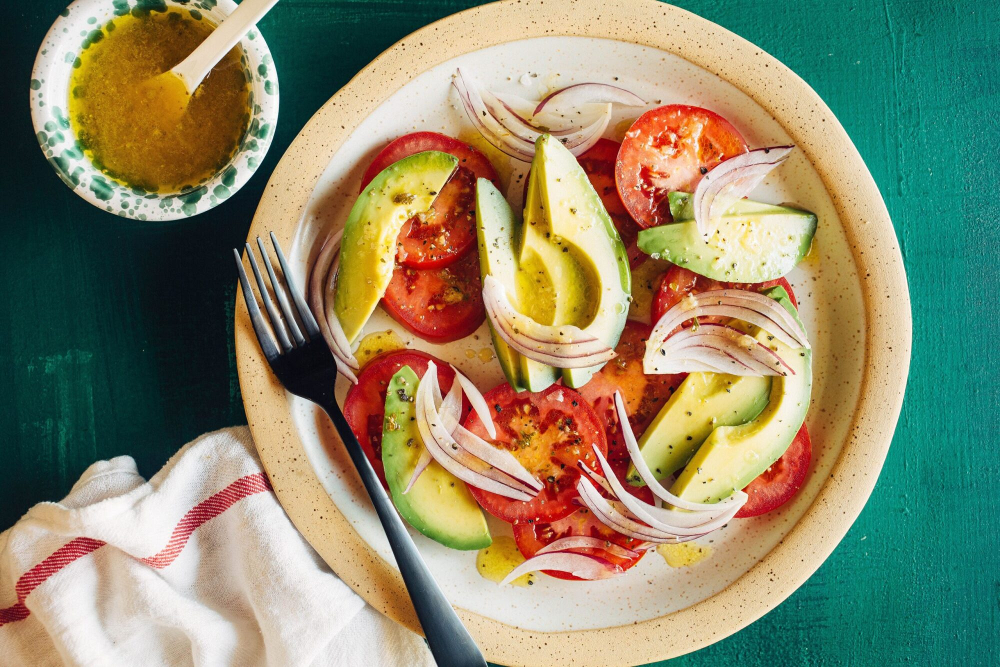

# Ensalada Cubana

*Cuba's simple salad: sliced ripe tomato, cucumber, white onion and avocado, dressed with olive oil, lime juice and a pinch of salt. The Cuban table standard, restrained, fresh, made in 5 minutes, that accompanies every main course alongside the rice and beans.*

**Serves:** 4

**Prep Time:** 10 minutes

**Cook Time:** 0 minutes

## Overview
Ensalada Cubana is Cuba's simple table salad and the traditional accompaniment to every Cuban main course: sliced ripe tomato, sliced cucumber, sliced raw white or red onion, sliced avocado, dressed with extra virgin olive oil, fresh lime juice, a pinch of salt and a touch of dried oregano. That's it. The salad is deliberately simple, no leaves, no dressing beyond oil-and-lime, no fancy components. The point is freshness and contrast against the rich heavy main courses (ropa vieja, lechón asado, picadillo, frijoles negros). The salad lives or dies by tomato quality; greenhouse winter tomatoes give bland results. Raw onion (red or white, thinly sliced) goes in straight; some Cuban cooks soak it briefly in cold water to mellow the sharpness, others leave it raw and assertive. Assembled at the last minute; don't pre-dress.

## Ingredients

- 4 large ripe tomatoes (sliced into rounds, or wedges)
- 1 large cucumber (peeled in stripes, sliced into rounds)
- 1 medium red onion (or white onion; thinly sliced)
- 2 large ripe avocados (sliced)
- 4 tablespoons extra virgin olive oil
- Juice of 2 limes
- 1 ½ teaspoons fine sea salt
- 1 teaspoon dried oregano
- ½ teaspoon ground black pepper

### Optional
- 1 small handful fresh coriander leaves
- 1 tablespoon sliced fresh chilli (for heat)
- Lime wedges

## Method

### Stage 1 - Soak the onion (optional)
1. If using raw onion and you want milder sharpness: soak the sliced onion in cold water for 10 minutes; drain.
2. If you like assertive raw onion, skip this step.

### Stage 2 - Arrange
1. Lay the tomato slices in a single layer on a wide serving platter.
2. Top with the cucumber slices, slightly overlapping.
3. Scatter the sliced onion.
4. Arrange the avocado slices on top.

### Stage 3 - Dress
1. Whisk together the olive oil, lime juice, salt, oregano and pepper.
2. Drizzle over the arranged vegetables.
3. Scatter the coriander (if using).
4. Add sliced fresh chilli (optional).

### Stage 4 - Serve immediately
1. Serve at room temperature alongside the main meal.

## Notes
- **Ripe tomatoes only:** the salad depends on tomato quality.
- **Dress just before serving:** salt and lime will leach water from the vegetables; pre-dressed salad goes soggy.
- **Avocado last:** so it doesn't get bruised; arrange on top.
- **No leaves:** the traditional Cuban ensalada has no lettuce. The simplicity is the point.
- **Adjust the onion to taste:** assertive raw onion or mild soaked onion; both are valid.

## Variations
**With white cheese:** crumble 100 g of queso fresco (or feta) over the top; gives extra creaminess and salt.
**With watercress:** add a small handful of watercress; gives peppery bite.
**With chayote:** add thin slices of raw chayote (christophine) for crunch; common Cuban variation.
**Pineapple-cabbage version:** swap cucumber for shredded cabbage and add fresh pineapple chunks; gives a fruitier Cuban variation.

## Serving
On a wide platter at the centre of the Cuban table alongside the main course (lechón asado, ropa vieja, picadillo). Drink: water with lime, Cristal beer, or mojito.

## Storage
- Best eaten immediately; the salad goes off-texture quickly once dressed.
- Components keep separately for 2 days; assemble fresh.
- Don't refrigerate the dressed salad; the texture suffers.
