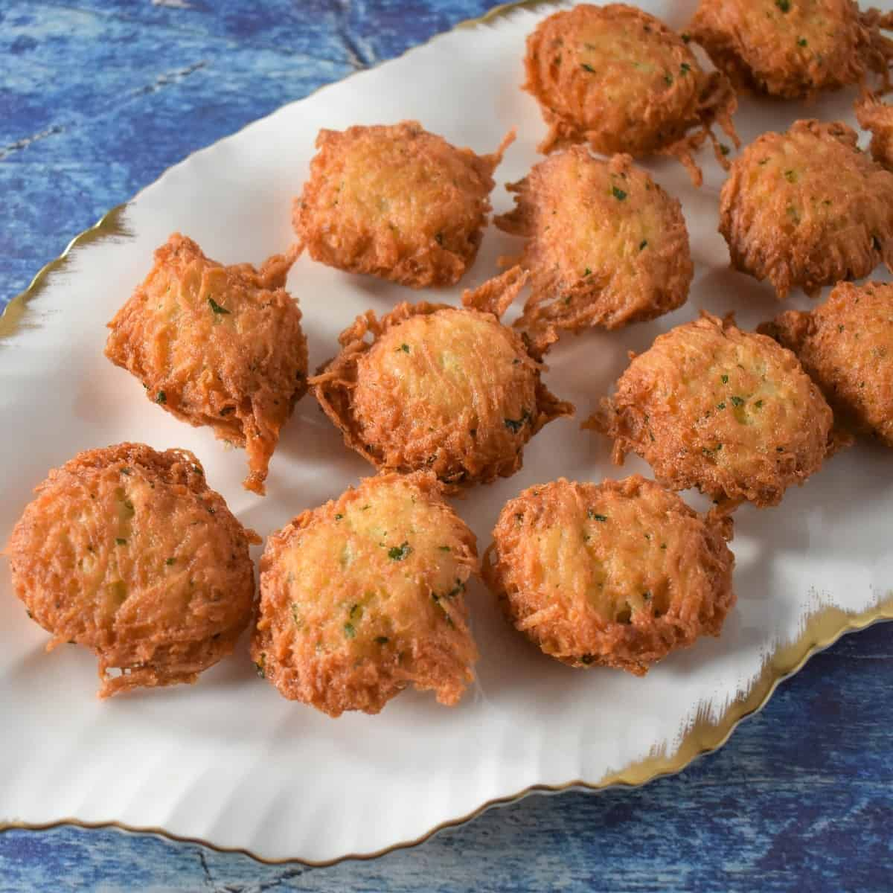

# Malanga Frita

*Cuba's fried taro chips: malanga root peeled and sliced into thin rounds, deep-fried in oil till the outside crisps deep golden and the inside stays soft. The Cuban counterpoint to potato fries: nuttier, slightly sweeter, with a distinctive earthy flavour. Served sprinkled with salt and a squeeze of lime alongside any Cuban main.*

**Serves:** 4

**Prep Time:** 15 minutes

**Cook Time:** 15 minutes

## Overview
Malanga frita is Cuba's beloved fried taro side and a staple of Cuban-American kitchens. Malanga root (also called yautía, eddoes or coco-yam; related to but distinct from the larger taro, smaller and creamier) peels, slices thin into rounds or wedges, and deep-fries in vegetable oil till the outside is deeply golden-brown and crispy while the inside stays creamy-soft. The earthy-nutty flavour is more nuanced than potato fries and gives the dish a distinct Cuban character. Peel carefully: malanga's brown skin is fibrous and slightly hairy, and a thin layer of the flesh just below the skin can also be fibrous and worth removing. Slice thin (3-4 mm) for chips or 1 cm thick for fries; the thinner the slice, the crisper the result. Fried at 175 °C, the sweet spot where the oil is hot enough to crisp without making the fries oily, but not so hot they burn before cooking through. Served sprinkled with flaky salt, a squeeze of lime juice, and often a small bowl of mojo sauce or pique for dipping.

## Ingredients

- 1 kg malanga root (about 3-4 medium roots; peeled weight)
- Vegetable oil for deep-frying (about 1 litre; or enough for 5 cm depth)
- 2 teaspoons fine sea salt
- Juice of 1 lime (for serving)
- 1 small bunch fresh coriander (chopped; optional)

### Optional dipping sauces
- Mojo sauce
- Pique
- Garlic mayonnaise
- Sour cream with garlic

## Method

### Stage 1 - Peel the malanga
1. Wash the malanga roots under cold running water to remove dirt.
2. Use a sharp knife or vegetable peeler to peel off the brown fibrous skin.
3. Cut away any blemishes or dark spots.
4. Rinse the peeled flesh under cold water.

### Stage 2 - Slice
1. For chips: slice into thin rounds (3-4 mm thick) using a mandoline or sharp knife.
2. For fries: cut into 1 cm × 1 cm × 7 cm batons.
3. Submerge in cold water as you slice (prevents oxidation).

### Stage 3 - Dry the malanga
1. Drain the sliced malanga in a colander.
2. Lay on a clean tea towel; pat dry thoroughly.
3. Dry malanga is essential for proper frying; wet malanga will spit and not crisp.

### Stage 4 - Heat the oil
1. Pour vegetable oil into a deep heavy pot to a depth of 5 cm.
2. Heat to 175°C (350°F).
3. Test with a small slice; it should sizzle and rise to the surface.

### Stage 5 - Fry in batches
1. Add the malanga slices in batches; don't overcrowd.
2. Fry chips for 3-4 minutes till deep golden-brown and crispy.
3. Fry fries for 5-6 minutes till golden and crisp on the outside.
4. Lift out with a slotted spoon; drain briefly on kitchen paper.

### Stage 6 - Season and serve
1. While still hot, sprinkle generously with sea salt.
2. Squeeze lime juice over.
3. Scatter chopped coriander if using.
4. Serve immediately with dipping sauces alongside.

## Notes
- **Peel thoroughly:** include a thin layer of the flesh below the skin which can be fibrous.
- **Dry the slices completely:** wet malanga spits and doesn't crisp.
- **175°C oil:** crucial for proper crisping.
- **Don't overcrowd:** crowded malanga steams; spread out gives crisp results.
- **Eat immediately:** crispness fades within 10 minutes.

## Variations
- **Yuca frita (the related cassava version):** swap malanga for yuca (cassava); boil 15 minutes first to tenderise, then fry. Different but related Cuban side.
- **Sweet potato malanga (boniato frito):** swap malanga for boniato (white sweet potato); fry the same way. Gives a sweeter starchier result.
- **Malanga balls (frituras de malanga):** grate the malanga raw; mix with garlic, salt and a beaten egg; shape into balls; deep-fry. Like Cuban malanga fritters.
- **Air-fried (healthier):** toss with 2 tablespoons oil; air-fry at 200°C for 12-15 minutes shaking halfway; less crisp but lighter.

## Serving
- Hot from the fryer, sprinkled with salt and lime, with dipping sauces on the side. Alongside any Cuban main: lechón asado, ropa vieja, picadillo. Or as a Cuban-style snack with cold beer.

## Storage
- Best eaten immediately.
- Keeps refrigerated 2 days; reheat in a hot oven (200°C / 400°F) for 4-5 minutes.
- Don't microwave; soggy.
- Don't freeze.
