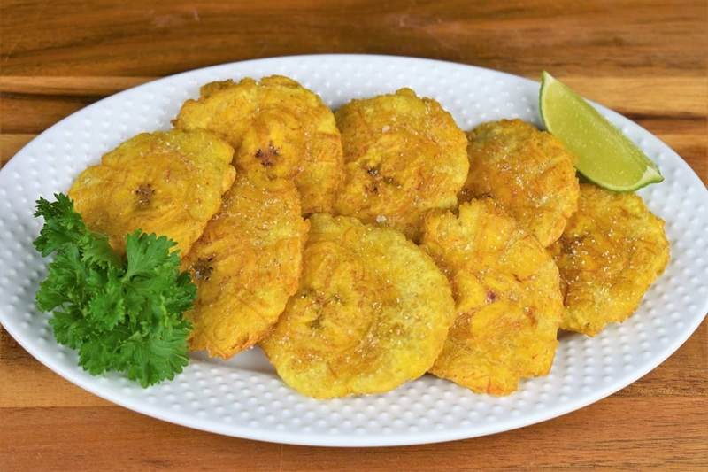

# Tostones

*Twice-fried green plantain rounds: golden disks, crisp on the outside and starchy-tender inside, smashed flat between two fryings and dunked into garlic-mojo while still hot. The standard Cuban side with roast pork, fried fish or rice and beans; also a snack with a beer.*

**Serves:** 4

**Prep Time:** 10 minutes

**Cook Time:** 15 minutes

## Overview
Green (unripe) plantains are peeled, sliced into thick rounds and fried gently in oil at moderate heat to par-cook them through. Each round is smashed flat to roughly twice its original diameter, then fried a second time at higher heat until deep gold and crisp. Salted immediately. Served with a garlic-citrus mojo for dunking.

## Ingredients

### Tostones
- 3 large green plantains (firm, unripe, dark green skin)
- About 500 ml sunflower or vegetable oil (for frying; needs to come 1 cm deep in the pan)
- Flaky salt

### Garlic-mojo dipper
- 6 garlic cloves
- ½ teaspoon salt
- 3 tablespoons olive oil
- 2 tablespoons fresh lime juice
- 2 tablespoons fresh orange juice (or replace both juices with 4 tablespoons sour orange juice if you can find it)
- ½ teaspoon ground cumin
- ½ teaspoon dried oregano
- Black pepper

## Method

### Stage 1 - Peel
1. Cut both ends off each plantain.
2. Score the skin lengthways in 3-4 places, just through the skin not into the flesh.
3. Slip your thumb under the skin at each score and peel it off in strips. Green plantain skin clings; cold water or a sharp knife under the edge helps.
4. Slice each peeled plantain into 2.5 cm thick rounds (slightly thicker than a £1 coin times two).

### Stage 2 - First fry
1. Heat 1 cm of oil in a wide pan to 160°C (a piece of plantain should bubble gently when added).
2. Add the plantain rounds in a single layer; don't crowd.
3. Fry 3-4 minutes a side, until pale gold and just tender when poked with a knife. The plantain should be cooked through but not browned.
4. Lift onto kitchen paper.

### Stage 3 - Smash
1. While still hot, smash each round flat between two pieces of parchment, a clean cloth or the bottom of a heavy glass. Press to roughly half the original thickness and twice the diameter, about 1 cm thick.
2. The rounds should hold together. If one falls apart, press the pieces back together; it'll fuse on the second fry.

### Stage 4 - Mojo (while plantains rest)
1. Pound the garlic with the salt to a paste in a mortar (or pulse in a small processor).
2. Stir in the cumin, oregano and pepper.
3. Whisk in the lime juice and orange juice.
4. Warm the olive oil in a small pan until just hot but not smoking. Pour over the garlic-citrus mix; it will hiss. This cooks out the raw garlic edge. Let it cool to warm.

### Stage 5 - Second fry
1. Raise the oil temperature to 180°C.
2. Drop the smashed rounds back into the oil; fry 2 minutes a side until deep gold and visibly crisp around the edges.
3. Lift onto kitchen paper. Salt generously while hot.

### Stage 6 - Serve
1. Arrange on a warm plate with the bowl of mojo for dunking.
2. Eat immediately. Tostones go leathery within 15 minutes.

## Notes
- **Green plantains:** Hard, dark green, no yellow patches. Yellow plantains are too sweet and don't crisp; they make maduros instead.
- **Salt the mojo aside, not in the marinade:** A scant amount of salt in the mojo because the tostones themselves are salted heavily out of the oil.
- **Smash thickness:** About 1 cm. Too thin and they crisp through with no soft middle; too thick and the centres are still chalky.
- **Hot oil for the second fry:** 180°C minimum. The crisp shell is set in this stage; tepid oil gives soggy tostones.
- **Plantain press:** A tostonera is the proper tool but unnecessary. The bottom of a heavy glass or mug works; a flat plate works.

## Variations
**With mojo on top:** Spoon mojo over the tostones rather than dipping; gives a wet, garlicky version.
**Stuffed (tostones rellenos):** Smash hot tostones in a cup-shape rather than flat; second-fry, then fill with seasoned shredded beef or shrimp.
**With lime alone:** A simpler version: a squeeze of lime and salt, no mojo.

## Serving
Serve with: Roast pork (lechon), ropa vieja, picadillo, fried fish, black beans and rice. Excellent with cold beer.
Garnish with: Fresh coriander, lime wedges.

## Storage
- Best eaten within 15 minutes of frying.
- Don't refrigerate or reheat: texture is gone.
- Par-fried rounds (after Stage 2, before smashing) can be refrigerated 24 hours; smash and second-fry from cold.
