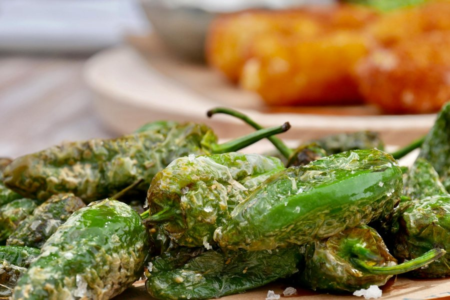

# Croquetas

*Cuba's small, slim croquettes: smaller and lighter than the Spanish original, just a few bites each. A bechamel-based filling enriched with finely chopped ham (jamón) or chicken, chilled until firm, shaped, breaded and shallow-fried golden. The cafeteria classic, the picnic classic, the late-night cafetín counter classic. Eaten with a squeeze of lime.*

**Serves:** 4 to 6 (makes about 18 croquetas)

**Prep Time:** 30 minutes (plus 4 hours chilling)

**Cook Time:** 15 minutes

## Overview
A thick bechamel cooks with finely diced ham or cooked chicken until it pulls away from the pan in a glossy mass. Chilled overnight (or at minimum 4 hours) until firm enough to shape into small cylinders. Each croqueta is breaded twice for a crisp shell that holds the soft, almost-pourable filling inside. Shallow-fried, not deep-fried, at moderate heat.

## Ingredients

### Filling
- 60 g unsalted butter
- 60 g plain flour
- 500 ml whole milk (warmed)
- ½ teaspoon ground nutmeg
- 200 g finely diced cooked ham (jamón cocido) or cooked chicken breast
- 2 tablespoons grated onion (with its juice)
- 1 tablespoon dry sherry (optional but traditional)
- Salt and white pepper

### Breading
- 80 g plain flour
- 2 large eggs (beaten with 1 tablespoon water)
- 200 g fine dry breadcrumbs (panko or homemade)
- About 250 ml sunflower oil, for shallow-frying
- Lime wedges, to serve

## Method

### Stage 1 - Bechamel base
1. Melt the butter in a heavy saucepan over medium heat.
2. Add the grated onion (with its juice); cook 1 minute until softened.
3. Add the flour; stir to a smooth roux. Cook 2 minutes, stirring constantly, until pale gold and smelling biscuity (not raw).
4. Add the warm milk in three additions, whisking smooth between each. The mixture should be thick and glossy.
5. Stir in the nutmeg, sherry if using, salt and white pepper.

### Stage 2 - Add the meat
1. Stir in the diced ham or chicken; the mixture should be thick enough that a spoon dragged through it leaves a path that closes slowly.
2. Continue cooking 4-5 minutes over low heat, stirring, until the mixture pulls away from the sides of the pan in a glossy mass. This is the consistency test.
3. Taste; adjust salt (ham is salty; chicken needs more).
4. Spread on a parchment-lined tray to a 2 cm thickness. Press another sheet of parchment directly on the surface to stop a skin forming.
5. Cool fully then refrigerate at least 4 hours, ideally overnight, until completely firm.

### Stage 3 - Shape
1. Set up three shallow bowls: flour, beaten egg, breadcrumbs.
2. Take heaped tablespoons of the chilled mixture and roll between damp palms into small cylinders, roughly 5 cm long and 2 cm thick. You should get 18-20.
3. Roll each in flour (tap off excess), then beaten egg, then breadcrumbs. For a sturdier shell, repeat the egg and breadcrumbs: this is the double-breading and recommended for first-timers.
4. Place on a tray. Chill the breaded croquetas 30 minutes if the kitchen is warm (helps them hold shape in the oil).

### Stage 4 - Fry
1. Heat 2 cm of oil in a wide pan to 170°C (a breadcrumb should bubble vigorously and brown in 30 seconds).
2. Fry the croquetas in batches of 5-6, turning gently with a spider, for 2-3 minutes total until deep gold all over.
3. Lift onto kitchen paper; salt lightly.
4. Keep warm in a low oven (100°C) while you fry the rest.

### Stage 5 - Serve
1. Pile onto a warm plate.
2. Serve immediately with lime wedges, hot sauce or a small bowl of mojo.

## Notes
- **Cuban vs Spanish:** Cuban croquetas are smaller (a couple of bites) and lighter than Spanish ones, with more milk in proportion to flour, giving a softer filling. Don't make them larger; they're snacks, not main-course croquettes.
- **Chill fully before shaping:** A barely-firm filling will leak in the fryer and the croquetas split. Overnight is best.
- **Double-bread for safety:** Two coats of egg and breadcrumbs gives a sturdier shell and is well worth the extra minute. The shell is what holds the soft filling in.
- **Oil at 170°C:** Hotter and the shell browns before the inside warms; cooler and oil seeps in. A thermometer is a real help here.
- **Damp palms:** Stop the filling sticking when shaping. Have a small bowl of water nearby.

## Variations
**Pollo (chicken):** Replace ham with finely chopped cooked chicken thigh; add an extra pinch of salt and a teaspoon of dried oregano.
**Bacalao (salt cod):** Use 200 g flaked, desalted cooked salt cod instead of ham; add 1 tablespoon chopped parsley.
**Queso y jamón:** Add 50 g grated mature cheddar or Gouda with the ham for a melty croqueta.

## Serving
Serve with: Lime wedges, a small bowl of mojo or salsa verde, cold beer or a glass of dry sherry.
Garnish with: Fresh parsley, a sprinkle of paprika.

## Storage
- Shaped, breaded, uncooked croquetas freeze excellently 1 month. Fry from frozen, adding 1 extra minute.
- Cooked croquetas keep 2 days refrigerated; reheat in a 180°C oven for 6-8 minutes.
- Don't microwave: the shell goes soft.
