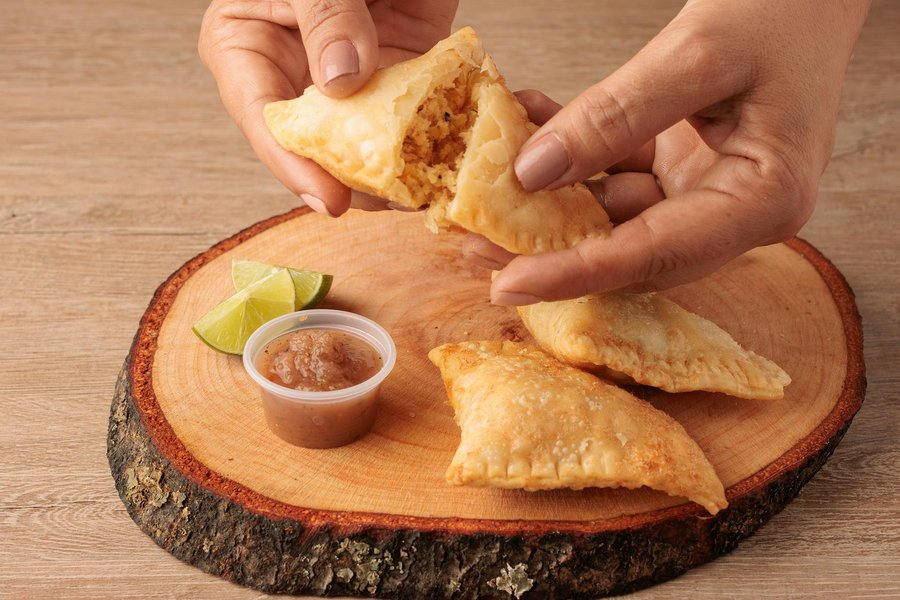

# Empanadas Cubanas

*Cuban-style empanadas: deep-fried half-moons of yellow dough filled with picadillo-style beef cooked down with sofrito, olives, raisins and capers.*

**Serves:** 4 to 6 (makes 12 empanadas)

**Prep Time:** 40 minutes (plus 30 minutes chilling)

**Cook Time:** 25 minutes (including the filling)

## Overview
A simple yellow dough (flour, lard or butter, water, salt, annatto or paprika for colour) rests cold while a picadillo-style ground beef filling cooks: sofrito, beef, tomato, olives, raisins, capers, cumin. Filling and dough chill separately. Rounds get filled, sealed with a crimped edge, and deep-fried until golden, blistered and hollow-sounding. Hot is best.

## Ingredients

### Dough
- 400 g plain flour
- 1 teaspoon salt
- 1 ½ teaspoons sweet paprika (for the yellow colour)
- 100 g cold lard or cold unsalted butter, cubed
- 1 egg (large)
- 150 ml cold water (more if needed)

### Picadillo filling
- 2 tablespoons olive oil
- 1 onion (medium, finely chopped)
- 1 green pepper (finely chopped)
- 4 garlic cloves (crushed)
- 1 teaspoon ground cumin
- 1 teaspoon dried oregano
- 1 teaspoon sweet paprika
- 400 g ground beef (15 to 20 percent fat)
- 2 tablespoons tomato purée
- 1 ripe tomato (large, chopped) or 100 g tinned chopped tomatoes
- 60 g pitted green olives (chopped)
- 40 g raisins
- 2 tablespoons capers (drained and chopped)
- 2 tablespoons dry white wine or dry sherry (optional)
- ½ teaspoon salt
- Black pepper

### To assemble and fry
- 1 egg (large, beaten with 1 teaspoon water, for sealing)
- 1 litre sunflower or vegetable oil, for deep-frying

## Method

### Stage 1 - Dough
1. Whisk the flour, salt and paprika in a bowl.
2. Rub in the cold fat until you have rough pea-sized lumps.
3. Beat the egg with the cold water; pour in. Mix with a knife then bring together into a rough ball. Add a tablespoon more water if the dough won't come together.
4. Press into a flat disc; wrap and chill 30 minutes.

### Stage 2 - Filling
1. Heat the olive oil in a wide pan over medium heat.
2. Add the onion and green pepper; cook 6-7 minutes until soft.
3. Add the garlic, cumin, oregano and paprika; cook 1 minute.
4. Add the beef; break up with a spoon. Brown 5-6 minutes until no longer pink, crumbling as it cooks.
5. Stir in the tomato purée; cook 1 minute. Add the chopped tomato, olives, raisins, capers, wine if using, salt and pepper.
6. Simmer uncovered 8-10 minutes until thick and almost dry (any wet filling will leak in the fryer). The mixture should hold its shape when pressed against the side of the pan.
7. Cool fully on a wide plate. Filling must be at room temperature or cooler before filling.

### Stage 3 - Shape
1. Divide the chilled dough into 12 equal pieces, about 50 g each.
2. Roll each piece into a thin round, about 14 cm across and 2 mm thick.
3. Place a heaped tablespoon of cooled filling in the centre.
4. Brush the egg wash around the edge of the round.
5. Fold over to a half-moon. Press the edges together firmly.
6. Crimp by pressing with a fork or by rolling and folding the edge (repulgue) for a classic look. Make sure the seal is complete: leaks ruin empanadas.
7. Place on a floured tray. Chill 15 minutes (helps them hold shape in the oil; optional but better).

### Stage 4 - Fry
1. Heat 4 cm of oil in a deep pan to 180°C (a small piece of dough should bubble and brown in 30 seconds).
2. Lower 3-4 empanadas into the oil (don't crowd: oil temperature drops).
3. Fry 3-4 minutes a side, turning once, until deep gold and visibly blistered.
4. Lift onto kitchen paper.
5. Continue with the rest, keeping oil temperature steady.

### Stage 5 - Serve
1. Eat hot, within 10 minutes of frying.
2. Serve with mojo, hot sauce or a wedge of lime.

## Notes
- **Annatto vs paprika:** Annatto (achiote) is the traditional colourant: a deep gold-yellow. Sweet paprika gives a slightly orange-yellow that's still right. Don't use turmeric: wrong flavour.
- **Dry filling:** This is the crucial step. Wet picadillo leaks through the seal and into the oil. Simmer the filling until it pulls from the pan; cool fully.
- **Seal properly:** Egg wash around the edge plus firm crimping. A small leak is acceptable; a big one is a disaster.
- **Fry, don't bake:** Cuban empanadas are deep-fried for the blistered crisp shell. Baked is a different dish (Argentinian-style).
- **Lard vs butter:** Lard makes a flakier, more savoury crust. Butter works.

## Variations
**Chicken:** Replace beef with 400 g cooked, shredded chicken; reduce simmer time to 5 minutes.
**Ham and cheese (jamón y queso):** Fill with cubed cooked ham and mature cheese instead of picadillo; gooey, fast.
**Black bean (vegetarian):** Replace beef with 300 g cooked drained black beans, mashed coarsely with the sofrito.

## Serving
Serve with: Mojo for dunking, hot sauce, lime wedges, cold beer.
Garnish with: A scatter of fresh coriander, lime wedges, a small bowl of pickled onion.

## Storage
- Shaped uncooked empanadas freeze 1 month; fry from frozen, adding 1 minute.
- Cooked empanadas keep 2 days refrigerated; reheat in a 180°C oven for 8 minutes (the microwave makes them soggy).
