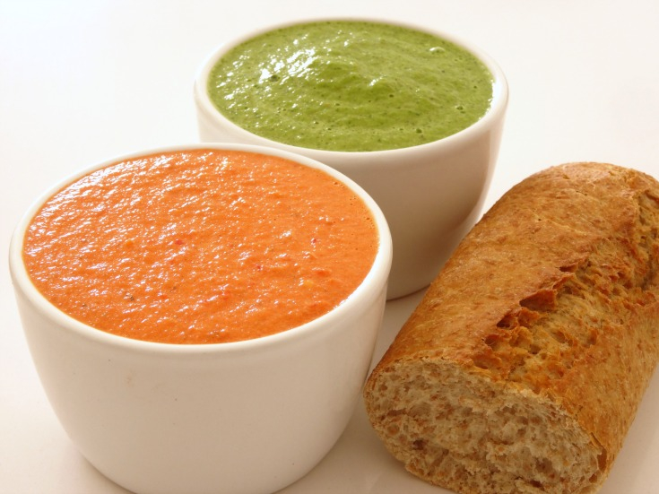

# Cuban Mojo Sauce

*Cuba's foundational garlic-citrus sauce: crushed garlic infused in warm olive oil, finished with fresh sour orange juice (or lime + orange juice), cumin, oregano and salt. The Cuban sauce that goes on everything - on lechón asado, on yuca, on plantains, as a dipping sauce, as a marinade. The single most important Cuban condiment.*

**Serves:** Makes about 300 ml

**Prep Time:** 10 minutes

**Cook Time:** 3 minutes

## Overview
Mojo (pronounced moh-ho) is the foundational Cuban sauce and the canonical Cuban condiment that goes on practically everything: a generous amount of crushed garlic infused briefly in warm olive oil (not browned; just heated till fragrant), then taken off the heat and combined with fresh sour orange juice (naranja agria; the canonical Cuban citrus), or a substitute mix of lime juice and orange juice, plus ground cumin, dried oregano, fresh chopped coriander and salt. The sauce is used both raw (drizzled over food at the table) and as a marinade (mojo criollo is the marinade form, used for lechón asado, masitas de puerco and grilled meats). Mojo turns up alongside virtually every Cuban dish: drizzled over yuca con mojo, ladled onto sliced lechón, spooned over malanga frita and tostones, used as a dipping sauce for fried plantains, mixed into the marinade for grilled chicken or fish. The dish is the absolute essence of Cuban flavour: bright, garlicky, citrusy, slightly oily, deeply aromatic. Three details define proper Cuban mojo. First, sour orange is canonical. Cuban naranja agria has a tart-sweet character that ordinary orange doesn't have. The standard substitute outside Cuba is equal parts lime juice and orange juice. Second, don't brown the garlic. Warm the oil; add garlic; cook for 30 seconds till fragrant only. Browned garlic ruins the sauce. Third, combine off heat. Once the garlic-oil is fragrant, take off the heat completely before adding the citrus juice. Adding cold juice to hot oil splatters dangerously, and the heat dulls the fresh citrus.

## Ingredients

- 12 garlic cloves (crushed; that's not a typo)
- 150 ml extra virgin olive oil
- 150 ml fresh sour orange juice (naranja agria); OR 75 ml fresh orange juice + 75 ml fresh lime juice as substitute
- 2 teaspoons fine sea salt
- 2 teaspoons ground cumin
- 2 teaspoons dried oregano
- 1 teaspoon ground black pepper
- 1 small fresh chilli (deseeded, finely chopped; optional)
- 1 tablespoon fresh coriander (chopped; optional)

## Method

### Stage 1 - Warm the oil
1. Place the olive oil in a small saucepan over low heat.
2. Heat for 30 seconds till just warm.

### Stage 2 - Add the garlic
1. Add the crushed garlic.
2. Cook 30-60 seconds, stirring, till just fragrant.
3. Don't let the garlic brown; it should stay pale.

### Stage 3 - Take off the heat
1. Take the pan off the heat immediately.
2. Let cool for 1-2 minutes (so the citrus doesn't splatter when added).

### Stage 4 - Add the citrus and seasonings
1. Pour in the sour orange juice (or the lime-and-orange substitute).
2. Stand back briefly; the oil may splutter when the cold juice hits.
3. Add the salt, cumin, oregano, pepper, optional chilli and coriander.
4. Stir well to combine.

### Stage 5 - Rest
1. Let stand for 30 minutes at room temperature; the flavours meld and the garlic mellows.
2. Taste; adjust salt and citrus.

### Stage 6 - Use or store
1. Transfer to a small jug for serving at the table.
2. Or transfer to a sealed jar for storage.

## Notes
- **Sour orange is canonical:** if you can find naranja agria, use it. The standard substitute is equal parts lime juice and orange juice.
- **Don't brown the garlic:** burned garlic ruins the sauce. Cook just till fragrant.
- **Add citrus off heat:** safer (no spluttering) and preserves the fresh citrus flavour.
- **Lots of garlic:** 12 cloves is canonical. The sauce is named for the garlic; don't be timid.
- **Rest before serving:** 30 minutes for the flavours to marry.

## Variations
**Mojo verde:** add 1 large bunch of chopped fresh coriander and 1 small chopped chilli; gives a green mojo close to Canarian-Spanish style.
**Mojo with cumin-heavy:** double the cumin; gives a deeper warm-spice profile.
**With cilantro (mojo criollo):** add 2 tablespoons of finely chopped fresh culantro/recao; gives a more aromatic Caribbean version.
**Roasted-garlic mojo:** roast the garlic cloves at 200°C / 400°F for 25 minutes till caramelised; then add to the warm oil; gives a sweeter mellower mojo. Different but excellent.

## Serving
At the table in a small jug for drizzling. Over yuca con mojo (the canonical pairing), sliced lechón asado, malanga frita, tostones, masitas de puerco, grilled chicken, grilled fish. As a marinade (mojo criollo) for lechón asado before roasting. As a dipping sauce for Cuban bread.

## Storage
- Keeps refrigerated 1 week in a sealed jar.
- The garlic flavour intensifies over time.
- Don't freeze; the texture suffers (the oil separates).
- For longer storage, freeze in ice-cube trays as 1-tablespoon portions; pop out and store in bags for up to 3 months.
- Bring to room temperature 20 minutes before serving (cold mojo congeals as the olive oil solidifies).
