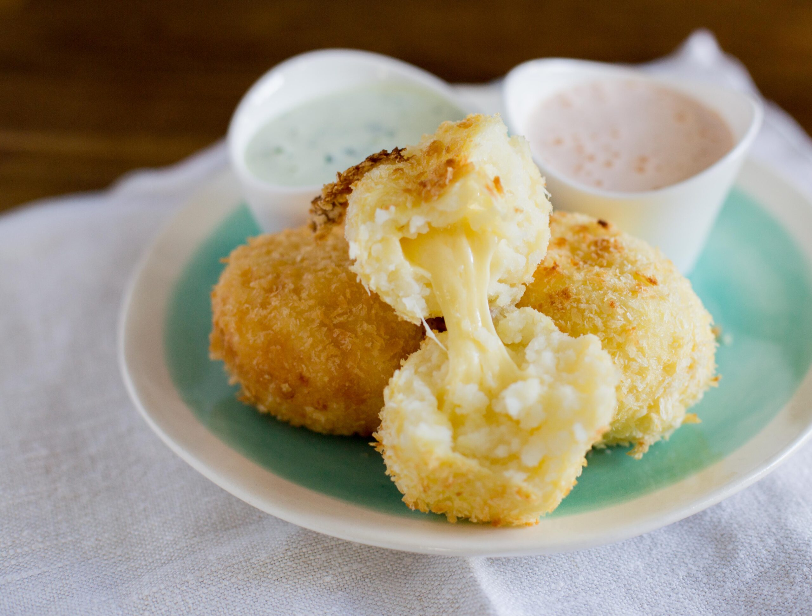

# Papas Rellenas

*Cuba's stuffed potato balls: balls of mashed potato wrapped around a spiced beef picadillo filling, dipped in egg, rolled in breadcrumbs and deep-fried till the outside is crisp golden and the inside stays soft. The Cuban-American street snack and party-table staple, eaten with a squeeze of lime or a side of pique.*

**Serves:** 6 (12 papas rellenas)

**Prep Time:** 45 minutes

**Cook Time:** 30 minutes

## Overview
Papas rellenas ("stuffed potatoes") is one of Cuba's most beloved street snacks and a Cuban-American party-table standard: balls of seasoned mashed potato wrapped around cold picadillo (spiced beef hash), shaped into spheres, dipped in beaten egg, rolled in breadcrumbs and deep-fried till deep golden-brown and crispy outside, soft and creamy inside. The mashed potato is seasoned with garlic, salt, butter and egg yolk for binding; it is not just a wrapper but a real component. The picadillo must be cold before assembly or it melts the potato. The double-coat is the secret to a proper crust: egg, breadcrumb, egg, breadcrumb gives a thick crispy shell that holds up in the fryer. Sold at every Cuban panadería alongside croquetas and pastelitos. Eaten with a squeeze of lime, a dollop of mayo-ketchup, or a small bowl of pique.

## Ingredients

### Mashed potato (the wrapper)
- 1.2 kg floury potatoes (Maris Piper, Russet, King Edward; peeled and cubed)
- 80 g unsalted butter
- 2 egg yolks
- 4 garlic cloves (crushed)
- 1 ½ teaspoons fine sea salt
- 1 teaspoon ground black pepper
- 1 teaspoon ground cumin (optional)
- 2 tablespoons fresh chopped parsley

### Filling
- 400 g cooked picadillo Cubano (see the picadillo recipe; thick, well-reduced, not wet)

### Coating
- 200 g plain flour (for first dredge)
- 3 large eggs (beaten with 2 tablespoons milk)
- 250 g fine dried breadcrumbs (panko works too)

### Frying
- Vegetable oil for deep-frying (about 1.5 litres; or enough for 7 cm depth)

### To serve
- Lime wedges
- Mayo-ketchup sauce
- Pique
- Mojo sauce

## Method

### Stage 1 - Cook the potatoes
1. Place the cubed potato in a large saucepan with cold water and 1 teaspoon salt.
2. Bring to a boil; cook 15-18 minutes till the potatoes are properly tender (a knife slides through easily).
3. Drain thoroughly; tip back into the warm pan.
4. Let dry over very low heat for 1-2 minutes (removes excess moisture; important for the wrapper texture).

### Stage 2 - Mash and season
1. Mash the potatoes till smooth (use a potato masher or push through a ricer for the smoothest finish).
2. Add the butter; whisk till melted.
3. Add the egg yolks, crushed garlic, salt, pepper, cumin and chopped parsley.
4. Mix thoroughly; the mash should be smooth, well-seasoned and slightly cooled.
5. Let cool to room temperature so it's workable but not hot.

### Stage 3 - Prepare the picadillo
1. Make sure the picadillo is cold or at room temperature, not hot.
2. The picadillo should be thick and well-reduced; wet filling will leak during assembly.

### Stage 4 - Shape the papas rellenas
1. Take 2 generous tablespoons of mashed potato (about 80 g); flatten in the palm of your hand into a 10 cm round disc, about 1 cm thick.
2. Place 1 generous tablespoon (about 30 g) of cold picadillo in the centre.
3. Wrap the potato around the filling; pinch the edges to seal completely.
4. Roll between your palms into a smooth round ball, about 6 cm across.
5. Place on a tray.
6. Repeat with the remaining potato and picadillo; you should have 12 balls.

### Stage 5 - Coat the balls
1. Set up 3 wide shallow dishes: flour in one, beaten eggs in the second, breadcrumbs in the third.
2. Working one at a time: roll a potato ball in flour, then dip into the egg, then roll in breadcrumbs.
3. For extra-thick crust: repeat the egg and breadcrumb step (egg → breadcrumb again).
4. Place each coated ball on a tray.
5. Refrigerate for 15-30 minutes (firms them up for frying; reduces breakdown risk).

### Stage 6 - Heat the oil
1. Pour vegetable oil into a deep heavy pot to a depth of 7 cm.
2. Heat to 175°C (350°F).
3. Test with a small ball of breadcrumb-coated potato; it should sizzle and brown in 90 seconds.

### Stage 7 - Deep-fry
1. Lower 3-4 papas rellenas into the hot oil with a slotted spoon; don't overcrowd.
2. Fry 4-5 minutes, turning gently with a slotted spoon, till deeply golden-brown all over.
3. Lift out with a slotted spoon; drain briefly on kitchen paper.
4. Continue with the remaining papas rellenas in batches.

### Stage 8 - Serve immediately
1. Pile the hot papas rellenas on a serving plate.
2. Place dipping sauces in small bowls.
3. Lime wedges alongside.
4. Eat hot; the crispness fades as they cool.

## Notes
- **Cold filling, room-temperature mash:** the temperature difference is essential. Hot picadillo melts the wrapping; hot mash is hard to shape.
- **Double-coat for the proper crust:** egg-breadcrumb-egg-breadcrumb gives the thick crispy crust that holds up to frying. Single coat can split.
- **Refrigerate before frying:** the chill firms up the wrappers; without this they can fall apart.
- **175°C oil:** higher burns the outside; lower gives oily papas.
- **Don't overcrowd:** 3-4 at a time max.

## Variations
**Ham-and-cheese filling:** swap the picadillo for finely diced ham mixed with grated cheese; gives a milder kid-friendly version.
**Chicken filling:** swap for shredded slow-cooked chicken with sofrito; lighter version.
**Vegetarian (with cheese and olives):** fill with a mix of crumbled feta, sliced olives and sautéed garlic-spinach; vegetarian-friendly.
**Baked version (healthier):** brush coated papas with oil; bake at 200°C / 400°F for 25 minutes till golden. Less crisp but lighter.

## Serving
On a serving plate with lime wedges and dipping sauces. At Cuban parties, family gatherings, breakfast spreads, or as a snack any time. Drink: Cristal beer, mojito, or fresh coffee.

## Storage
- Best eaten immediately while crispy.
- Keeps refrigerated 3 days; reheat in a hot oven (200°C / 400°F) for 8-10 minutes.
- Don't microwave; the crust goes soggy.
- The uncooked coated balls freeze 2 months on a tray, then transferred to a bag; fry from frozen at 165°C for 7-8 minutes.
