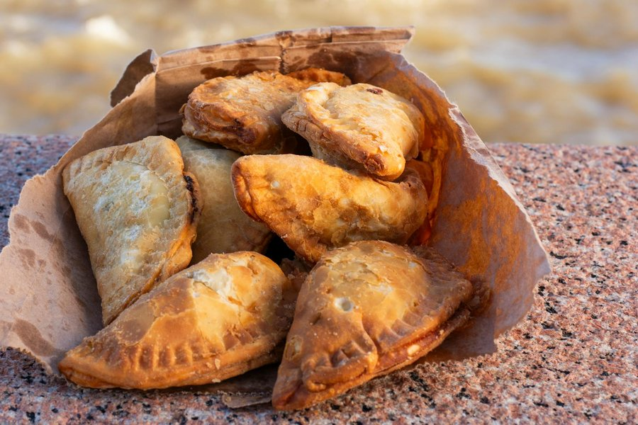

# Pastelitos

*Cuba's bakery pastry: small flaky puff-pastry squares filled with guava paste and cream cheese, baked till the pastry is shatteringly gold.*

**Serves:** 4 to 6 (makes 12 pastelitos)

**Prep Time:** 25 minutes (plus 15 minutes chilling)

**Cook Time:** 22 minutes

## Overview
Pastelitos are the Cuban bakery breakfast every Calle Ocho café has stacked in the display case from six in the morning, golden puff-pastry parcels with melting cream cheese and dark guava paste inside. All-butter puff pastry (homemade if you've the patience, shop-bought all-butter if you don't) rolls out, cuts into squares, takes a slab of guava paste and a chunk of cream cheese, then seals into a parcel or gets topped with a second pastry square. Brush with egg wash for the gloss; bake at high heat until golden and dramatically puffed. While still hot from the oven, a brush of simple sugar syrup gives them the shiny lacquered finish you see in the bakery windows. Eat warm with a Cuban coffee.

## Ingredients

### Pastry
- 500 g all-butter puff pastry (one block, shop-bought is fine; ideally rolled to 3 mm thick)

### Filling
- 250 g guava paste (Spanish: "pasta de guayaba"; sold in slabs in Latin shops or supermarket "World Foods" aisle)
- 250 g full-fat cream cheese (cold; the firm block kind, not whipped)

### Egg wash and finish
- 1 egg (large, beaten with 1 teaspoon water and a pinch of salt)
- 50 g caster sugar
- 50 ml water
- ½ teaspoon vanilla extract

## Method

### Stage 1 - Prep the fillings
1. Slice the guava paste into 12 rectangles, roughly 5 × 3 cm × 5 mm thick.
2. Slice the cream cheese (cold from the fridge) into 12 similar rectangles.
3. Keep both in the fridge while you prep the pastry.

### Stage 2 - Cut the pastry
1. Heat the oven to 200°C (180°C fan). Line two baking sheets with parchment.
2. Unroll or roll the pastry on a lightly floured surface to a rectangle roughly 36 × 24 cm and 3 mm thick.
3. Cut into 12 even squares of about 12 × 6 cm (or 24 squares of 6 × 6 cm if you prefer the smaller topped-and-bottom style).

### Stage 3 - Assemble
1. Method A (folded parcel, 12 pastelitos): Place a piece of guava paste and a piece of cream cheese side by side on one half of each 12 × 6 cm rectangle. Brush the border with egg wash. Fold over to a 6 × 6 cm square; press edges to seal with the back of a fork.
2. Method B (top-and-bottom, 12 pastelitos): Lay a guava-and-cream-cheese stack on 12 squares of 6 × 6 cm pastry. Brush the edges with egg wash. Top with another square; press the edges with a fork to seal.
3. Place on the prepared sheets, leaving 4 cm between each.
4. Cut a small steam vent in the top of each with the tip of a knife.
5. Brush the tops with egg wash.
6. Chill 15 minutes (cold pastry going into a hot oven rises best).

### Stage 4 - Bake
1. Bake 18-22 minutes until deep gold, fully puffed and visibly flaky.
2. Lift the parchment with the pastelitos onto a wire rack.

### Stage 5 - Glaze and serve
1. While the pastelitos bake, combine the sugar, water and vanilla in a small pan.
2. Bring to a simmer; cook 2 minutes until slightly syrupy. Take off the heat.
3. Brush the warm pastelitos generously with the warm syrup; this gives the bakery-style shine.
4. Cool 5 minutes (the guava paste is napalm-hot straight from the oven).
5. Eat warm, with strong sweet coffee.

## Notes
- **All-butter puff:** Margarine-based puff has the wrong flavour. Spend the extra; brands like Carrême or Jus-Rol All Butter are reliable.
- **Cold filling:** Guava paste and cream cheese both stay neater if cold going in. The cream cheese needs to be the firm block sort, not the whippable tub kind, or it leaks.
- **Don't overfill:** A small slab of each is enough. Too much guava and it bubbles out and burns on the tray.
- **Steam vent:** Critical. Without it, the pastry won't rise evenly and may burst at a random edge.
- **Sugar glaze:** This is what separates home pastelitos from bakery ones. Don't skip.

## Variations
**Carne (beef):** Fill with cooled, dry picadillo (Cuban ground beef with olives, raisins and capers) instead of guava and cream cheese. Savoury, equally classic.
**Coco (coconut):** Fill with dulce de coco (sweet shredded coconut cooked with condensed milk).
**Guava only:** Some traditional bakeries make a pure guava version with no cream cheese. Sweeter, lighter.
**Ham and cheese:** Fill with thinly sliced cooked ham and grated Gruyère; the breakfast version.

## Serving
Serve warm with strong sweet coffee (café cubano) or a glass of cold milk. Best eaten the day they're baked, within an hour or two of the oven.

## Storage
- Best within hours of baking.
- Keep at room temperature in a sealed tin 1 day; refresh in a 170°C oven for 4 minutes to revive the crisp.
- Unbaked, assembled pastelitos freeze 1 month; bake from frozen, adding 4-5 minutes.
