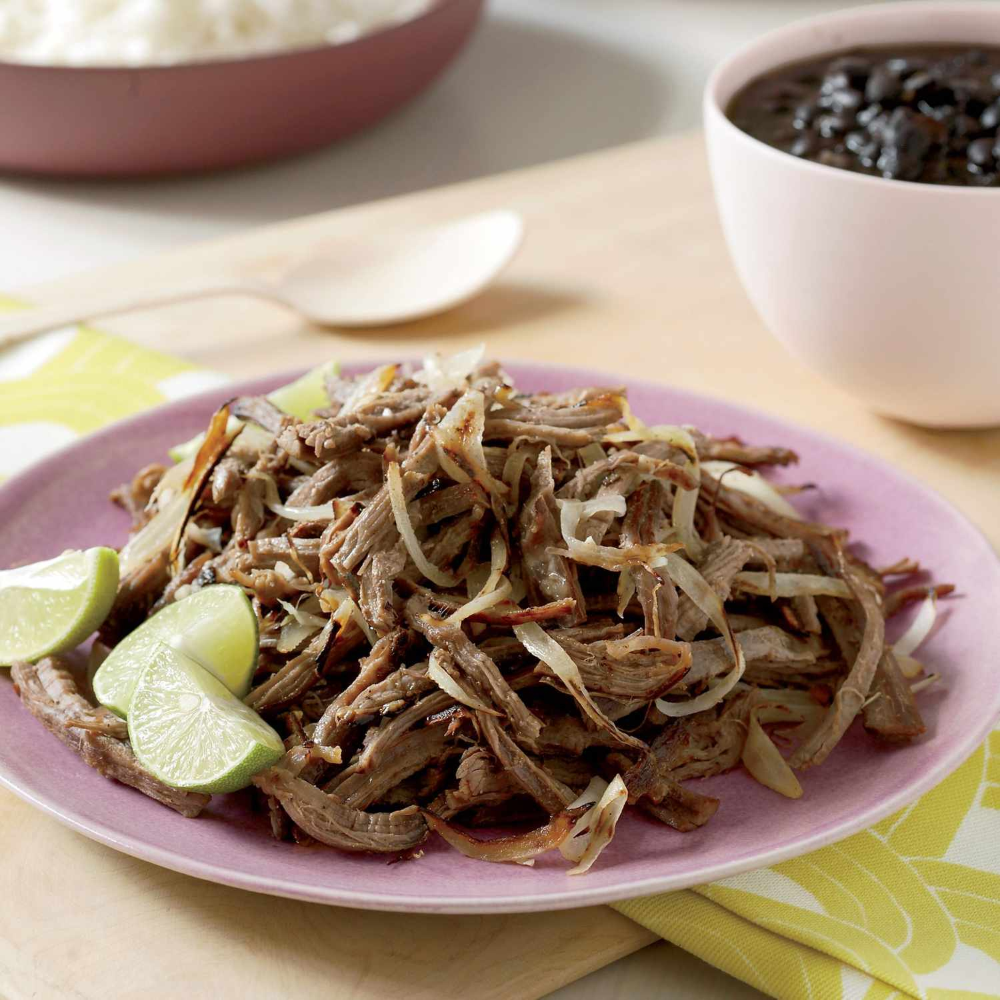

# Vaca Frita

*Cuba's "fried cow": shredded slow-cooked flank steak (often leftover from ropa vieja or fresh-cooked) marinated briefly in citrus and garlic, then pan-fried in a screaming-hot skillet with onions till the edges crisp and the strands turn crackly-brown. The Cuban diner-classic, eaten over rice with black beans and sweet plantains.*

**Serves:** 4

**Prep Time:** 15 minutes (plus 30 minutes marinating)

**Cook Time:** 40 minutes (or 10 minutes if using leftover ropa vieja meat)

## Overview
Vaca frita (literally "fried cow") is one of Cuba's most beloved beef preparations and the traditional Cuban diner classic, a close cousin to ropa vieja but distinct in finish. Flank steak first slow-simmers in flavoured broth till fork-tender, shreds along the grain into long strands, marinates briefly in sour orange (or lime and orange juice) and garlic, then pan-fries in a screaming-hot skillet with olive oil and sliced onions till the edges of the beef strands go crisp-crackly-brown and the onions melt into a glossy sweet base. Often made from leftover ropa vieja meat (the shredded beef without the sauce), making vaca frita the natural second-day evolution. The pan must be smoking-hot before the beef goes in; the crisp edges come from very high heat. Don't crowd the pan: the beef strands need space to brown, and a crowded pan steams instead of fries. The citrus marinade tenderises further and adds the proper Cuban tang. Eat over plain white rice with black beans, sweet plantains and a fresh salad.

## Ingredients

### Beef (if starting from raw flank)
- 1 kg flank steak
- 1 large onion (quartered)
- 6 garlic cloves (whole)
- 2 bay leaves
- 1 teaspoon black peppercorns
- 1 ½ teaspoons fine sea salt
- 1.5 litres beef stock or water

### OR (using leftover ropa vieja beef)
- 800 g shredded cooked beef from leftover ropa vieja (drained of sauce)

### Marinade
- Juice of 4 limes (or use sour orange / naranja agria juice; or juice of 2 limes + juice of 1 orange as substitute)
- 8 garlic cloves (crushed)
- 1 tablespoon ground cumin
- 1 tablespoon dried oregano
- 1 teaspoon fine sea salt
- 1 teaspoon ground black pepper
- 2 tablespoons olive oil

### Frying
- 6 tablespoons olive oil
- 2 large onions (sliced into thin half-moons)
- 1 teaspoon fine sea salt (for onions)
- 1 small fresh chilli (deseeded, sliced, optional)

### To finish
- 1 small bunch fresh coriander (chopped)
- Juice of 1 lime
- Lime wedges

### To serve
- Plain white rice
- Black beans
- Sweet plantains (maduros)
- Sliced avocado
- Fresh salad
- Cristal beer or mojito

## Method

### Stage 1 - Cook and shred the beef (if starting raw)
1. Place the flank steak in a large pot.
2. Add the quartered onion, garlic, bay leaves, peppercorns, salt and stock.
3. Bring to a boil; reduce to a simmer; cover with the lid ajar.
4. Cook 90 minutes till the beef is fork-tender.
5. Lift out; cool slightly.
6. Shred along the grain into long thin strands.

### Stage 2 - Marinate
1. In a wide bowl, combine the lime juice (or sour orange), crushed garlic, cumin, oregano, salt, pepper and olive oil.
2. Add the shredded beef; toss to coat thoroughly.
3. Cover and refrigerate 30 minutes (or up to 2 hours).

### Stage 3 - Fry the onions
1. Heat 4 tablespoons of olive oil in a wide heavy frying pan over medium-high heat.
2. Add the sliced onions; cook 10 minutes till deeply soft and starting to caramelise.
3. Add the chilli if using.
4. Transfer to a plate; keep warm.

### Stage 4 - Sear the beef
1. Increase the heat to high.
2. Add the remaining 2 tablespoons of olive oil to the pan; let smoke briefly.
3. Lift the marinated beef from the bowl (let excess drip off; reserve any leftover marinade).
4. Add the beef in 2-3 batches to the screaming-hot pan; don't crowd.
5. Cook each batch 3-4 minutes, pressing down with a spatula occasionally, till the edges of the strands turn deeply golden-brown and crispy.

### Stage 5 - Combine and finish
1. Once all the beef is cooked, return all the batches to the pan along with the fried onions.
2. Pour the reserved marinade over.
3. Toss together over high heat for 1-2 minutes; the marinade evaporates and the flavours meld.
4. Add the lime juice and chopped coriander.
5. Toss once more.

### Stage 6 - Serve immediately
1. Spoon hot white rice onto plates.
2. Pile the vaca frita over.
3. Add black beans, plantains, avocado and salad alongside.
4. Lime wedges.

## Notes
- **Screaming-hot pan:** essential for the crispy edges. The pan must be smoking before the beef goes in.
- **Don't crowd the pan:** crowded beef steams; spread-out beef crisps. Work in 2-3 batches.
- **Sour orange is traditional:** if you can find naranja agria (Seville sour orange), use it. Lime + orange juice is the standard substitute.
- **Use leftover ropa vieja:** the dish was historically a way to use up leftover ropa vieja meat. Making fresh works; leftover works too.
- **Press down while cooking:** the spatula-press on the beef strands helps the surface area contact the hot pan, which crisps the edges.

## Variations
- **Vaca frita with grapefruit:** swap half the lime juice for grapefruit juice; gives a different citrus note.
- **Vaca frita de pollo (chicken version):** swap the flank steak for shredded slow-cooked chicken thigh; lighter version.
- **With pickled red onions:** top the vaca frita with quick-pickled red onions (red onion + lime juice + salt + 10 minutes); adds tang and crunch.
- **Spicy vaca frita:** add 2 chopped habanero peppers to the marinade; properly Caribbean fierce.

## Serving
- On wide plates with white rice, black beans, sweet plantains, sliced avocado, fresh salad and lime wedges. Drink: cold Cristal beer, mojito, or fresh limeade. As a Cuban family weekend lunch.

## Storage
- Best eaten immediately when the edges are crispy.
- Keeps refrigerated 3 days; reheat in a hot pan briefly for 2 minutes to re-crisp.
- Don't microwave; the crisp edges go soggy.
- The shredded marinated beef (before frying) keeps refrigerated 2 days; freezes 2 months.
- Day-old vaca frita is excellent in tacos or Cuban sandwiches.
