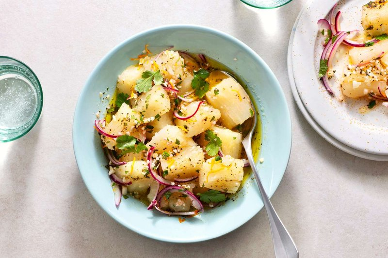

# Yuca Con Mojo

*Cuban boiled cassava drowned in mojo, the raw sauce of crushed garlic, sour orange and olive oil. The starchy yuca soaks up the punchy citrus-garlic dressing.*

**Serves:** 4

**Prep Time:** 15 minutes

**Cook Time:** 25 minutes

## Overview
Yuca con mojo is the Cuban side that turns a humble cassava root into something punchy, garlicky and almost greasy in the best way. The yuca (cassava) boils in salted water until a knife slides through easily; this can take fifteen to thirty minutes depending on the freshness of the root. Meanwhile you crush garlic to a coarse paste with salt; sour orange juice (or lime mixed with orange if you can't find sour oranges) mixes in; hot olive oil pours over the garlic mixture to bloom it, the kitchen filling with that distinctive raw-garlic-meets-hot-oil aroma. The drained yuca lands on a serving dish, the mojo gets poured generously over the top, and everyone digs in with their hands. Beside roast pork, this is what Cuban Sunday lunch looks like.

## Ingredients

- 1 kg cassava (yuca; peeled, cored and cut into 4 cm chunks)
- 1 tablespoon salt (for the cooking water)

### Mojo
- 8 garlic cloves (crushed to paste with a pinch of salt)
- 1 teaspoon salt
- ½ teaspoon ground cumin
- ½ teaspoon dried oregano
- 100 ml olive oil
- 2 sour oranges (or 60 ml fresh orange juice + 30 ml lime juice, juice)
- 1 onion (small, very thinly sliced)
- Black pepper
- Fresh parsley (or coriander, chopped, to serve)

## Method

### Stage 1 - Boil the yuca
1. Cover the cassava with cold water in a large pan; add the salt.
1. Bring to the boil; reduce to a simmer and cook 20-25 minutes until a knife slides through easily.
1. Drain; arrange in a serving dish; pull out the woody central core if any pieces still have it.

### Stage 2 - Mojo
1. Mash the garlic with the salt to a paste in a mortar (or finely mince and crush with the side of a knife).
1. Mix in the cumin, oregano, citrus juices and onion. Let sit 5 minutes.
1. Heat the olive oil in a small pan until shimmering (just before smoking).
1. Pour the hot oil over the garlic mixture; it will sizzle and bloom. Stir; let stand 2 minutes.

### Stage 3 - Serve
1. Spoon the mojo all over the hot yuca, including the onions.
1. Top with chopped parsley or coriander.

## Notes
- **Sour orange (naranja agria) is traditional:** If you can't find it, the orange + lime mix is the standard substitute.
- **Cassava cooking time varies:** Older roots take longer. The piece is done when a knife meets no resistance.
- **Hot oil is key:** Cold oil gives raw garlic. The bloom step mellows the garlic and emulsifies the sauce.
- **Frozen cassava:** Pre-peeled frozen yuca (Caribbean grocers) skips a tedious knife job; cook from frozen, adding 5 minutes.

## Storage
- Best eaten right away. Leftover yuca refrigerates 2 days; reheat in the microwave; remake the mojo fresh.
