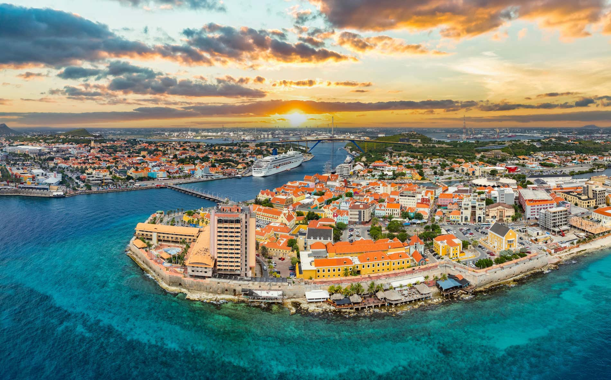

# Curaçaoan Cuisine

Papiamento-speaking food from the largest of the ABC islands, where Dutch, West African, Sephardic and Latin American cooking have braided together over four centuries. The Dutch brought wheels of Edam, which Curaçao turned into keshi yena, a whole hollowed cheese stuffed with spiced chicken stew. The everyday plate is funchi (a cornmeal mush), karni stoba (slow-stewed beef in allspice and tomato) and a flaky deep-fried pasthechi for the road. Okra slips into yambo stews from the African side, while sweet plantain, lime and fresh-caught reef fish hold the Caribbean line. The drinks repertoire centres on the world-famous Blue Curaçao liqueur, distilled from the bitter laraha orange peel grown only on the island.
