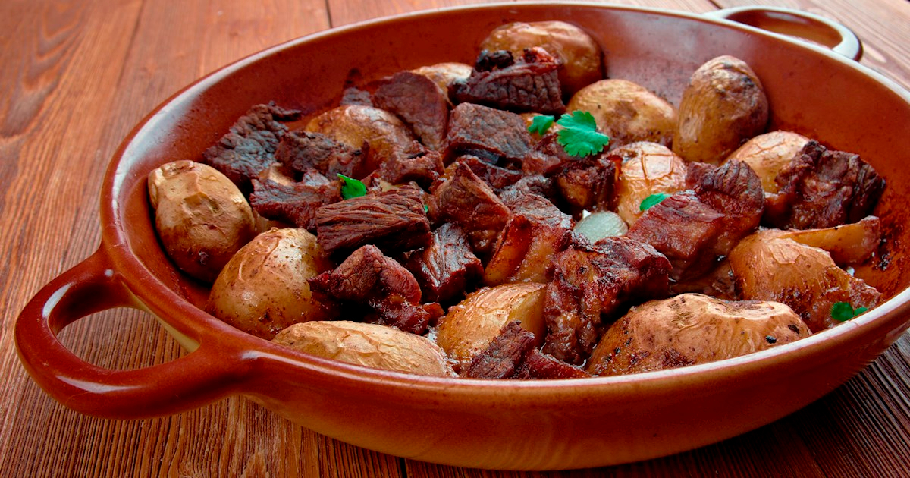

# Afelia

*Cubes of pork shoulder marinated overnight in red wine and crushed coriander seed, then slow-stewed in the same wine until the sauce reduces to a glossy spiced gravy.*

**Serves:** 4-6

**Prep Time:** 15 minutes (plus overnight marinating)

**Cook Time:** 1 hour 30 minutes

## Overview
Afelia is the Cypriot pork stew that runs on two ingredients more than any other: red wine and coriander seed. Pork shoulder cuts into 3 cm cubes and marinates overnight in dry red wine, crushed coriander seed, salt and pepper, no garlic, no onion, no herbs, the simplicity is the point. The next day the meat lifts out of the marinade and browns hard in olive oil; the marinade pours back in and the lot simmers very slowly on the lowest heat for an hour and a half, until the wine reduces to a glossy spiced gravy and the meat collapses to the touch of a fork. Crushed coriander seed is the central flavour and must be roughly crushed, not ground (ground is muddy; cracked seeds give pops of perfume). Eat with pourgouri to drink the sauce, a wedge of lemon at the side.

## Ingredients

### Marinade
- 1 kg pork shoulder (cut in 3 cm cubes)
- 500 ml dry red wine (a Cypriot Lefkada or a sturdy table red)
- 3 tablespoons coriander seed (lightly crushed in a mortar; aim for cracked, not powdered)
- 1 ½ teaspoons salt
- 1 teaspoon ground black pepper

### Stew
- 4 tablespoons olive oil
- 1 tablespoon plain flour (optional, for a thicker sauce)
- 2 bay leaves
- 1 cinnamon stick (small, optional)
- Hot water as needed

### To serve
- Lemon wedges
- A handful of chopped flat-leaf parsley

## Method

### Stage 1 - Marinate overnight
1. Combine the pork cubes, red wine, crushed coriander seed, salt and pepper in a non-reactive bowl.
1. Cover; refrigerate at least 12 hours, ideally 24.
1. Turn the meat once or twice during the marinade if it isn't fully submerged.

### Stage 2 - Drain and brown
1. Lift the pork out of the marinade with a slotted spoon; reserve the marinade.
1. Pat the pork dry between two clean tea towels (wet meat steams instead of browning).
1. Heat the olive oil in a heavy casserole over medium-high heat.
1. Brown the pork in 2 batches, 6 minutes per batch, until deep golden on all sides.
1. Lift each batch to a plate.

### Stage 3 - Build the stew
1. With the second batch of pork still in the pan, return the first batch.
1. If using flour, sprinkle it over and stir 1 minute to coat.
1. Pour the reserved marinade over the meat; scrape up any brown bits from the bottom of the pan.
1. Add the bay leaves and the cinnamon stick if using.
1. Bring to a simmer.

### Stage 4 - Slow cook
1. Drop the heat to the lowest possible setting; the surface should barely tremble.
1. Cover with the lid slightly ajar; cook 1 hour 15 minutes.
1. Check the level of liquid every 20 minutes; top up with a splash of hot water if it dries out too fast (the sauce should always be at least halfway up the meat).
1. The pork is done when a piece pulls apart with a gentle squeeze of two forks.

### Stage 5 - Reduce
1. Lift the pork pieces out with a slotted spoon; cover to keep warm.
1. Raise the heat under the sauce; boil hard 5-8 minutes until reduced to a glossy spiced gravy that coats a spoon.
1. Taste; adjust salt and pepper.
1. Return the pork to the sauce; turn to coat; warm through 2 minutes.

### Stage 6 - Serve
1. Spoon onto warm plates.
1. Scatter with chopped parsley.
1. Lemon wedges alongside.

## Notes
- **Crushed, not ground, coriander seed.** Use a mortar and pestle and stop when the seeds are cracked into a few pieces each. Ground coriander goes muddy and dulls the dish.
- **Dry red wine, nothing sweet.** A Cypriot Lefkada or Maratheftiko is the right choice; any dry, full-bodied table red works. Avoid sweet or oaked wines.
- **The lowest possible simmer.** A rolling boil dries the pork. The surface should tremble but not bubble.
- **The cinnamon stick is optional.** Some Cypriot homes add it, some do not. It deepens the spice without dominating; leave out if you want a purer coriander expression.
- **No garlic, no onion.** The dish is defined by its restraint. Resist the urge to add either.

## Variations
- **Octopus afelia.** Octopus cubes in place of pork; reduce the simmer to 1 hour. The summer version.
- **Mushroom afelia.** A vegetarian variation using portobello and chestnut mushrooms in large chunks; same marinade, much shorter cook (30 minutes).
- **With dried mountain herbs.** A sprig of fresh oregano or thyme tied with string and lifted out at the end; a village-house touch.

## Serving
Serve with pourgouri · plain rice · talattouri · a sharp salad with red onion · a glass of the same red wine used in the marinade.

## Storage
- Keeps 4 days refrigerated; the flavour deepens on day two.
- Freezes 3 months; thaw overnight before reheating.
- Reheat covered on a low hob with a splash of water to loosen the sauce.

