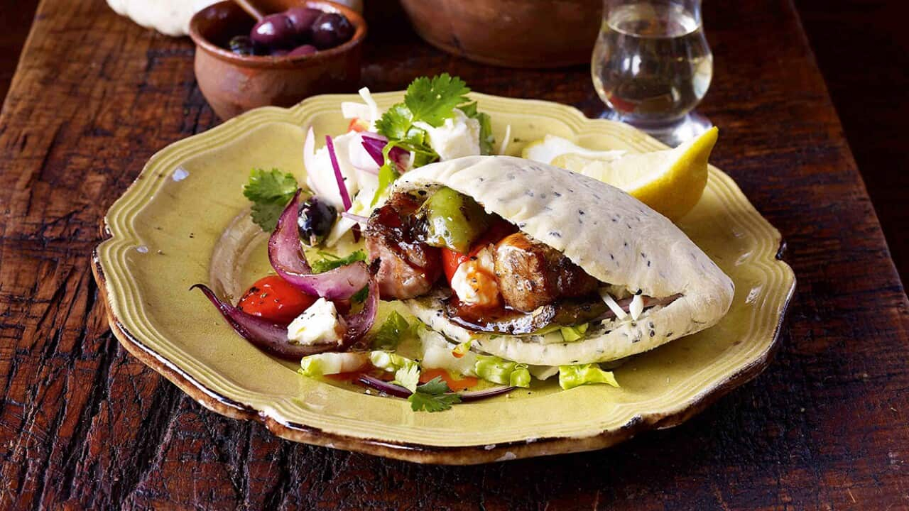

# Cypriot Souvlakia

*Cubes of marinated pork shoulder threaded onto skewers, grilled hard over charcoal until the edges char, then folded into a warm pita with raw onion, chopped parsley and tahini-yoghurt sauce.*

**Serves:** 4

**Prep Time:** 30 minutes (plus 2 hours marinating)

**Cook Time:** 15 minutes

## Overview
Cypriot souvlakia are larger and meatier than their mainland-Greek cousins; the pork is cut in generous 3 cm cubes from the shoulder so it stays juicy under the heat of a hot grill. The marinade is straightforward: olive oil, lemon, oregano, garlic and a grind of pepper, no yoghurt and no spice-shop blends. Two hours is enough; longer turns the surface mushy. The skewers go onto a very hot charcoal grill and stay there until the corners blacken and the centres are just cooked through. The wrap is the giveaway dish: a thick Cypriot-style pita pocket (not the thin Greek round) holds the meat with raw red onion, chopped flat-leaf parsley, a few rings of tomato and a spoon of tahini-yoghurt sauce, the Levantine touch that separates the Cypriot version from the Greek one. Eat with both hands.

## Ingredients

### Pork and marinade
- 700 g pork shoulder (cut in 3 cm cubes)
- 4 tablespoons olive oil
- 3 tablespoons lemon juice
- 1 tablespoon dried oregano (Cypriot rigani if you can find it)
- 3 garlic cloves (crushed)
- 1 teaspoon salt
- ½ teaspoon ground black pepper

### Tahini-yoghurt sauce
- 200 g thick Greek yoghurt
- 2 tablespoons tahini
- 1 tablespoon lemon juice
- 1 small garlic clove (crushed)
- A pinch of salt
- 2 tablespoons cold water (to loosen)

### To serve
- 4 thick Cypriot-style pita pockets (or large pita)
- 1 small red onion (finely sliced)
- 30 g flat-leaf parsley (chopped)
- 2 tomatoes (sliced into rings)
- Lemon wedges

### Equipment
- 8 metal skewers (or wooden, soaked 30 minutes)

## Method

### Stage 1 - Marinate
1. Whisk the olive oil, lemon juice, oregano, garlic, salt and pepper in a bowl.
1. Add the pork cubes; turn to coat.
1. Cover; refrigerate 2 hours (no longer; the lemon starts to break down the meat).

### Stage 2 - Tahini-yoghurt
1. Stir the yoghurt, tahini, lemon juice, garlic and salt together.
1. Add cold water a little at a time until the sauce drops slowly from the spoon (it should pour, not plop).
1. Taste; adjust salt and lemon.
1. Chill until serving.

### Stage 3 - Thread and grill
1. Light a charcoal grill and let it burn down to glowing coals with a light ash coating (or heat a gas barbecue to its highest setting).
1. Thread the pork tightly onto the skewers; pack the cubes close together so the centres steam-cook a little while the edges sear.
1. Grill 10-12 minutes total, turning every 3 minutes, until the corners are charred and the centre of a cube reads 65°C.
1. Rest 3 minutes off the heat.

### Stage 4 - Build the wrap
1. Warm the pitas briefly on the cooling edge of the grill, 20 seconds per side.
1. Split each pita open at one end to make a pocket (or lay flat if using large pita).
1. Slide the meat off the skewer into the pita.
1. Top with sliced red onion, parsley, tomato rings and a spoon of tahini-yoghurt.
1. Eat hot, with a lemon wedge alongside.

## Notes
- **Pork shoulder, not loin.** Loin dries out on a hot grill; shoulder has enough fat to stay juicy through a char.
- **Pack the skewers tight.** Loose cubes on a skewer cook all the way through before the outside chars. Tight packing gives you charred outside and tender pink-edged inside.
- **The pita is the Cypriot tell.** Thick pocket pita (the kind that splits open into a pouch) is the Cypriot wrap; thin Greek pita is rolled around the meat instead. Either works.

## Variations
- **Lamb souvlakia.** Same marinade, lamb leg cut in 3 cm cubes. Slightly stronger flavour, slightly less forgiving on the grill.
- **Chicken souvlakia.** Thigh meat in 3 cm cubes, the same marinade plus a teaspoon of paprika.
- **With sheftalia.** A second skewer of sheftalia sausages alongside; the classic mixed-grill plate of the village taverna.

## Serving
- Serve with pourgouri pilaf · grilled halloumi · talattouri · a Greek-style chopped salad · a glass of cold Keo beer or light red Cypriot wine.

## Storage
- Cooked meat keeps 3 days refrigerated; reheat briefly under a hot grill, never in the microwave (it goes rubbery).
- Marinade keeps 4 days refrigerated.
- Build the wraps to order; assembled wraps go soggy within 20 minutes.

