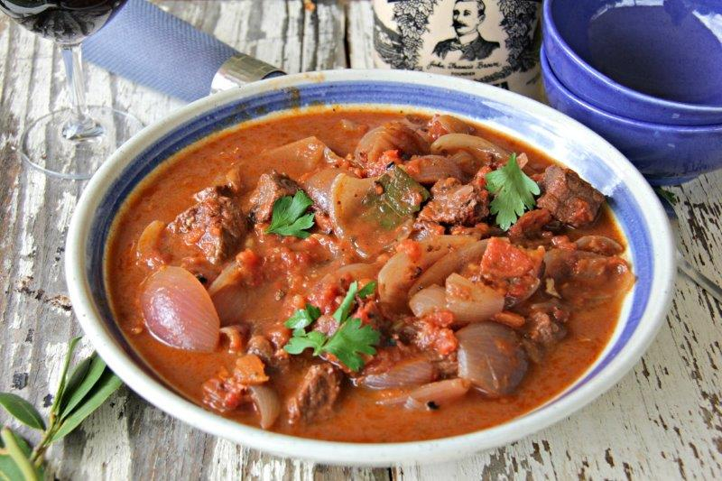

# Cypriot Stifado

*Beef and pearl-onion stew simmered in red wine, vinegar and tomato with a Cypriot warm-spice lift of cinnamon, clove and allspice, slow-cooked until the onions melt into the sauce.*

**Serves:** 4-6

**Prep Time:** 30 minutes

**Cook Time:** 2 hours 30 minutes

## Overview
Stifado is the slow-cooked onion stew of the eastern Mediterranean; the Cypriot version distinguishes itself from the mainland-Greek one with a heavier hand of warm spice (cinnamon stick, whole cloves, allspice berries) and a touch more vinegar to cut the sweetness of the pearl onions. Beef shin or chuck cuts into large chunks, browns hard in olive oil, then simmers very slowly in a sauce of red wine, red wine vinegar, tomato puree and stock with bay, cinnamon and clove. Whole peeled pearl onions, as many as the meat itself by weight, go in halfway through and slowly collapse into the sauce as it reduces, the onion sugars darkening the gravy until it turns the colour of mahogany. The dish is at its best the next day. Eat with pourgouri or crusty bread to mop the sauce.

## Ingredients

### Stew
- 1 kg beef shin or chuck (cut in 4 cm chunks)
- 3 tablespoons olive oil
- 2 tablespoons plain flour (for dusting the meat)
- 1 teaspoon salt
- 1 teaspoon ground black pepper
- 2 onions (large, finely chopped)
- 6 garlic cloves (crushed)
- 3 tablespoons tomato puree
- 300 ml dry red wine
- 4 tablespoons red wine vinegar
- 500 ml beef stock (or hot water)
- 1 cinnamon stick
- 4 whole cloves
- 6 allspice berries
- 3 bay leaves
- 1 teaspoon dried oregano
- 1 strip orange zest (optional but traditional)

### Pearl onions
- 1 kg pearl onions or small shallots (peeled, root left intact)
- 1 tablespoon olive oil
- 1 teaspoon caster sugar

## Method

### Stage 1 - Brown the meat
1. Pat the beef chunks dry with kitchen paper (wet meat steams rather than browns).
1. Toss the beef with the flour, salt and pepper in a wide bowl.
1. Heat the olive oil in a heavy casserole over medium-high heat.
1. Brown the beef in 2 or 3 batches, 6-8 minutes per batch, until deep brown on all sides; transfer each batch to a plate.
1. Do not crowd the pan; crowded meat steams instead of browning.

### Stage 2 - Soften the aromatics
1. Drop the heat to medium.
1. Add the chopped onions to the same pan; cook 8 minutes until soft and pale gold.
1. Stir in the crushed garlic; cook 1 minute.
1. Stir in the tomato puree; cook 1 minute (this darkens and sweetens the puree).

### Stage 3 - Deglaze and build the sauce
1. Pour in the red wine and red wine vinegar; bring to a vigorous boil; scrape up any brown bits from the bottom of the pan.
1. Boil 3 minutes to take the raw-alcohol edge off.
1. Add the stock, cinnamon stick, cloves, allspice, bay, oregano and orange zest.
1. Return the browned beef and any juices to the pan.
1. Bring to a gentle simmer; cover; cook on low 1 ½ hours.

### Stage 4 - Peel and prep the onions
1. Bring a pan of water to the boil; drop the pearl onions in for 1 minute, then plunge into cold water.
1. Trim the tops; squeeze the onions out of their skins (the boil makes this easy).
1. Leave the root end intact so they hold shape in the stew.

### Stage 5 - Sweat the onions
1. Heat the second tablespoon of olive oil in a small frying pan.
1. Add the peeled onions and the teaspoon of sugar.
1. Sweat over medium heat 8 minutes, shaking the pan, until lightly golden on the outside but still firm.

### Stage 6 - Combine and finish
1. Add the sweated pearl onions to the stew.
1. Cover; cook a further 45-60 minutes on the lowest possible heat (a barely-bubbling simmer) until the beef collapses under a fork and the onions are tender but whole.
1. Lift the lid for the last 15 minutes if the sauce is thin; it should coat the back of a spoon.
1. Taste; adjust salt, pepper and a splash more vinegar if it needs lifting.

### Stage 7 - Rest
1. Rest off the heat 20 minutes before serving (or, better, cool, refrigerate overnight and reheat the next day).

## Notes
- **Beef shin is the best cut.** The collagen breaks down into a thick glossy sauce; chuck works but is less rich. Avoid lean cuts entirely.
- **Pearl onions whole, not chopped.** The whole-onion shape is half the dish; chopped onions melt into a puree.
- **Vinegar amount is personal.** Cypriot stifado leans more vinegary than Greek. Start with 4 tablespoons; add another at the end if you want a sharper finish.
- **Better the next day.** The spices marry, the sauce thickens, the onions soften further. Always cook a day ahead if you can.
- **Low simmer only.** A rolling boil shreds the meat fibres before the collagen melts; you get tough dry meat in a thin sauce.

## Variations
- **Rabbit stifado.** Wild rabbit cut into joints, same sauce, slightly shorter cooking time (1 ½ hours total). The most traditional Cypriot version.
- **Octopus stifado.** Cleaned octopus in 5 cm pieces; no browning step; simmer 1 ½ hours.
- **Hare stifado.** Marinate the hare in the wine and vinegar overnight before cooking.

## Serving
Serve with pourgouri · plain rice · crusty village bread · a glass of red Maratheftiko or Lefkada.

## Storage
- Keeps 5 days refrigerated; the flavour improves on day two and three.
- Freezes 3 months; thaw overnight, reheat gently.
- Reheat covered on a low hob with a splash of stock or water.
