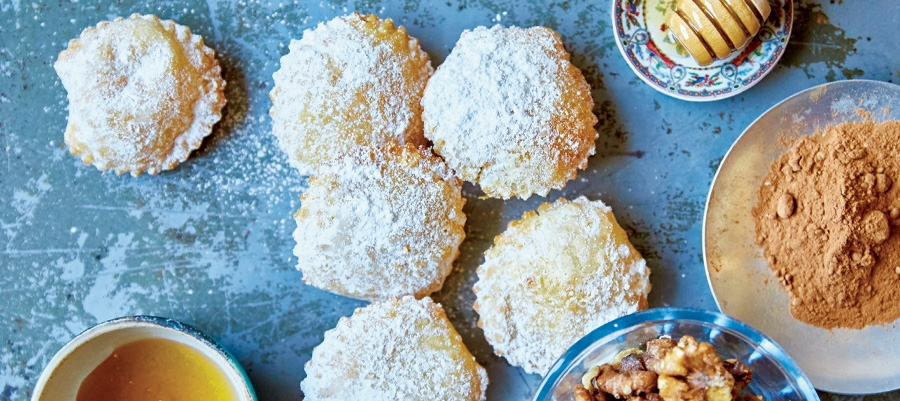

# Bourekia me Anari

*Crescent-shaped fried pastries filled with fresh sweet anari cheese, scented with cinnamon and rose water, dipped in syrup and dusted with cinnamon sugar.*

**Serves:** 6 (makes about 20 bourekia)

**Prep Time:** 1 hour

**Cook Time:** 25 minutes

## Overview
Bourekia me anari are the small Cypriot sweet pastries that turn up at every wedding, christening and saint's day across the island. The pastry is a thin egg-and-flour dough, rolled out and stamped into rounds; the filling is fresh anari (the whey cheese left over from halloumi making, mild and crumbly), mixed with a little sugar, cinnamon and rose water. A spoon of filling goes onto each round, the edges fold over and crimp into a half-moon, and the bourekia go straight into hot oil to fry until pale gold. From the oil they go briefly into a warm honey-and-rose-water syrup, then onto a plate with a dust of cinnamon sugar. The pastry must be thin (the cheese is the main event); the syrup must be warm (cold syrup will not penetrate); the bourekia must be eaten on the same day they are made (the pastry softens by the next morning).

## Ingredients

### Pastry
- 350 g plain flour
- 1 large egg
- 100 ml warm water
- 2 tablespoons olive oil
- 1 tablespoon caster sugar
- ½ teaspoon salt

### Filling
- 400 g fresh anari (or ricotta if anari is unavailable)
- 50 g caster sugar
- 1 teaspoon ground cinnamon
- 1 teaspoon rose water
- ½ teaspoon ground mahleb (optional but traditional)
- Zest of 1 lemon

### Syrup
- 200 g caster sugar
- 200 ml water
- 1 tablespoon honey
- 1 tablespoon lemon juice
- 1 teaspoon rose water
- 1 cinnamon stick

### To finish
- 1 litre neutral oil for deep frying
- 2 tablespoons caster sugar
- 1 teaspoon ground cinnamon

## Method

### Stage 1 - Pastry
1. Sift the flour, sugar and salt into a wide bowl.
1. Whisk the egg, warm water and olive oil in a jug.
1. Pour the wet mix into the dry; stir with a wooden spoon until shaggy.
1. Tip out onto a clean surface; knead 8 minutes until smooth and elastic (the dough should feel like a soft pasta dough).
1. Wrap in cling film; rest 30 minutes.

### Stage 2 - Filling
1. If using anari, drain in a sieve 15 minutes (anari can be wet).
1. Combine the anari, sugar, cinnamon, rose water, mahleb if using and lemon zest in a bowl.
1. Mash with a fork until uniform but still textured.
1. Taste; the filling should be sweet but not sugary, with a clear cinnamon-rose note.

### Stage 3 - Syrup
1. Combine the sugar, water, honey, cinnamon stick and lemon juice in a small saucepan.
1. Bring to a gentle simmer; cook 8 minutes until syrupy (it should coat the back of a spoon).
1. Off the heat, stir in the rose water.
1. Keep warm.

### Stage 4 - Shape
1. Divide the dough in half (the other half stays under cling film to keep it from drying).
1. Roll one half out as thin as you can manage on a lightly floured surface (3 mm at most).
1. Cut into 9 cm circles with a cutter or the rim of a glass.
1. Place a heaped teaspoon of filling onto each circle.
1. Brush the edge with a little water; fold the circle over to make a half-moon; press the edges with a fork to seal.
1. Lay the finished bourekia on a floured tray; cover with a damp cloth.
1. Repeat with the second half of the dough and any re-rolled scraps.

### Stage 5 - Heat the oil
1. Heat the oil in a wide deep pan to 170°C.
1. Test with a small piece of dough; it should sizzle gently and turn pale gold in about 90 seconds.

### Stage 6 - Fry
1. Lower 4-5 bourekia at a time into the oil with a slotted spoon.
1. Fry 3 minutes, turning halfway, until pale gold (do not let them brown deeply; they will look pale next to other fried pastries).
1. Lift onto a wire rack to drain 15 seconds.

### Stage 7 - Dip and dust
1. Dip the warm bourekia into the warm syrup for 20 seconds, turning once.
1. Lift onto a serving platter.
1. Mix the caster sugar and cinnamon; sieve a dust over the bourekia.
1. Serve warm or at room temperature on the day of making.

## Notes
- **Pastry must be thin.** A thick wrapper makes the bourekia heavy and starchy. Roll out as thin as possible, ideally so you can see the work surface through the dough.
- **Warm syrup, warm bourekia.** Cold syrup will not penetrate the pastry; cold bourekia will not absorb. Sync the timings.
- **Fry pale, not deep.** Bourekia should look almost biscuit-pale, not the deep brown of a Greek loukouma. Over-fried pastry tastes of oil.
- **Anari is the right cheese.** Mild, crumbly, fresh; the discount substitute is ricotta drained well. Cream cheese will not work, it goes sticky.
- **Mahleb is optional but lovely.** A small jar from a Middle-Eastern or Greek shop gives the dish its almond-cherry undertone.

## Variations
- **With orange-blossom water.** Replace the rose water with orange-blossom water in both filling and syrup; a more spring-leaning version.
- **Walnut variation.** A handful of finely chopped walnuts stirred into the cheese filling.
- **Baked, not fried.** Brush with egg wash and bake at 190°C for 18 minutes; lighter, less traditional.
- **Sour-cherry filling.** Replace the cheese with thick sour-cherry compote for a December variant.

## Serving
Serve with strong Cypriot coffee · a glass of zivania for grown-ups · a glass of cold water with a spoon of glyko tou koutaliou alongside.

## Storage
- Best on the day; the pastry softens overnight.
- Day-two bourekia keep at room temperature in a closed tin but lose their crisp.
- Do not refrigerate; the syrup crystallises and the pastry goes stale fast.
