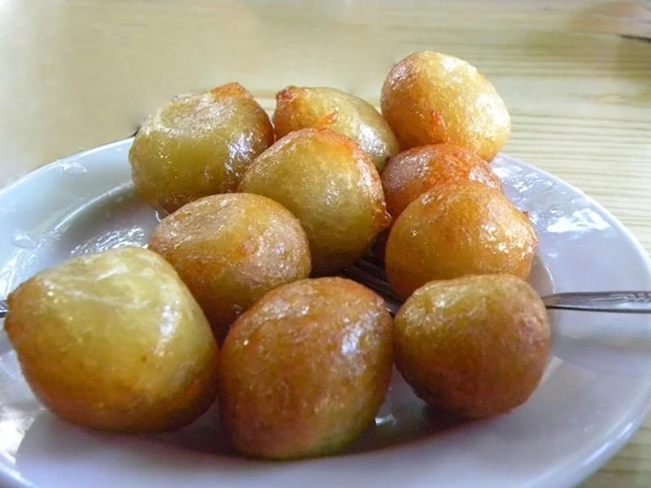

# Loukoumades Cypriot

*Small yeasted dough balls fried golden and drenched in warm honey syrup, the Cypriot version scented with cinnamon and finished with a dust of cinnamon sugar.*

**Serves:** 6 (makes about 30 loukoumades)

**Prep Time:** 25 minutes (plus 1 hour rising)

**Cook Time:** 25 minutes

## Overview
Loukoumades are the Greek and Cypriot festival doughnut, a yeasted batter dropped by the spoonful into hot oil and tumbled straight from the fryer into warm honey syrup. The Cypriot version is smaller and more often served with cinnamon-sugar rather than walnut, and the syrup tends to lean more on honey and cinnamon than the lemon-and-honey of the mainland-Greek take. A wet yeasted batter (flour, warm water, yeast, salt, a touch of sugar) rests an hour until risen and bubbly. A small syrup of honey, water and cinnamon stick simmers for five minutes. Oil heats to 175°C; the cook scoops a small ball at a time from a wet hand and drops it into the oil, where it puffs into a walnut-sized golden ball. Two to three minutes per ball, then straight into the warm syrup so they drink it up, then onto a plate with a dust of cinnamon sugar. Eat immediately, with fingers, while the shells still crackle.

## Ingredients

### Batter
- 500 g plain flour
- 7 g instant yeast
- 1 teaspoon salt
- 1 tablespoon caster sugar
- 600 ml warm water

### Syrup
- 250 g clear honey (Cypriot thyme honey if available)
- 100 ml water
- 1 cinnamon stick
- 1 strip lemon peel (yellow zest only)

### To finish
- 1 litre neutral oil for deep frying
- 2 tablespoons caster sugar
- 2 teaspoons ground cinnamon
- 2 tablespoons sesame seeds (optional)

## Method

### Stage 1 - Batter
1. Whisk the flour, yeast, salt and caster sugar in a wide bowl.
1. Pour in the warm water all at once.
1. Whisk vigorously for 1 minute; the batter should be smooth, sticky and pourable from a spoon.
1. Cover with cling film; rest in a warm spot 1 hour, until the surface is bubbly and the volume has doubled.

### Stage 2 - Syrup
1. Combine the honey, water, cinnamon stick and lemon peel in a small saucepan.
1. Bring to a gentle simmer; cook 5 minutes.
1. Take off the heat; keep warm (but not boiling).

### Stage 3 - Cinnamon sugar
1. Stir the caster sugar and ground cinnamon together in a small bowl.

### Stage 4 - Heat the oil
1. Heat the oil in a wide deep pan to 175°C.
1. Test with a small drop of batter; it should sizzle and rise immediately and brown in about 20 seconds.

### Stage 5 - Fry
1. Set a bowl of cold water beside the pan.
1. Dip your right hand in the water; grab a small handful of batter; squeeze your fist gently so the batter pops out the top.
1. With a wet teaspoon, scoop a walnut-sized piece off the top of your fist and drop straight into the oil.
1. Continue until you have 6-8 loukoumades frying at once (do not crowd the pan).
1. Fry 2-3 minutes total, turning with a slotted spoon, until deep gold and puffed on all sides.

### Stage 6 - Syrup soak
1. Lift the fried balls with a slotted spoon; drain briefly on a wire rack (10 seconds).
1. Tumble into the warm syrup; let soak 30 seconds while you start the next batch.
1. Lift out onto a serving platter.

### Stage 7 - Finish
1. Pile the syrup-soaked loukoumades on the warm platter.
1. Dust generously with the cinnamon sugar.
1. Scatter sesame seeds if using.
1. Drizzle a little extra syrup if you like it sticky.
1. Serve at once; loukoumades cool fast and the crisp shell goes soft within ten minutes.

## Notes
- **Wet hand, wet spoon.** Sticky yeasted batter is impossible to handle dry; keep a bowl of cold water beside you and re-wet constantly.
- **Squeeze through your fist.** The traditional shaping method: batter pops out the top of a gently closed fist; a wet spoon scrapes off the protrusion straight into the oil. Practise the motion before frying.
- **Hot syrup on hot loukoumades.** The temperature drives the absorption. Cold syrup sits on the surface; warm syrup soaks in.
- **Eat at once.** The crisp-shell-against-syrup-soaked-inside contrast lasts about ten minutes. After that you have a soft honey ball, still pleasant but the magic is gone.

## Variations
- **With chopped walnuts.** The mainland-Greek finish; a handful of chopped lightly-toasted walnuts in place of (or alongside) the cinnamon sugar.
- **Carob syrup.** Replace half the honey with Cypriot carob syrup (charoupi); a darker, more caramelised, more local result.
- **Anari and honey.** Top each loukoumas with a small spoon of fresh anari cheese, then honey; the indulgent restaurant version.
- **Rose-water syrup.** A teaspoon of rose-water stirred into the syrup off the heat; an Ottoman-influenced touch.

## Serving
Serve with strong Cypriot coffee · a glass of cold milk · a small glass of zivania for grown-ups.

## Storage
- Best within 30 minutes of frying.
- Day-two loukoumades soften and lose their crisp; warm gently in a 160°C oven 5 minutes (will not fully revive).
- Do not refrigerate; the syrup crystallises and the texture suffers.
