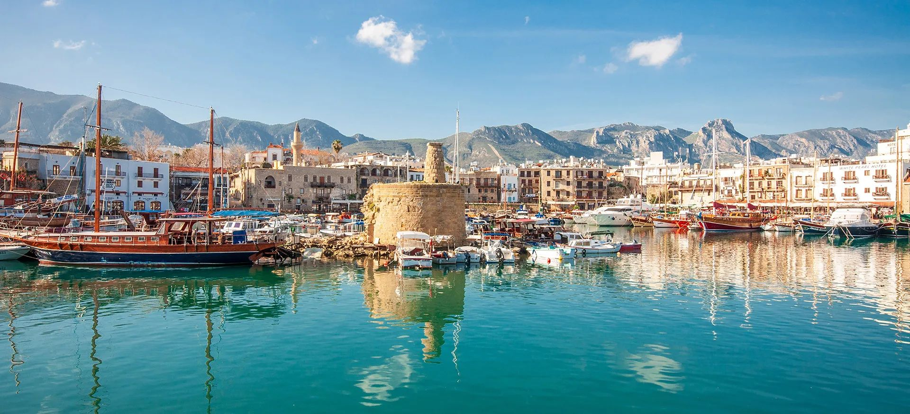

# Cypriot Cuisine

Cooking shaped by the meeting of Greek and Levantine traditions on a single Mediterranean island. Halloumi, anari and yogurt anchor the dairy; lamb, pork and goat dominate the meat; bulgur (pourgouri) and pulses ground the table. Charcoal-grilled souvlakia and sheftalia define the koupepia-and-skewer side of the cuisine; village-oven kleftiko and afelia hold the slow-cooked side; the meze table runs across both, a long social ritual of small plates that often outlasts the daylight. The grill culture is coastal and constant; halloumi goes onto coals as readily as meat.
