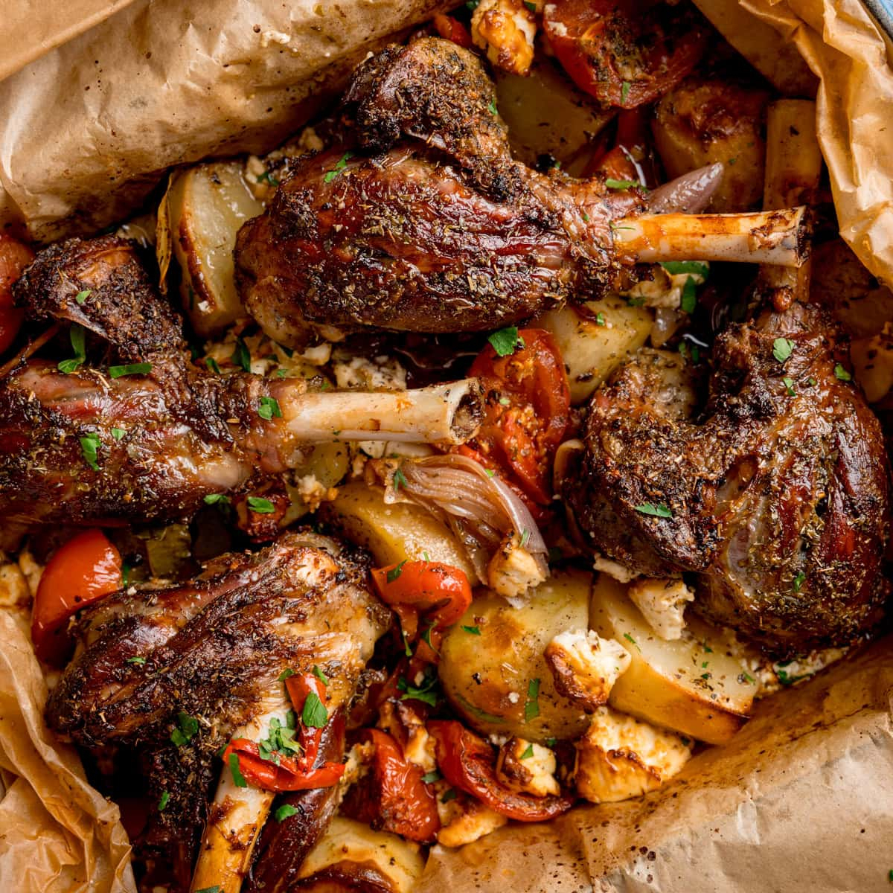

# Kleftiko

*Lamb shoulder slow-baked in a sealed parchment parcel with garlic, lemon, oregano, bay and potatoes, until the meat falls off the bone and the parcel pools with lemon-scented juices.*

**Serves:** 4-6

**Prep Time:** 20 minutes (plus 4 hours marinating)

**Cook Time:** 4 hours

## Overview
Kleftiko (literally "stolen meat") is the great Cypriot village-oven dish, a leg or shoulder of lamb sealed inside a parcel of parchment paper or, traditionally, a clay pot, and baked at low heat for so long that the meat collapses and the juices reduce to a thick lemony liquor at the bottom of the parcel. The name comes from the bandits of Ottoman-era Cyprus and mainland Greece who would steal a lamb, dig a pit, light a fire in it, and bury the wrapped meat in the embers to cook overnight without giving off smoke. Modern Cypriot kitchens use parchment paper inside a foil parcel for the same effect; village tavernas still bake it in sealed clay pots. The marinade is olive oil, lemon, garlic, oregano and bay; potatoes go in alongside to drink up the juices. The cook is long and slow, four hours at 150°C. Open the parcel at the table.

## Ingredients

### Lamb and marinade
- 1.5 kg lamb shoulder on the bone (or a small leg)
- 6 tablespoons olive oil
- 4 tablespoons lemon juice (plus zest of 1 lemon)
- 8 garlic cloves (crushed)
- 2 tablespoons dried oregano (Cypriot rigani if possible)
- 4 fresh bay leaves (or 6 dried)
- 1 ½ teaspoons salt
- 1 teaspoon ground black pepper
- 1 teaspoon ground cinnamon (optional, traditional in some villages)

### In the parcel
- 800 g waxy potatoes (Cyprus reds if available, otherwise charlotte or new potatoes), peeled and cut in 4 cm chunks
- 2 onions (peeled, cut in thick wedges)
- 200 g feta or halloumi (broken into 3 cm pieces)
- 1 lemon (cut in thick rounds)
- 2 tomatoes (cut in wedges)
- A generous handful of fresh oregano (or extra dried)

## Method

### Stage 1 - Marinate
1. Stab the lamb shoulder all over with a small sharp knife to make slits for the marinade to penetrate.
1. Whisk the olive oil, lemon juice, lemon zest, crushed garlic, oregano, salt, pepper and cinnamon in a large bowl.
1. Rub the marinade all over the lamb, pushing some into the slits.
1. Add the bay leaves.
1. Cover; refrigerate at least 4 hours, ideally overnight.

### Stage 2 - Build the parcel
1. Heat the oven to 150°C.
1. Lay a large sheet of heavy-duty foil on the work surface (roughly 60 cm long).
1. Lay a similar-sized sheet of baking parchment on top of the foil.
1. Spread the potato chunks, onion wedges and tomato wedges in the centre of the parchment in a thick layer.
1. Place the marinated lamb on top of the vegetables.
1. Tuck the feta or halloumi pieces around the edges.
1. Top with the lemon rounds and any leftover marinade.
1. Scatter with extra oregano.

### Stage 3 - Seal
1. Bring the long edges of the parchment up over the lamb; fold them down together to make a tight seam.
1. Roll the short ends up to meet the seam; fold over to seal.
1. Repeat with the foil layer outside; the parcel should be airtight.
1. Lift the whole parcel onto a large roasting tin or shallow baking tray.

### Stage 4 - Slow bake
1. Bake at 150°C for 3 ½ hours.
1. Open the foil at the top (carefully, the steam is fierce); leave the parchment closed.
1. Bake a further 30 minutes (this lets the top brown lightly and the juices reduce).
1. Test the meat with a fork: it should pull apart with no resistance.

### Stage 5 - Serve
1. Carry the open parcel to the table on its tray.
1. Open the parchment fully at the table; the steam and aroma are part of the dish.
1. Lift the lamb onto a board; pull it apart with two forks (carving never works, the meat is too tender).
1. Spoon the potatoes, onions, cheese and lemon-scented juices over each plate of meat.

## Notes
- **Low and slow.** 150°C is the right heat. Higher and the meat tightens before it collapses; lower and it never browns.
- **Seal the parcel tight.** The dish is a steam-bake; leaks are wasted juice. If unsure, double-wrap.
- **Cypriot reds for the potatoes.** Cyprus red-skinned potatoes (grown in the volcanic soil around Avgorou) hold their shape under long cooking and drink up the lamb juices without going floury. Charlotte or new potatoes are the next best.
- **Cinnamon is regional.** Some Cypriot villages add cinnamon to kleftiko, some do not. A small pinch lifts the dish; a teaspoon is the safe maximum.

## Variations
- **Clay-pot kleftiko.** Use an unglazed terracotta pot (sealed with a flour-and-water paste around the lid). Identical timing.
- **Goat kleftiko.** Substitute goat shoulder for lamb; add 30 minutes to the cooking time.
- **Without potatoes.** Some Cypriot homes leave the potatoes out and serve the lamb with pourgouri instead.
- **Lamb chops kleftiko.** Lamb chops, same marinade, individual parcels, baked 2 hours instead of 4. A taverna trick to serve kleftiko at lunchtime.

## Serving
Serve with pourgouri · talattouri · a sharp horiatiki-style salad · a bowl of olives · a glass of Maratheftiko or a chilled Xynisteri.

## Storage
- Keeps 4 days refrigerated in the parcel juices; the second day is arguably better.
- Reheat the meat with a splash of stock or water in a covered dish at 150°C for 25 minutes.
- Freezes 2 months in its juices; thaw overnight before reheating.

