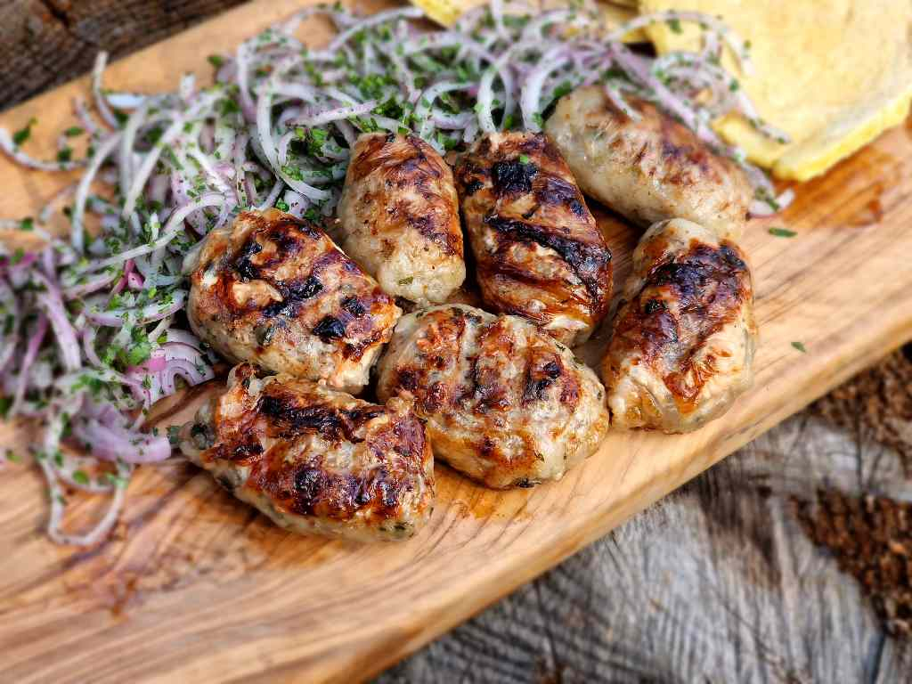

# Sheftalia

*Cypriot caul-fat sausages: minced lamb and pork seasoned with onion, parsley and cinnamon, wrapped in lacy caul fat and grilled over charcoal until the caul melts away into a crisp golden skin.*

**Serves:** 4 (makes 12 sheftalia)

**Prep Time:** 30 minutes

**Cook Time:** 15 minutes

## Overview
Sheftalia are the great Cypriot grill sausage, distinct from any other Mediterranean sausage because they are skinless. The mince mixture (lamb shoulder and pork shoulder in equal parts, plus grated onion, chopped parsley, a faint hint of cinnamon and plenty of black pepper) is rolled into stubby cylinders, then wrapped in a sheet of caul fat, the lacy membrane from inside a pig's or lamb's belly. The caul fat does two jobs: it holds the meat together without any casing, and it bastes the sausage as it melts away on the grill, leaving behind a crisp golden skin and an aroma of charred fat that defines a Cypriot taverna. Charcoal is essential; the smoke is half the dish. Eat with warm pita, raw red onion, lemon and a smear of talattouri.

## Ingredients

### Sausage
- 350 g lamb shoulder mince (15 percent fat)
- 350 g pork shoulder mince (20 percent fat)
- 1 onion (large, finely grated, then squeezed dry)
- 30 g flat-leaf parsley (very finely chopped)
- 1 ½ teaspoons salt
- 1 teaspoon ground black pepper
- ¼ teaspoon ground cinnamon
- 200 g caul fat (sometimes sold as crepine or pork lace)

### To serve
- 4 thick pita pockets (or large pita)
- 1 small red onion (finely sliced)
- A handful of chopped parsley
- 1 lemon (cut in wedges)
- Talattouri (page in this collection)

## Method

### Stage 1 - Prep the caul fat
1. Rinse the caul fat under cold water to remove brine or salt.
1. Soak in a bowl of warm water with a splash of lemon juice or vinegar for 10 minutes (this softens it and removes any porkiness).
1. Drain; pat dry between two clean cloths.
1. Spread out on a board and cut into roughly 12 cm squares.

### Stage 2 - Mix
1. Grate the onion on the coarse side of a box grater into a sieve.
1. Squeeze the grated onion HARD with your hands to remove the juice (wet onion makes the mince soggy and the sausages fall apart on the grill).
1. Combine the lamb and pork mince in a wide bowl.
1. Add the squeezed onion, parsley, salt, pepper and cinnamon.
1. Mix with your hands for 2 minutes until the mixture is sticky and uniform.
1. Pinch off a small piece; fry it in a dry pan; taste; adjust salt and pepper before shaping the lot.

### Stage 3 - Shape and wrap
1. Divide the mixture into 12 equal portions (about 60 g each).
1. Roll each into a stubby cylinder, roughly 7 cm long and 3 cm thick.
1. Lay a caul square on the board.
1. Place a sausage in the centre; wrap the caul over and around twice; trim any thick excess; tuck the loose end under.
1. Lay seam-side-down on a plate; repeat for the rest.
1. Chill 20 minutes if the kitchen is warm (helps them hold shape on the grill).

### Stage 4 - Grill
1. Light a charcoal grill and let it burn down to glowing coals with a light ash coating.
1. Lay the sheftalia seam-side-down across the bars.
1. Grill 12-15 minutes total, turning every 3-4 minutes, until the caul has melted away and the skin is golden, blistered and crisp.
1. Test one by cutting in half: the centre should be just cooked through, with no pink mince but plenty of juices.
1. Rest 2 minutes on a warm plate.

### Stage 5 - Serve
1. Warm the pita briefly on the cooling edge of the grill.
1. Slide a sheftalia into each split pita with red onion, parsley and a squeeze of lemon.
1. Spoon talattouri inside or alongside.

## Notes
- **Caul fat is essential.** It is what makes a sheftalia. Most halal butchers and good independent butchers will order it in if asked. Without caul, you have a meatball, not a sheftalia.
- **Squeeze the onion dry.** This is the single biggest mistake. Wet onion makes the mince loose and the sausages collapse on the grill.
- **Charcoal, not gas.** The smoky char on the caul-fat skin is half the dish. Gas works in a pinch but you lose the aroma.
- **The mix is half lamb, half pork.** Pork alone is too soft, lamb alone too gamey. The combination is the Cypriot balance.

## Variations
- **Lamb-only.** For halal kitchens or houses that do not eat pork; bump the fat content up by using 70 percent lamb shoulder and 30 percent lamb belly.
- **Cinnamon-and-clove.** A pinch of ground clove alongside the cinnamon, the Christmas-feast version.
- **Oven-finish.** Grill on the barbecue 8 minutes to set the skin, then transfer to a 200°C oven 6 minutes; useful when the coals run out.

## Serving
Serve with grilled halloumi · pourgouri · talattouri · a chopped tomato-and-cucumber salad · cold Keo beer or a glass of Xynisteri.

## Storage
- Uncooked, wrapped sheftalia keep 1 day refrigerated and freeze 2 months (freeze on a tray, then bag).
- Cooked sheftalia keep 2 days refrigerated; reheat under a hot grill, never in the microwave.

