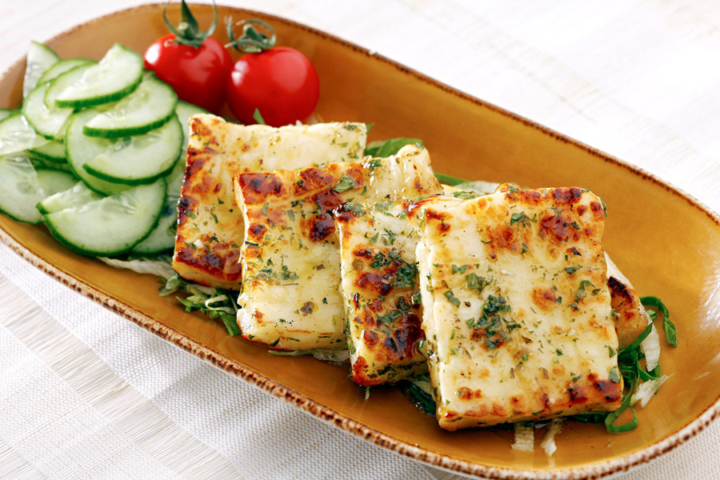

# Grilled Halloumi

*Slabs of Cyprus's salty bouncy national cheese charred over hot coals until the outside blisters and the inside softens, finished with lemon, fresh mint and a drizzle of olive oil.*

**Serves:** 4 (as a side or meze)

**Prep Time:** 5 minutes

**Cook Time:** 4 minutes

## Overview
Halloumi is the great Cypriot cheese, made from a blend of sheep's and goat's milk (often with a smaller share of cow's milk in modern production), pressed into rectangular blocks and brined in salted whey with a single sprig of fresh mint folded into each pack. It is the only cheese that does not melt under direct heat; the curds are heated past their melting point during manufacture, which gives halloumi its famously squeaky bounce. Grilled halloumi is the simplest dish in the cuisine and arguably the most loved: slabs go onto a screaming-hot grill or pan for one to two minutes per side until the surface is mottled deep brown and the centre has softened to the point of giving slightly to a fork. Lemon, fresh mint and a drizzle of good olive oil finish it. Eat hot, the moment the slabs come off the grill; halloumi turns rubbery within five minutes of cooling.

## Ingredients

- 250 g halloumi (the traditional Cypriot kind, not the cow's-milk imitation)
- 1 lemon (½ for juice, ½ in wedges)
- A small handful of fresh mint leaves (shredded)
- 2 tablespoons extra virgin olive oil
- A grind of black pepper
- A pinch of dried Cypriot oregano (optional)

## Method

### Stage 1 - Slice and dry
1. Lift the halloumi from its brine; pat very dry between two clean tea towels (surface moisture stops the cheese from charring properly).
1. Slice into 1 cm thick slabs (thinner pieces dry out; thicker pieces stay too cold in the centre).

### Stage 2 - Heat the grill
1. Light a charcoal grill and let it burn down to glowing coals with a light ash coating, OR heat a ridged griddle pan over the highest possible heat for 4 minutes.
1. The grill or pan must be properly hot; halloumi needs to char fast, not warm slowly.
1. Brush the slabs very lightly with olive oil (no need to soak; halloumi is already oily under heat).

### Stage 3 - Grill
1. Lay the halloumi slabs across the bars or onto the dry hot pan.
1. Do not move them for 90 seconds; let the underside develop deep brown grill marks.
1. Flip with a thin spatula; cook a further 60-90 seconds until the second side matches.
1. The centre should give slightly when pressed with a finger.
1. Lift onto a warm platter immediately.

### Stage 4 - Finish
1. Squeeze the lemon half generously over the hot slabs.
1. Scatter with shredded fresh mint and a pinch of oregano if using.
1. Drizzle with the olive oil.
1. Grind black pepper over (no salt; halloumi brings its own).
1. Serve at once with lemon wedges alongside.

## Notes
- **Pat the halloumi dry.** Surface brine prevents the Maillard browning that makes the dish; a dry surface chars properly.
- **High heat, short time.** Halloumi cooks in 3 minutes total. Over-grilled halloumi turns rubbery and tough.
- **Eat immediately.** The window for perfect halloumi is short. As soon as the cheese cools, the texture firms up and loses its appeal.
- **No melt is the point.** If your halloumi is collapsing or melting on the grill, it is not real halloumi; it is a cow's-milk imitation. Look for the PDO designation on the pack.

## Variations
- **Halloumi with watermelon.** Slabs of grilled halloumi alternated with chilled watermelon wedges; mint, lemon, olive oil. A Cypriot summer staple.
- **Halloumi-and-mushroom skewers.** Cubes of halloumi and chestnut mushroom on a skewer, grilled together.
- **Honey-and-thyme finish.** A drizzle of warm honey and a sprig of fresh thyme instead of lemon; a sweeter meze plate.
- **Pan-fried for indoor cooking.** A dry non-stick pan over high heat works when a grill is not available; the result is browner but lacks the smoke.

## Serving
Serve with warm pita · talattouri · a chopped salad · a bowl of olives · a glass of Xynisteri or a cold Keo beer.

## Storage
- Eat hot. Cooled halloumi can be refrigerated 2 days but the texture suffers; reheat under a hot grill for a minute (do not microwave).
- Uncooked halloumi keeps 2 weeks refrigerated in its brine; freezes 3 months.

