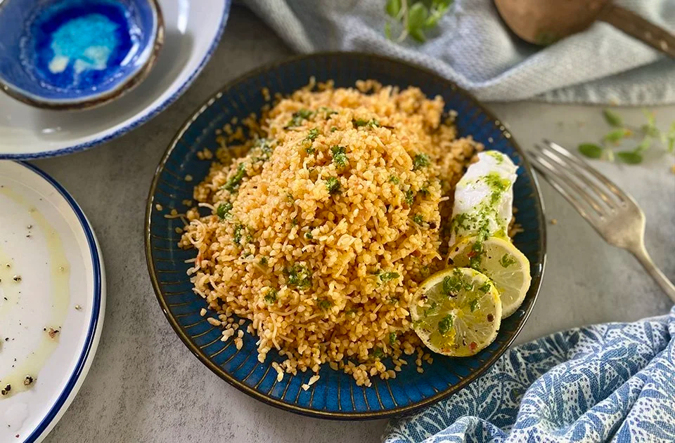

# Pourgouri

*Cypriot bulgur pilaf cooked with toasted vermicelli, sweet onion and a touch of tomato, the staple grain dish of every Cypriot table.*

**Serves:** 4-6

**Prep Time:** 5 minutes

**Cook Time:** 25 minutes

## Overview
Pourgouri is the Cypriot bulgur pilaf, the everyday grain dish that sits beside stews, grilled meat and stuffed vegetables on every Cypriot table; for many Cypriots it is more of a comfort food than rice. The method is borrowed from the Levantine bulgur pilavs but the Cypriot version is sweeter and softer, built on coarse bulgur wheat (the dark kind, never fine) cooked with toasted vermicelli, slowly softened onion and a small spoon of tomato puree for a faint pink-orange colour. Stock pours in, the lid goes on, the heat goes down, and the pan steams for fifteen minutes until the grains drink up the liquid and the vermicelli softens into the pilaf. The dish rests off the heat for ten minutes (covered) before serving; this is non-negotiable, it is what separates a pilaf from a porridge. Eat with everything.

## Ingredients

- 4 tablespoons olive oil
- 80 g vermicelli (broken into 2-3 cm pieces)
- 1 onion (large, finely chopped)
- 1 tablespoon tomato puree
- 300 g coarse bulgur wheat (pourgouri, the dark amber kind)
- 600 ml hot chicken or vegetable stock
- 1 teaspoon salt
- ½ teaspoon ground black pepper
- 1 cinnamon stick (small, optional)
- A small handful of fresh mint (optional, to finish)

## Method

### Stage 1 - Toast the vermicelli
1. Heat the olive oil in a heavy saucepan with a tight-fitting lid over medium heat.
1. Add the broken vermicelli pieces.
1. Stir for 3-4 minutes, watching closely, until the vermicelli turns a deep golden brown (do not let it go too dark, it carries on cooking).

### Stage 2 - Soften the onion
1. Drop the heat to medium-low.
1. Add the chopped onion; cook 6-8 minutes until soft, sweet and pale gold.
1. Stir in the tomato puree; cook 1 minute (this dulls the raw-tomato note and deepens the colour).

### Stage 3 - Toast the bulgur
1. Tip in the bulgur; stir for 2 minutes until every grain is coated in the oil and the pan smells faintly of toasted nuts.
1. Add the salt, pepper and cinnamon stick.

### Stage 4 - Steam-cook
1. Pour in the hot stock all at once (it will sizzle hard); stir once.
1. Bring to a strong simmer; drop the heat to its lowest setting; cover with the tight lid.
1. Cook undisturbed 15 minutes; do not lift the lid.

### Stage 5 - Rest
1. Take the pan off the heat; leave the lid ON; rest 10 minutes.
1. This is the most important step; the residual steam finishes the grains and separates them.
1. Lift the lid; fluff with a fork.
1. Remove the cinnamon stick.
1. Scatter with mint if using.

## Notes
- **Coarse bulgur is essential.** Cypriot pourgouri uses the dark coarse bulgur sold by Middle-Eastern shops as #3 or #4. Fine bulgur (used for tabbouleh) turns to mush.
- **Toast the vermicelli properly.** Pale vermicelli gives a pale pilaf; deep gold vermicelli gives the nutty flavour the dish lives on.
- **Do not lift the lid.** The rest step is half the cooking. Steam escapes and the grains harden if you peek.
- **The cinnamon stick is gentle and optional.** Adds warmth without flavour-bombing; most Cypriot homes use it.

## Variations
- **With chickpeas.** A handful of cooked chickpeas added with the stock; a heartier dish, often eaten as a one-pot supper with yoghurt.
- **Trahanas-style.** Add 50 g dried trahanas (Cypriot fermented wheat) with the bulgur; a deeper, tangier dish.
- **Lemony herb version.** Off the heat, stir in chopped dill, parsley and the zest and juice of half a lemon. Eaten cold as a summer salad.
- **Mushroom pourgouri.** Add 200 g chopped chestnut mushrooms to the onion stage; cook out before adding the bulgur.

## Serving
- Serve with kleftiko · stifado · afelia · grilled halloumi · a bowl of talattouri.

## Storage
- Keeps 3 days refrigerated; reheat with a splash of water in a covered pan over low heat.
- Freezes 2 months in portions; thaw in the fridge, reheat as above.
- Cold pourgouri makes a good lunchbox salad with lemon, parsley and tomato stirred through.

