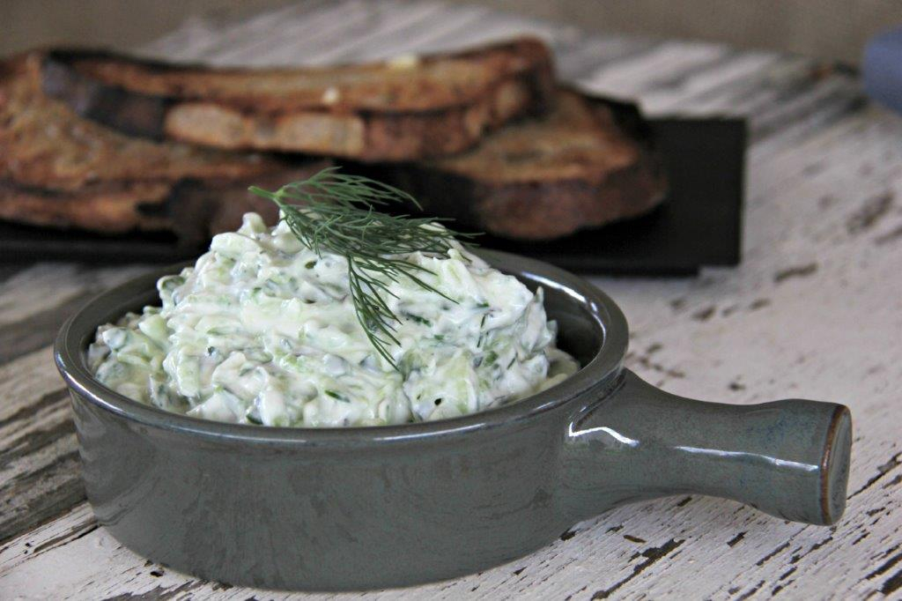

# Talattouri

*The Cypriot cousin of tzatziki: thick yoghurt with grated cucumber, garlic, dried and fresh mint, a touch of dill, lemon and olive oil. The mint is what marks it as Cypriot.*

**Serves:** 4-6 (as a dip)

**Prep Time:** 15 minutes (plus 30 minutes drain)

**Cook Time:** 0 minutes

## Overview
Talattouri is the Cypriot yoghurt-and-cucumber dip; close cousin to Greek tzatziki and Turkish cacık, but with two clear differences. First, dried mint as well as fresh, the dried mint gives the deep savoury back-note that defines the dish, the fresh mint gives the bright top-note. Second, dill is optional rather than central; in many Cypriot homes the dip is mint-only. The method is identical to tzatziki: cucumber grates on the coarse side of a grater, salts heavily, drains thirty minutes in a sieve, then squeezes bone-dry by the fistful. Squeezed cucumber stirs into thick strained yoghurt with crushed garlic, dried mint, fresh mint, optional dill, olive oil, lemon and salt. Half an hour in the fridge melds the flavours. Serve with warm pita, sheftalia, grilled halloumi or any plate of charred meat.

## Ingredients

- 1 cucumber (large; peeled if waxy, otherwise skin-on)
- 1 teaspoon salt (for the cucumber drain)
- 400 g thick strained yoghurt (Greek or Cypriot, full-fat)
- 3 garlic cloves (crushed)
- 1 tablespoon dried mint
- 2 tablespoons fresh mint leaves (chopped)
- 1 tablespoon fresh dill (chopped, optional)
- 1 tablespoon extra virgin olive oil (plus more to finish)
- 1 tablespoon lemon juice
- ½ teaspoon salt
- A grind of black pepper

## Method

### Stage 1 - Drain the cucumber
1. Halve the cucumber lengthways; scrape out the seeds with a teaspoon (wet seedy cucumber gives a thin dip).
1. Coarsely grate on the rough side of a box grater.
1. Toss with the teaspoon of salt; tip into a sieve set over a bowl.
1. Sit 30 minutes to weep its water.
1. Squeeze the cucumber HARD between two hands or inside a clean cloth until very little water comes out (this is the single most important step).

### Stage 2 - Wake the dried mint
1. Crumble the dried mint between your palms over the bowl to release the oils.
1. The pre-crushed mint should smell strongly minty after rubbing.

### Stage 3 - Mix
1. Combine the squeezed cucumber, yoghurt, crushed garlic, dried mint, fresh mint, dill (if using), olive oil, lemon juice, salt and pepper in a bowl.
1. Stir gently until uniform.
1. Taste; the dip should be assertive, with garlic, mint and salt all clearly present.
1. Adjust as needed.

### Stage 4 - Chill
1. Refrigerate at least 30 minutes; longer is better, up to a day.
1. The dried mint deepens and the garlic mellows during the rest.

### Stage 5 - Serve
1. Spoon into a shallow bowl.
1. Make a swirl with the back of a spoon; pool a little olive oil in it.
1. Scatter with a few extra fresh mint leaves and a final dust of dried mint.

## Notes
- **Dried mint is the Cypriot signature.** Without it, you have tzatziki. Use it generously and rub it between your palms first.
- **Squeeze the cucumber dry.** Wet cucumber dilutes everything and the dip turns watery in the fridge.
- **Use thick strained yoghurt.** "Greek-style" yoghurt in supermarkets is often loose and runny; either strain it through muslin for an hour or buy genuine strained Greek or Cypriot yoghurt.
- **Rest matters.** A half-hour chill turns a sharp raw dip into a properly fused one.

## Variations
- **No-dill version.** Skip the dill entirely; mint-only is the more traditional Cypriot form.
- **With cumin.** A pinch of toasted ground cumin stirred in at the end; the more Levantine-leaning version.
- **As a sauce, not a dip.** Loosen with 50 ml cold water until pourable; drizzle over sheftalia or souvlakia inside a pita.

## Serving
- Serve with sheftalia · cypriot souvlakia · grilled halloumi · koupes · warm pita · a bowl of olives.

## Storage
- Keeps 4 days refrigerated; the cucumber softens but the flavour holds. Stir well before each use.
- Do not freeze; the yoghurt splits on thawing.

