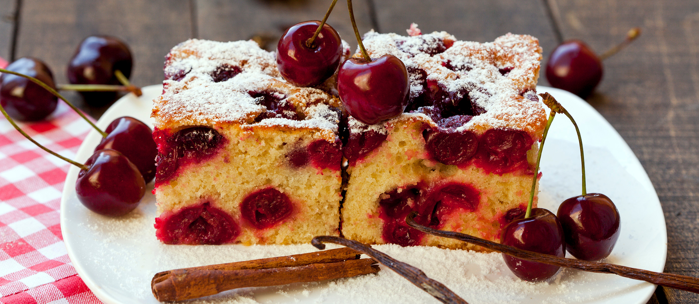

# Bublanina (Czech Bubble Cake)

*The Czech summer fruit cake: a simple butter sponge studded with whole stone fruit, cherries or berries, baked into a tray-cake. The "bubbles" are the fruits sinking into the batter. Quick to make, fast to eat, the Czech grandmother's cake of any afternoon.*

**Serves:** 9

**Prep Time:** 15 minutes

**Cook Time:** 35 minutes

## Overview
Bublanina ("bubble cake") gets its name from the appearance of cherries, plums or berries bobbing in a pale yellow batter like bubbles in a glass of soda. It's the simplest Czech home cake - a basic butter sponge, with whole sour cherries or chopped plums folded in or scattered on top, baked in a square tray and cut into squares. It takes 15 minutes to assemble and 35 minutes in the oven; the result is a tender butter sponge with juicy pockets of warm fruit and a slight pink stain where the cherry juice has run. Serve warm or cold with coffee, with whipped cream for a dessert, or plain in the hand on a summer afternoon. Every Czech grandmother has her version; the fruit changes with the season.

## Ingredients

### Cake
- 200 g unsalted butter, softened
- 200 g caster sugar
- 3 large eggs
- 1 tsp vanilla extract
- 250 g plain flour
- 1.5 tsp baking powder
- A pinch of fine salt
- 100 ml whole milk
- Zest of 1 lemon

### Fruit (choose one)
- 400 g pitted sour cherries (fresh, frozen, or jarred-drained) - the most traditional
- OR 400 g pitted dark plums, halved or quartered
- OR 400 g blueberries / raspberries / blackberries
- OR 400 g sliced peaches or nectarines

### Topping
- 2 tbsp caster sugar (for sprinkling)
- 1 tbsp flaked almonds (optional)
- Icing sugar for dusting

## Method

### Stage 1 - Prep
1. Preheat the oven to 180°C.
2. Grease and line a 23 cm square baking tin with greaseproof paper.

### Stage 2 - Cream the butter and sugar
1. In a large bowl, cream the softened butter and caster sugar with an electric mixer until pale and fluffy, about 3-4 minutes.

### Stage 3 - Add eggs
1. Add the eggs one at a time, beating well after each.
2. Beat in the vanilla and lemon zest.

### Stage 4 - Combine dry and wet
1. Sift the flour, baking powder and salt together.
2. With the mixer on low, add half the flour mixture; mix briefly.
3. Add the milk; mix.
4. Add the rest of the flour; mix only until just combined.
5. Don't overmix - the cake toughens.

### Stage 5 - Fill the tin
1. Tip the batter into the prepared tin; smooth the top.

### Stage 6 - Scatter the fruit
1. Distribute the fruit evenly over the top of the batter.
2. Press each piece lightly into the batter, but don't bury them - some should be visible from above.
3. Sprinkle the topping sugar and (optional) flaked almonds over the surface.

### Stage 7 - Bake
1. Bake 30-35 minutes until the cake is golden and a skewer inserted in the middle (between fruit pieces) comes out clean.
2. The fruit will have partially sunk and partially stayed on top, creating the "bubble" effect.

### Stage 8 - Cool and serve
1. Cool in the tin 15 minutes; lift out using the paper.
2. Dust with icing sugar.
3. Cut into 9 squares.
4. Best warm or just-warm; also fine cold the next day.

## Notes
- **Don't bury the fruit:** Press each piece down lightly into the batter but leave the top visible. Buried fruit gives a damp interior with no visible bubbles.
- **Sour fruit balances:** Sour cherries are traditional; sweet cherries are fine but produce a less interesting cake. If using sweet fruit, add a teaspoon of lemon juice to the batter for balance.
- **Single layer of fruit:** Don't double-layer - the batter underneath stays raw. One layer scattered across the top is the right amount.

## Serving
Czech afternoon coffee with a square of bublanina. With ice cream as a dessert. With softly whipped cream as a slightly more elaborate version.

## Storage
- Room temperature in a tin 3 days; the fruit stays juicy.
- Refrigerates 5 days but the cake firms slightly; bring back to room temperature.
- Freezes 2 months in slices; thaw at room temperature.
