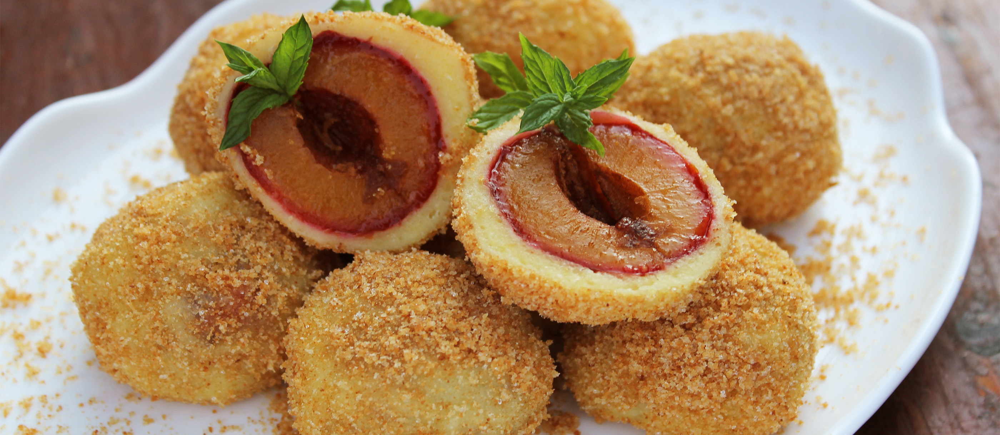

# Ovocné Knedlíky (Czech Fruit Dumplings)

*Czech fruit dumplings: whole plums or strawberries wrapped in a thin curd-cheese dough, boiled, then rolled in butter, sugar and ground poppy seeds or curd cheese. The summer kitchen pleasure; the Sunday lunch from the cottage.*

**Serves:** 4 (makes about 12 dumplings)

**Prep Time:** 30 minutes (plus 15 minutes rest)

**Cook Time:** 15 minutes

## Overview
Ovocné knedlíky - "fruit dumplings" - are the Czech summer dessert and sometimes-main: a whole piece of fruit (small plums, strawberries, apricots, sometimes pitted cherries) wrapped in a thin dough, boiled, then rolled in butter, sugar and a topping of either ground poppy seeds (mák), sweetened cottage cheese (tvaroh), or chopped nuts. The dough is the central decision: traditional Czech home cooks use a curd-cheese (tvaroh) dough that gives a tender, slightly tangy wrapper; some prefer a potato dough for sturdier dumplings; some use a yeasted bread dough. This recipe uses the curd cheese version, which is the most elegant. Best warm in summer when plums and apricots are in season; serve any time of year with frozen or jarred fruit.

## Ingredients

### Fruit (choose one)
- 12 small dark plums (damson plums, or Italian prune plums) - traditional
- OR 12 large strawberries
- OR 12 apricots, halved and pitted
- 2 tsp caster sugar
- 12 sugar cubes (optional - one tucked into the cavity of each pitted fruit)

### Curd-cheese dough
- 250 g curd cheese (tvaroh) - or substitute drained ricotta, or quark
- 200 g plain flour, plus extra for shaping
- 1 large egg
- 30 g unsalted butter, melted
- A pinch of fine salt

### Topping (choose one or two)
- 50 g unsalted butter, melted
- 80 g icing sugar, sifted
- 50 g ground poppy seeds (toasted briefly in a dry pan)
- OR 80 g sweetened tvaroh (curd cheese mixed with 2 tbsp icing sugar)
- OR 80 g toasted chopped walnuts mixed with cinnamon sugar

### To finish
- Optional: a small spoonful of sour cream
- Optional: extra sugar at the table

## Method

### Stage 1 - Prep the fruit
1. Wash and dry the plums (or other fruit).
2. For plums and apricots: halve and remove the pits; insert a sugar cube into the cavity; press the fruit back together.
3. For strawberries: hull and use whole.

### Stage 2 - Make the dough
1. In a large bowl, combine the curd cheese, egg, melted butter and salt.
2. Sift in the flour; mix to a soft dough.
3. Knead briefly on a floured surface until smooth (don't overwork).
4. Rest 15 minutes.

### Stage 3 - Shape the dumplings
1. Divide the dough into 12 equal pieces (about 35g each).
2. On a floured surface, flatten each piece into a thin round about 8 cm wide.
3. Place a piece of fruit in the centre.
4. Bring the dough up around the fruit, pinching the edges closed at the top to fully enclose.
5. Smooth into a round ball; the fruit should be completely sealed inside.
6. Set on a floured tray.

### Stage 4 - Boil
1. Bring a large pot of salted water to a gentle simmer (not a rolling boil - it tears the dumplings).
2. Lower the dumplings in gently with a slotted spoon.
3. Cook 8-10 minutes. They float to the surface within a minute; turn each once during cooking for even cooking.
4. The dough should be just-cooked-through; cut one open to check.

### Stage 5 - Drain and butter
1. Lift out with a slotted spoon onto a warm plate.
2. Brush each with melted butter immediately (stops them sticking).

### Stage 6 - Top
1. Roll each dumpling in the topping of choice (poppy seed + sugar; or curd cheese + sugar; or chopped nuts + cinnamon sugar).
2. Or set the toppings out in bowls and let each diner pick.

### Stage 7 - Serve
1. Plate 3 dumplings per portion.
2. A drizzle more melted butter; a dust of icing sugar.
3. Optional: a small spoon of sour cream alongside.

## Notes
- **Seal the dough completely:** Any gap and the fruit's juice leaks out during boiling, leaving a flat empty dumpling. Pinch firmly; flour your hands as you go.
- **Simmer, not boil:** A rolling boil tears the dough open. Gentle simmer; let the dumplings move slowly in the water.
- **Topping is personal:** Poppy seed is the most traditional; tvaroh (sweet curd cheese) is a more delicate option; nuts work for any season. Many Czech families have all three at the table and let each person dress their own.

## Serving
Czech families serve fruit dumplings sometimes as a sweet main course (a Sunday lunch dessert-dish hybrid), sometimes as dessert. Best fresh and warm with the toppings melting into the butter.

## Storage
- Best eaten same day, fresh out of the pot.
- Cooked dumplings refrigerate 2 days; reheat briefly in steam.
- Freezes 1 month uncooked (assembled but not boiled); cook from frozen, adding 3-4 minutes to the time.
