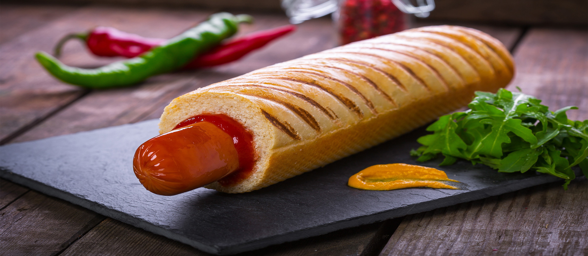

# Párek v Rohlíku (Czech Tunneled Hot Dog)

*Czechia's tunnel-bun hot dog: a long sausage inserted into a crusty bread roll that has had a hole punched through it lengthwise, the cavity smeared with mustard and ketchup before the sausage slides in. The Prague street-food classic; the engineering-elegant alternative to the split-bun American hot dog.*

**Serves:** 4

**Prep Time:** 10 minutes

**Cook Time:** 8 minutes

## Overview
The párek v rohlíku ("sausage in a roll") is the Czech Republic's national hot dog and a Prague street-food fixture sold from kiosks and grocery-store counters throughout the country: instead of splitting a bun in half American-style, the Czech approach uses a long crusty bread roll (rohlík, the Czech-style crescent-shaped roll that has a slightly hardened crust and a pillowy interior) into which a long thin hole is punched through one end with a heated metal spike or specialised tool. Mustard and ketchup are squeezed deep into the cavity through the hole, then a warm boiled sausage (párek, a long mild pork-and-beef sausage) is slid into the cavity from the open end. The result: a sealed roll with the sausage and sauces entirely enclosed, no spillage, no soggy bun, hand-eaten with no need for utensils or napkins. The engineering is so practical that the dish has barely changed since the 1950s when the technique was popularised at the U Rozvařilů buffet on Prague's Wenceslas Square.

## Ingredients

### Sausages
- 4 long mild párek-style sausages (about 15cm; or substitute with any long thin pork-and-beef hot dog)
- 1.5 litres water (for boiling)

### Rolls
- 4 long crusty Czech rohlík rolls (about 15-18cm long, slightly tapered at the ends; or substitute with French baguette sections, or Italian hoagie rolls, anything with a sturdy crust and pillowy interior)

### Sauces (inside the roll)
- 6 tablespoons spicy brown mustard or Czech mustard (Czech mustard is similar to German Düsseldorf, sharp, vinegar-tangy)
- 6 tablespoons tomato ketchup
- Optional: 2 tablespoons mayonnaise

### Optional outer topping
- A sprinkle of fried onions or chopped raw onion on top

### To serve
- A cold Czech beer (Pilsner Urquell, Budvar)
- A pickled gherkin (utopenec, the Czech pickled-sausage-and-onion side dish)

## Method

### Stage 1 - Heat the sausages
1. Bring a pan of water to a gentle simmer (not a hard boil; the sausages split).
2. Add the sausages; warm 5-6 minutes till heated through.
3. Lift out with tongs; keep warm.

### Stage 2 - Prep the rolls
1. The classic Czech approach uses a metal spike heated over flame to punch a tunnel through one end of the roll, char-toasting the inside of the cavity as it goes.
2. Home method: take each rohlík roll. With a long thin sharp knife, push the knife into one end (the more pointed/tapered end if there is one) and rotate carefully to bore a tunnel about 10cm deep through the centre of the roll without breaking the outer crust.
3. Wiggle the knife to widen the tunnel slightly, the cavity should be wide enough to fit the sausage.
4. (Optional, for the proper toasted-cavity flavour: insert the knife into the cavity briefly to a hot grill or open flame, then withdraw, this lightly toasts the inside.)

### Stage 3 - Squeeze in sauces
1. Using a squeeze bottle, dispense a generous stripe of mustard deep into the cavity of the roll.
2. Then a stripe of ketchup deep inside.
3. Optional: a small zigzag of mayo.
4. The sauces should coat the inside of the cavity all the way down.

### Stage 4 - Insert the sausage
1. Take a warm sausage; slide it into the cavity from the open end.
2. Push it in fully; the end of the sausage should sit just inside the open end of the roll.
3. About 3cm of the sausage should be visible at the open end; the rest is inside the roll.

### Stage 5 - Serve immediately
1. Hand over warm; eat from the closed end first (the open end with the sausage sticking out is the last bite).
2. No napkins needed; the sealed cavity contains all the drips.
3. A pickled gherkin on the side.
4. Cold Czech pilsner.

## Notes
- **Tunnel-cut, not split:** the structural and cultural signature. The sealed cavity is the dish's elegance.
- **Mustard + ketchup INSIDE the cavity:** they coat the sausage as it slides in, not on top.
- **Czech-style mustard:** sharp, vinegar-tangy. Yellow American mustard is a substitute.
- **Eat from the closed end:** the sealed end keeps the structure intact till the last bite.
- **No napkin needed:** the traditional Czech eating geometry.

## Variations
- **With horseradish:** swap mustard for horseradish cream (křen).
- **With grated cheese:** sprinkle grated cheese on the sausage before sliding it in (the heat melts it slightly).
- **With sauerkraut:** add a small spoonful of sauerkraut into the cavity before the sausage.
- **Spicy:** swap the Czech mustard for spicy English-mustard or add chili pepper relish.
- **Klobása v rohlíku:** swap the párek for a Czech klobása (a thicker garlicky smoked sausage): same technique.

## Serving
- At a Wenceslas Square kiosk in Prague; at a Czech grocery-store deli counter; at home with a cold pilsner.

## Storage
- Cooked sausages refrigerate 4 days.
- Rolls best fresh; the crust softens after 1 day.
- Don't assemble in advance.
