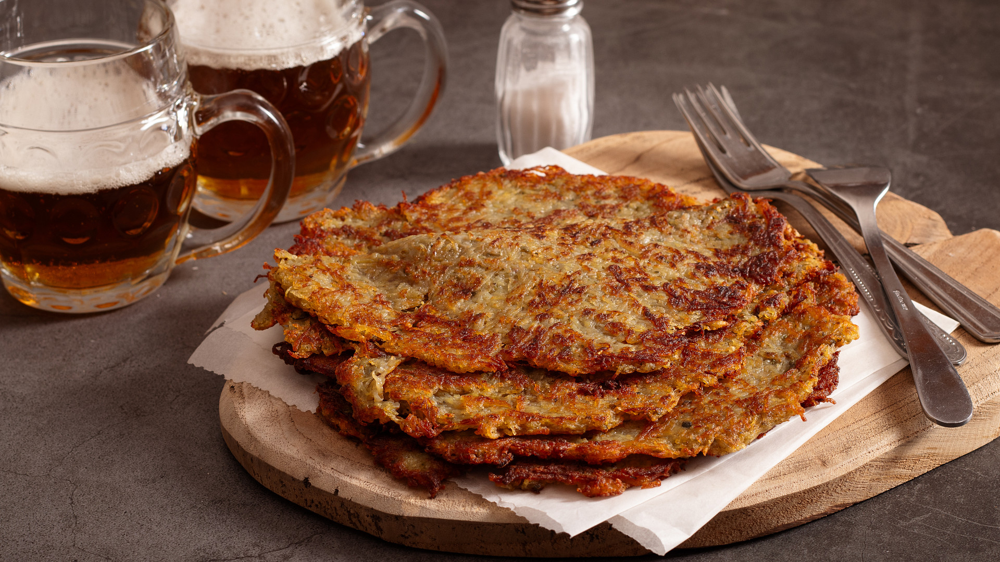

# Bramboráky (Czech Potato Pancakes)

*Grated raw potato fried into thin crisp pancakes seasoned with garlic, marjoram and a pinch of caraway. Eat hot from the pan as a side, or piled high with stewed mushrooms as a meal. Cottage country food, pub kitchen staple.*

**Serves:** 4 (makes 8 pancakes)

**Prep Time:** 15 minutes

**Cook Time:** 25 minutes

## Overview
Bramboráky (also called cmunda in some regions) are the Czech potato pancakes - thin, crisp, fried in shallow oil, deeply seasoned with garlic and the herb signature of Czech cooking (marjoram and caraway). The technique is straightforward: grate raw potatoes, squeeze out the water, mix with flour, egg, garlic and herbs, pan-fry until golden on both sides. They're served alongside roast meat or saucy stews as a starch alternative to dumplings; they also work as a meal in their own right, topped with sauerkraut and a fried egg, or piled with mushroom stew. Pub kitchens in the Czech Republic serve them by the plate alongside beer. Best straight from the pan while still crisp.

## Ingredients
- 1 kg waxy potatoes (Charlotte, Désirée, or any waxy variety)
- 1 small onion, finely grated
- 4 cloves garlic, minced
- 2 large eggs
- 4 tbsp plain flour
- 1 tsp dried marjoram
- 1 tsp caraway seeds, lightly crushed
- 1.5 tsp fine sea salt
- 0.5 tsp freshly ground black pepper
- 100 ml vegetable oil or lard (for frying)

### To serve
- Sour cream
- Pickled gherkins
- Optional: sauerkraut, fried egg, mushroom stew (for the full-meal version)

## Method

### Stage 1 - Grate the potatoes
1. Peel the potatoes; grate on the coarse side of a box grater.
2. Tip into a clean tea towel.
3. Gather the towel into a bundle; wring tightly over the sink to squeeze out as much water as possible.
4. The grated potato should be barely damp, not wet.

### Stage 2 - The batter
1. In a large bowl, combine the squeezed grated potato with the finely grated onion.
2. Add the garlic, eggs, flour, marjoram, crushed caraway, salt and pepper.
3. Mix thoroughly with a fork or your hands - the mixture is thick and slightly sticky.

### Stage 3 - Heat the oil
1. Heat 3-4 tbsp of the oil in a large heavy frying pan over medium-high heat (the oil should be 3-4 mm deep).
2. Test with a small piece of the batter; it should sizzle immediately on contact.

### Stage 4 - Fry
1. Scoop a heaped spoonful of the mixture into the pan; flatten with the back of the spoon into a thin disc about 12 cm across and 5 mm thick.
2. Cook 2-3 of these at a time without crowding.
3. Fry 3-4 minutes per side until deeply golden and crisp at the edges.
4. The interior cooks through as the surface crisps; if the inside is still raw when the outside is dark, your pancakes are too thick.

### Stage 5 - Drain
1. Lift onto kitchen paper to drain.
2. Sprinkle with a small pinch more salt while hot.
3. Keep warm in a 100°C oven if cooking in batches.

### Stage 6 - Continue
1. Add more oil between batches as needed.
2. Continue with all the mixture.

### Stage 7 - Serve hot
1. Stack 2 bramboráky per plate.
2. A spoon of sour cream on the side; a few gherkin slices.
3. Or pile high with mushroom stew or sauerkraut and a fried egg for the main-meal version.

## Notes
- **Squeeze the potato dry:** Wet grated potato makes flat soggy pancakes. Wring the towel until your forearms ache; the dryer the potato, the crispier the pancake.
- **Marjoram is the herb signature:** Without it, the pancakes are generic potato fritters; with it, they're distinctly Czech. Dried marjoram is best (oregano substitutes poorly).
- **Thin pancakes only:** Aim for 5 mm thick. Thick bramboráky end up raw in the middle and burnt outside.

## Serving
A pub side with goulash or roast pork. A weekend lunch with sauerkraut and a fried egg. Always serve straight from the pan - they wilt within 10 minutes.

## Storage
- Best fresh; reheat poorly.
- The batter alone keeps refrigerated 4 hours (oxidises further and turns greyer beyond that; still tastes fine).
- Don't freeze; the texture is ruined.
