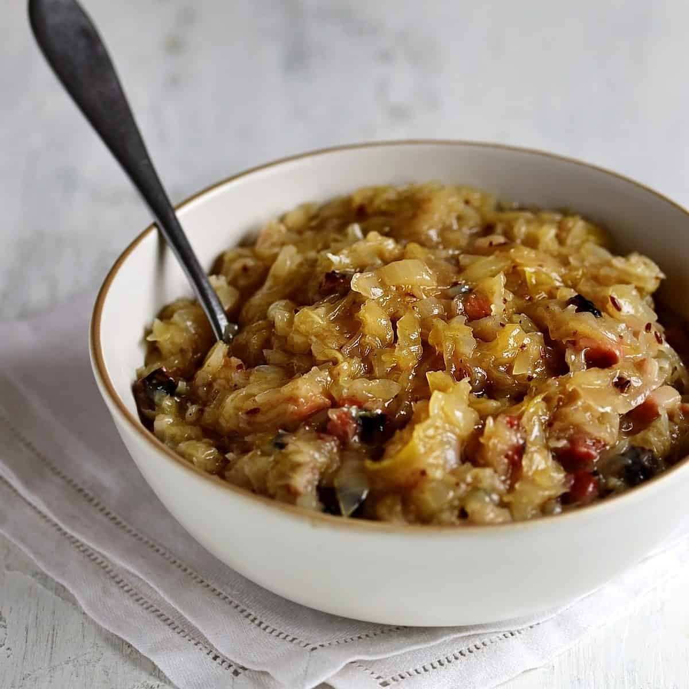

# Czech Zelí (Braised Sauerkraut)

*Czech sauerkraut done the home way: drained sauerkraut braised slowly with onion, caraway and a touch of brown sugar, lightly thickened with a flour roux. Silky, sweet-sour, never sharp. The side every Czech plate of roast pork or duck requires.*

**Serves:** 6 as a side

**Prep Time:** 10 minutes

**Cook Time:** 30 minutes

## Overview
Czech zelí (or kysané zelí - "sour cabbage") is the side dish that turns Czech sauerkraut from sharp pickled cabbage into a silky braised accompaniment. The technique is the difference: the raw sauerkraut is drained (some brine kept), then slow-cooked with onion, caraway, a touch of brown sugar and a flour-thickened liquor until the cabbage softens, the harsh sharpness mellows into a sweet-sour balance, and the texture becomes glossy and almost luxurious. It goes with vepřo (roast pork), duck (kachna), roast goose, knedlíky, sausages, and just about every other heavy Czech main. Better made a day ahead - the flavours meld; it reheats perfectly. A staple of Sunday dinners and Christmas Eve carp.

## Ingredients
- 800 g sauerkraut (in a jar or vacuum pack; not the harsh wine-vinegar kind - look for naturally fermented)
- 1 large onion, finely diced
- 50 g smoked bacon lardons (optional but traditional)
- 2 tbsp lard or duck fat (or vegetable oil)
- 1 tsp caraway seeds, lightly crushed
- 1 bay leaf
- 2 tsp soft brown sugar
- 1.5 tbsp plain flour
- 300 ml water (or stock for richer)
- 100 ml reserved sauerkraut brine
- 1 small dessert apple, peeled and grated (optional - Moravian style)
- Salt and pepper to taste

## Method

### Stage 1 - Drain the kraut
1. Drain the sauerkraut into a colander, reserving about 100 ml of the brine.
2. Press lightly to remove excess liquid (don't rinse - rinsing removes the lactic acid flavour).
3. If the sauerkraut is very long and stringy, chop it briefly with a knife into shorter strands.

### Stage 2 - Render the bacon and sweat the onion
1. In a heavy saucepan, heat the lard over medium heat.
2. Add the bacon lardons (if using); cook 4-5 minutes until the fat renders and the bacon is golden.
3. Add the diced onion; cook 6-8 minutes until softened and starting to colour.

### Stage 3 - Add the spices and flour
1. Stir in the caraway seeds, bay leaf and brown sugar.
2. Sprinkle the flour over; stir to coat the onions in a roux.
3. Cook 1 minute (the flour smells nutty).

### Stage 4 - Build the liquid
1. Pour in the water (and stock) gradually, whisking to break up any flour lumps.
2. Pour in the reserved brine.
3. Bring to a gentle simmer; the mixture thickens to a loose sauce.

### Stage 5 - Add the sauerkraut and braise
1. Tip the drained sauerkraut into the pot; stir well to coat.
2. Stir in the grated apple if using.
3. Reduce heat to very low; cover loosely.
4. Cook 20-25 minutes, stirring every 5 minutes, until the sauerkraut is silky and the liquid is mostly absorbed (the dish should be moist but not soupy).

### Stage 6 - Adjust
1. Taste; the kraut should be sweet-sour and balanced.
2. Add more salt, more sugar, or a splash more brine to your taste.
3. Discard the bay leaf.

### Stage 7 - Serve
1. Spoon onto plates alongside roast pork, sausages, duck, knedlíky, or any heavy main.
2. Best slightly warm rather than piping hot.

## Notes
- **Real fermented sauerkraut:** Not the kind that's just shredded cabbage in white vinegar. Look for jars marked "naturally fermented" or buy from a Polish/Czech/Russian deli where it's sold fresh in bulk.
- **Don't drain too much:** The lactic acid in the brine is what gives Czech zelí its character. Keep some of the brine; don't rinse.
- **Make ahead:** The dish genuinely improves on day two. Cook on Saturday for Sunday lunch.

## Serving
- Alongside any Czech main; the inseparable companion to vepřo (roast pork), kachna (duck), husa (goose) and the Christmas carp (kapr).

## Storage
- Refrigerates 1 week in a sealed container; reheats beautifully.
- Freezes 3 months; thaw in the fridge before reheating.
- The leftover dish is also good stirred into bigos, used as a pierogi filling, or piled on a sandwich with cold roast meat.
